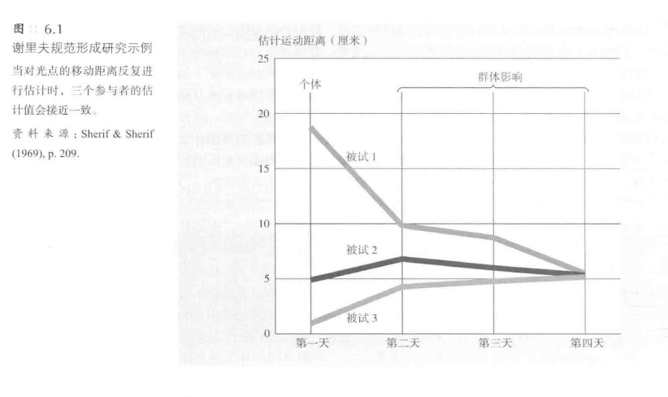
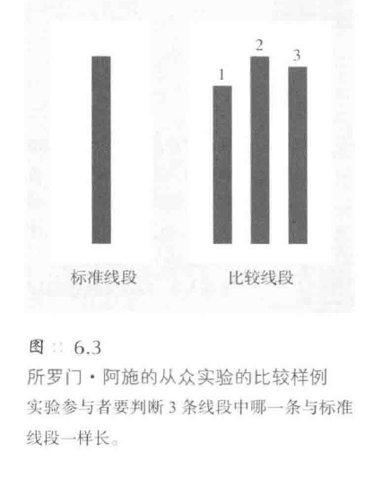
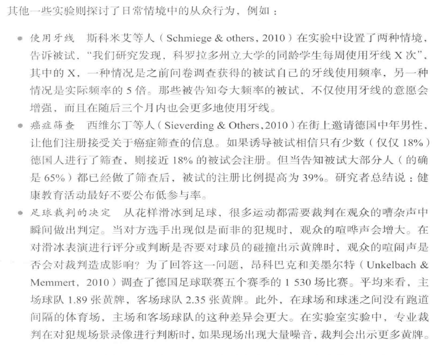
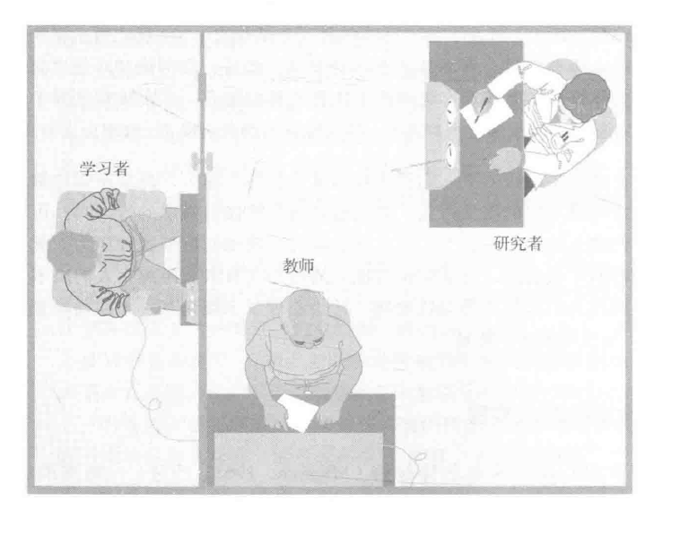
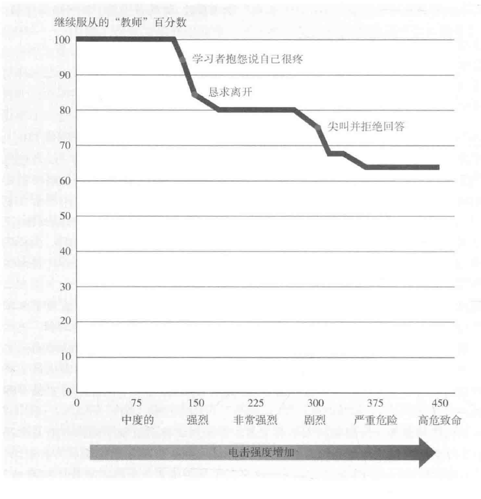
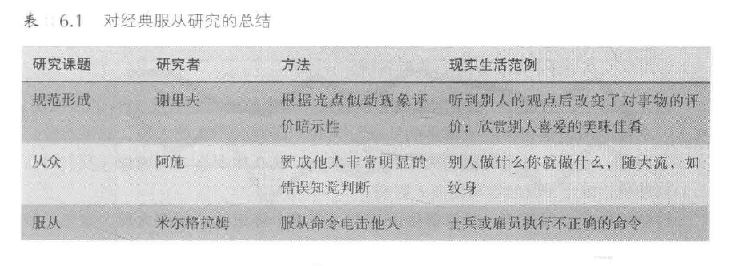
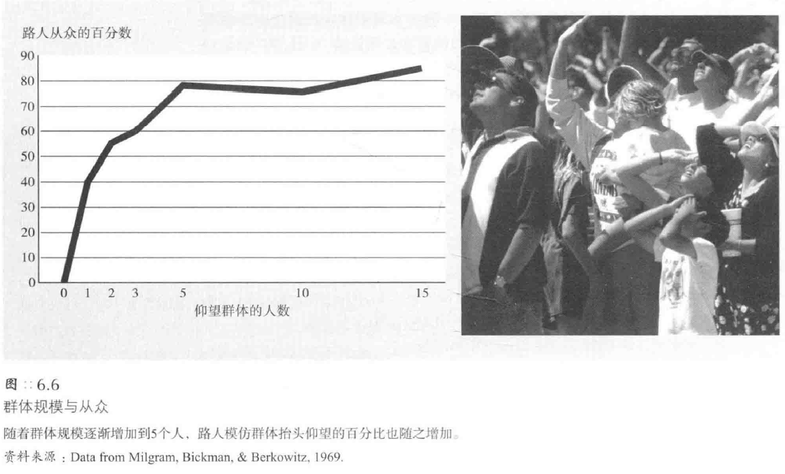
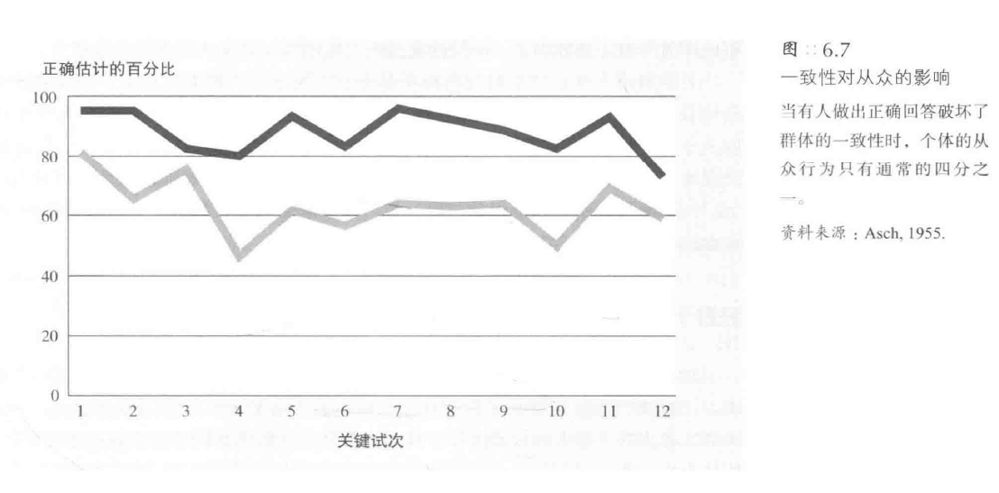

[TOC]
# 从众与服从
## 从众的概念
* **西方个人主义文化**并不赞赏屈从于同伴压力；因此，“conformity”（从众）一词往往含有**消极**的价值判断
  * 北美和欧洲的社会心理学家给社会影响贴上了**消极的标签**（从众、屈从、顺从），而不是赋予**积极的含义**（社会敏感性、反应性、团队合作），这反映了他们的**个人主义文化**
  * 在日本，与其他人保持一致不是软弱的表现，而是**宽容、自控和成熟**的象征
* 从众不仅仅是**与其他人一样地行动**，还指个人**受他人行动的影响**，从众不同于你独自一人时的行动和思维；因此，**从众**（conformity）是指根据他人而做出的行为或信念的改变
  * 个人是否从众的关键是，当你**脱离群体**时，你的行为和信念是否**仍保持不变**
  * 从众有多种表现形式，包括顺从、服从和接纳
    * 有时我们会顺从某种期望或要求，但并不真正喜欢这样做；这种由外部力量施压而违心的从众行为叫做**顺从**（compliance）
    * 如果我们的顺从行为是由明确的命令所引起的，那么我们称它为**服从**（obedience）
    * 有时我们真的**相信**群体要求我们所做的事情理所当然；这种发自内心真诚的从众行为叫做**接纳**（acceptance）
  * 甚至有学者对顺从和接纳进行了**神经科学研究**：构成公开顺从的**短暂记忆**与构成内心接纳的**长时记忆**，两种过程有着**不同的神经基础**
## 经典的从众和服从研究
* 研究从众和服从的学者们构建了**微型社会**，即实验室微观文化，简化和模拟了日常社会影响的主要特征
### 谢里夫的规范形成研究
* 谢里夫（Sherif，1935，1937）想知道，在**实验室情境**下是否能够观察到**社会规范**的形成过程；就像生物学家想努力把病毒分离出来，以便对之做实验一样，谢里夫也想把社会规范**分离出来**，然后对其进行研究
  * 谢里夫实验的参与者坐在一个非常黑暗的屋子里，在对面4.5米处出现了一个小光点；起初，什么事情也没发生，过了几秒钟，这个光点不规则地动了起来，最后消失了，现在，要求你猜测光点移动了多长的距离
  * 第二天你来参加实验时，另有两个人加入，在前一天他们与你有相同的经历，当第一次光点消失后，这两个人根据前一天的经验说出了最佳的估计；其中一个人说“2.5厘米”，另一个人说“5厘米”，轮到你了，你有些犹豫，还是回答，“15厘米”
  * 实验发现，随着次数的增加，参加谢里夫实验的哥伦比亚大学学生明显地改变了他们对光点移动距离的估计

  * 谢里夫等人利用这一实验方法考察了个体的**易受暗示性**；如果一年以后再对人们**单独地重测**，值得我们注意的是，他们**依然遵循群体规范**
* 在日常生活中，人的这种**易受暗示性**有时很有趣，某个人咳嗽、微笑或打呵欠后，周围的人也会表现出类似的行为；喜剧表演中加入的**背景笑声**就利用了我们的易受暗示性
  * 身边的人都很愉快的话，我们也会感觉愉快；英国谢菲尔德大学工作心理学教授彼得·托特德尔等人（Totterdell）把这种现象称之为“**心境联结**”，他在研究英国的护士和会计师时发现，同一工作团队里人们的心境通常**非常相似**
* 另一种社会传染效应是“**变色龙效应**”，由美国组约大学心理学教授沙特朗和巴奇（Chartrand&Bargh）提出；“变色龙”现象是指个体会**无意识地模仿**他人的动作、表情、口音乃至呼吸频率和情绪
  * 行为同步也包括**说话**，人们往往会模仿自己读过或听过的句子中的语法；又因为行为会影响态度和情感，这种自动的从众还会令你对他人**感同身受**
* 荷兰研究者巴伦等人（Baaren&others，2004）进行的一项实验表明，模仿行为能**令他人喜欢你**，有益于你和他人的交往
  * 人们会更乐意帮模仿自己行为的人捡起掉落的铅笔；模仿貌似能增强社会联系，甚至能帮助慈善团体筹集更多的金钱
  * 这种“模仿促进喜欢”的规则存在一种例外：**模仿别人生气会让人讨厌**（Van der Velde&others）
* 在歌德的第一本小说《**少年维特之烦恼**》于1774年出版后不久，年轻人模仿维特绝望行为的报道就越来越多
  * 两个世纪之后，社会学家戴维·菲利普证实了这种**模仿性自杀行为**，并称为“**维特效应**"（Philips&others）；在为人知的自杀事件之后，死亡事件如自杀，致命的车祸、私人飞机坠毁（有时是伪装的自杀）也会迅速增加
  * 当肥皂剧里出现虚构的自杀情节后，现实生活中的自杀率也会略有上升；更具讽刺意味的是，即使在关注自杀问题的严肃话剧上演后，仍会出现这种情况
### 阿施的群体压力研究
* 谢里夫的实验中从众者面对的是**模糊的现实情景**，而社会心理学家**所罗门·阿施**研究**不太模糊的知觉问题**

  * 假设你要参加阿施的实验，坐在7个人一排的第6个位置，研究者告诉你这是一个知觉判断的实验，然后要求你判断，图里的3条线段中哪一条与标准线段一样长；你很容易就可以看出是线段2，当你前面的其他5个人都说“线段2”时，这没什么好奇怪的
  * 但第三次判断却令你大吃一惊，尽管正确的答案是显而易见的，但第一个人答错了，在第二个人也给出同样错误的答案时，你从椅子上站了起来，使劲盯着卡片；第三个人也同意前面两人的答案，你张大嘴巴，浑身开始冒汗，“怎么回事？”
  * 很多大学生在阿施的实验中都体验到这类冲突，控制组的大学生单独回答时正确率超过99%；尽管有些人从来不从众，但四分之三的人至少有过一次从众行为，总的看来，**37%的回答是从众的**
* 阿施的实验程序成为后来许多实验的范式，虽然这些实验缺乏第1章所说的日常从众的“世俗现实性”，却有“实验现实性”；在这种经历中人们变得**情绪化**

### 米尔格拉姆的服从实验
* 耶鲁大学心理学家**米尔格拉姆**（Milgram，1965，1974）一系列的实验——“社会心理学历史上最著名，或者说最恶名昭著的研究”（Benjamin&Simpson，2009）——考察了权威与道德的冲突
  * **米尔格拉姆的服从实验**是社会心理学**最著名也是最有争议的实验**，斯坦福大学社会心理学家罗斯（Ross，1988）如此评论道：“若要论社会科学历史上实证研究的贡献，可能无出其右；米尔格拉姆的服从实验是人类社会共同的智慧遗产（如历史事件、圣经寓言和古典文学）的一部分，伟大的思想家在探讨人类本性和思考人类历史时可以信手拈来，有如天成”

  * 两个人来到耶鲁大学心理实验室参加一项学习和记忆的研究，实验者穿着白大褂，严肃地解释说，本实验是一项考察惩罚对学习影响的尖端研究；实验要求其中一人（“教师”）教另一人（“学习者”）学习配对出现的单词，如果记忆错误，就要进行惩罚，给“学习者”逐渐施加增强的电击
  * 为了分配角色，他们要从帽子里抽签，其中一人是性情温和的47岁的会计师，他是研究助手，假装说自己抽到了“学习者”签，并被领进隔壁房间；另一人是应征而来的志愿者，安排担当“教师”的角色，“教师”在体验一次轻微的电击后，看着研究者把学习者绑在椅子上，并在其手腕上缚上电极
  * 然后，“教师”和米尔格拉姆回到主房间，“教师”坐在“电击启动器”前，该仪器上有一排开关，每档相差15伏，从15伏一直到450伏，开关上写着“轻微电击”、“强电击”、“危险：高强电击”等等，在435伏和450伏的开关中间有“高危致命”（XXX）字样；研究者告诉“教师”，学习者每答错一次，“就在电击发生器上提高一个档次实施电击”，每次只要轻按开关，灯光就会闪烁，继电器开关随之“咔嗒”一声响，电蜂鸣器就嗡嗡地响起来了
  * 如果“教师”服从研究者的要求，那么，他会在75、90和105伏时听到学习者的哼哼声，在120伏时学习者大喊电击太疼了，在150伏时他咆哮着，“实验者，把我从这里弄出去！我不再参加这个实验了！我拒绝继续做下去！”在270伏时学习者的抗议声成了痛苦的尖叫声，并坚持要出去，在300和315伏处，他尖叫着拒绝回答，330伏后他再也没有声音了；米尔格拉姆在“教师”询问和要求停止实验时说，学习者不回答就算回答错误
  * 为了让“教师”继续实验，研究者采用了四种口头鼓励：鼓励1：请继续下去（或请继续）；鼓励2：该实验要求你继续进行下去；鼓励3：你继续进行下去是绝对必须的；鼓励4：你没有其他选择，必须进行下去
  * 米尔格拉姆给精神病学家、大学生、中产阶层等110人描述了这个实验，三个群体的人都认为自己会在135伏左右不服从命令，没人想进行到300伏以上；考虑到自我估计可能会受到自我服务偏差的影响，米尔格拉姆要求他们估计其他人会进行到什么程度，实际上，没有一个人期望他人使用电击发生器中的“高危致命”（XXX）档（精神病学家估计大约1000人中会有1人这样做）
  * 然而，当米尔格拉姆对40名男性（职业不同，20-50岁）测试时，有26人（65%）一直进行到450伏；中途停止电击的人一般在150伏左右，此时学习者的抗议声听上去更为急迫
  * 我们想知道今天的人们会不会同样如此服从，伯格（Burger，2009）重复了米尔格拉姆的实验一尽管最高只到了150伏；实验结果表明：在150伏的时候，70%的参与者仍然会服从，这个数字比米尔格拉姆的实验结果略低
  * 在米尔格拉姆的实验中，在150伏仍会服从的参与者大部分会继续到最后；事实上，所有服从指令达到450伏的参与者（“教师”）都会一直继续实验，直到另外2个试次之后实验者喊停为止

#### 米尔格拉姆实验的道德伦理问题
* 米尔格拉姆所用的**实验程序**令许多社会心理学家**惶恐不安**
  * 这些实验里的“学习者”实际上**没有受到任何电击**（“学习者”离开了电椅，打开磁带录音机，播放抗议声）；然而，有批评说，米尔格拉姆**施加于参与者的伤害**正是参与者施加于受害者的
  * 他强迫参与者违背自己的意愿，实际上，许多“教师”确实体验到了**极度的痛苦感**；他们流汗、颤抖、紧咬嘴唇、说话结巴、痛苦呻吟，甚至爆发出无法控制的神经质般的大笑
  * 批评家也认为，参与者的**自我概念**可能会因此而改变；一位参与者的妻子对他说：“你可以称你自己为艾希曼了”（指纳粹死亡集中营的执行官阿道夫·艾希曼）
* 在为自己辩护时，米尔格拉姆总结了由1000多个不同参与者所做的20多个实验所获得的经验教训，他也引用了参与者支持自己的一些评论，这些评论是在向参与者解释了实验目的和披露了欺骗程序之后获得的；随后的调查发现，84%的参与者说他们很高兴参加了实验；只有1%的人表示遗憾
### 引起服从的因素
* 有**四个因素**会影响服从，即与受害者的情感距离、权威的接近性与正当性、机构的权威性和不服从的同伴参与者的释放效应
#### 与受害者的情感距离
* 米尔格拉姆的参与者在**无法看到**“学习者”（“学习者”也无法看到他们）的情况下，其行动表现出的**同情最少**
  * 当受害者**距离遥远**，“教师”听不到抗议声时，几乎所有参与者都**冷静地服从**直到实验做完；相对于研究者的权威而言，这类情境把学习者对参与者服从的影响减小到了最低限度
  * 当学习者与参与者在**同一房间**时，那么，“只有”40%的参与者表现出服从把实验进行到450伏；当要求教师把学习者的手**强制按在电击板上**时，那么，完全服从的比例下降到30%
  * 在一项米尔格拉姆的再现实验中设置两种条件，录像中的演员**在电脑屏幕呈现或隐藏**，参与者知道那个人正在承受痛苦；结果再次显示，当参与者**能够看到**受害者时，服从的比例**显著降低**
  * 战争法允许从40000英尺高的地方对手无寸铁的村民投掷炸弹，但不允许对他们开枪射击，在与敌人进行近距离肉搏时，许多士兵既不开火，也不瞄准；这种违抗军令的行为，对于那些接到命令后以远距离火炮或飞机进行杀戮的军人来说是很罕见的
  * 从积极一面讲，人们对于**个性化的人**是最富有同情心的；这就是人们在替未出生的胎儿、机饿的难民或动物权利进行呼吁时，总是用令人感动的照片或描述来赋予其个性化的原因
#### 权威的接近性与正当性
* **研究者亲临现场**也会影响服从
  * 当米尔格拉姆**通过电话**下达命令时，整个服从比例下降到了21%（虽然许多人撒谎并且说自己听从了命令）
  * 其他研究也证实，权威**在空间上的接近性**会**增加服从率**；轻微碰触一下手臂，会使人愿意捐一个硬币，在请愿书上签名，或者品尝新的比萨饼
* 但是，权威必须是**正当合理**的
  * 在米尔格拉姆式实验的另一变式中，研究者假装接到一个电话，要离开实验室；研究者说，仪器可以自动记录数据，所以“教师”可以继续做实验；研究者离开后，另一个人代替研究者（实际上是研究者的另一个助手）来发布命令；该助手“命令”对每个错误回答增强一档电击，并且还有针对性地指导“教师”，这种情况下有80%的“教师”完全拒绝服从
  * 助手装作厌恶这种违抗，并亲自坐在电击启动器前，试图代替“教师”实施电击，这时，大多数不满的参与者发出了抗议；一些人还试图拔下启动器的插头，一个高大的男子把助手从椅子里拽起来，并把他推出房间，参与者对不正当权威的反叛，与之前在研究者面前常常表现出来的恭顺和礼貌形成了鲜明的对照
* 在奇怪的“**直肠耳朵疼**”的案例中，我们可明显看到个体对合法权威的服从
  * 医生要求给右耳感染的病人耳朵里滴药，在处方上，医生把“滴入右耳”写成了“滴入屁股”；看了医生的处方后，顺从的护士把指定数量的药液滴入了顺从的病人的直肠里
#### 机构的权威性
* 如果权威的声望很重要，那么**耶鲁大学的机构声望**也可能使米尔格拉姆的实验命令变得合法化了；在实验后的访谈中，许多参与者说如果不是耶鲁大学的名声，他们坚决不会服从
  * 为了考察一下真实情况，米尔格拉姆把实验地点移到康涅狄格州的布里奇波特市，他在一座并不豪华的商务大楼里成立了“布里奇波特研究会”，然后由同一批；虽然服从率（48%）仍然较高，但明显低于耶鲁大学的65%
* 在日常生活中也同样如此，**有机构作背景的权威**易发挥社会权力
  * 斯坦福大学心理学教授**罗伯特·奥恩斯坦**（Ornstein）讲述了一件事，他的朋友是位精神病学家，有次因为一位病人爬上悬崖威胁要跳崖而前去规劝，精神病学家的苦口婆心仍无法使病人离开悬崖，无奈之下，他只能期望警方的谈判专家能快点到来；尽管谈判专家没有到来，但另一名完全不知情的警察恰巧来到现场，拿出他的手提式扩音喇叭，对聚集在悬崖边的人群大叫：“哪个混蛋在马路中间把货车并排停在另一辆车旁边？害得我差点儿撞上。不管你是准，现在就把它开走！”听到这些，要跳崖的那个病人马上乖乖地走下来，把车开走，然后一声不吭地钻进警车去了附近的医院
#### 群体影响的释放效应
* 这些经典实验好像表明从众都是消极的；但是，从众也可以是**积极有效**的
  * 米尔格拉姆也观察到了这种从众的释放效应，他让“教师”和两个助手“教师”一起实验，两个助手“教师”都公然反抗研究者，然后研究者命令那个真正的参与者（“教师”）一个人继续下去；通过模仿反抗的助手，90%的参与者释放了自己
  * 社会心理学家（Fiske，Harris&Cuddy）指出，冲进世贸大厦熊熊大火中的消防员是“非常勇敢”的，但他们也只是“部分地出于服从上级命令，部分地出于遵从极端的集体忠诚”
### 对经典研究的反思
* 对米尔格拉姆研究结果的普遍反应是，大家意识到这与**近代世界史**有异曲同工之处
  * 纳粹德国的**阿道夫·艾希曼**辩解说：“我只是执行了命令而已”；**威廉·卡利**中校在1968年指挥了一场大屠杀，在越南米莱村杀死了数以百计的无辜平民后也是这样辩解；发生在伊拉克、卢旺达、波斯尼亚等地的“种族大屠杀”也都这样辩解
  * 战争和种族屠杀的大部分恶行和残暴程度**远远超出了服从**；有一些执行大屠杀任务的人根本不需要给他们下达命令让他们杀人，他们是“**乐意的屠杀者**”
### 行为和态度
* 当**外界的影响**作用超过了**内在的信仰**时，态度便无法决定行为
  * 在服从实验中，**强大的社会压力**（研究者的命令）超越了**力量较弱的因素**（远方受害者的抗争）；“教师”在受害者的抗争和研究者的命令之间，在希望避免造成伤害和成为合格的参与者之间挣扎，绝大多数人选择了服从
* 人们一步一步陷人圈套的**登门槛现象**
  * 米尔格拉姆实验中最初的惩罚是轻微的——15伏——并没有出现抗议，“教师”也会同意继续做下去；当电击达到75伏，并听到学习者第一次呻吟声时，他们己经顺从5次了，而接下来的一次，研究者只要求“教师”实施比先前略微强一点的电击而已；在他们实施330伏电击时，已经是第22次服从了，“教师”早已降低了认知不协调感
* 个体外在的行为和内在的心理倾向可以彼此影响**互相促进**，有时还会**螺旋式上升**
  * 许多参与者严重地贬低受害者，就是为了“迫害”他，诸如“他非常愚蠢和固执，就应该电击”的言论很多；一旦电击了学习者，“教师”必然会认为他毫无价值，学习者的智力或性格缺陷是实施惩罚的最好理由
* 但人类还具有**英雄主义**的品质
  * 在纳粹大屠杀期间、法国一个小村庄（LChambon）保护了5000名犹太和其他难民，他们本应流放押往德国；村民绝大多数是新教徒，村里的权威人物牧师教导他们“无论何时，只要敌人要求我们服从的命令有违福音书上的训诫，我们都要反抗”
#### 情境的力量
* 第5章最重要的启示是，文化是影响人们生活最有力的力量：而本章最重要的启示是，**即时的情境力量**也同样有力——这都证明了**社会环境**的影响力
  * 在最近宾夕法尼亚州立大学的实验中，大学生同样发现很难说出挑衅他人的话语；让大学生假设自己要与3个人讨论，挑选其中一人到荒岛去生活，研究者要求他们想象其中一位男生，说了3句与性有关的话，例如，“我想岛上需要有更多的女人，以便使男人更满意。”只有5%的人估计自己会无视这种言论，或者等待看看其他人的反应
  * 但是，社会心理学家（Swim&Hyrs）研究发现，在学生讨论时让男助手说出这类话语时，结果55%（而非5%）的人没有说出批判的话语
* 米尔格拉姆的实验也引起人们对**恶行**的思考
  * 恶行有时由**少数邪恶的家伙**所为，他们常常表现为悬念小说和恐怖电影里的冷血杀手形象；但是，恶行也会因**社会因素**而引发——就如同高温、潮湿和病菌可能使整筐苹果变坏
  * 当大家**分散工作各司其职**时，恶行似乎更易进行；米尔格拉姆对恶行的分隔作用进行了研究，他让另外40个人间接地参与实验，他们只负责学习测验，而其他人实施电击，结果发现40人里有37个人完全服从了
  * 对恶行的听之任之常常会使之日积月累，尽管我们并不是有意识地去作恶；拖延同样是对恶行的无意识放任，会造成自我伤害
* 单凭社会情境**并不能解释**为什么在同一街区或死亡集中营中，有些人表现出极端的残忍，也有人表现出英雄主义的仁慈
  * 参加1942年1月万塞会议制定纳粹大屠杀最后方案的14个人中，有8个人曾获得欧洲大学博士学位
  * 在邪恶力量的支配下，善良的人们有时也会堕落，他们会对不道德的行为进行**合理化的归因**
  * 那么，对暴行的情境化分析可以免除作恶者的罪过吗？可以免除他们的责任吗？美国著名的剧作家**亚瑟·米勒**（Miller）说，在外行人看来，答案在某种程度上是肯定的；但是研究罪恶根源的心理学家却不这么认为

## 预测从众的因素
### 群体规模
* 在实验室实验里，**规模较小的群体**就可以引起较大的效应
  * 阿施和其他研究者发现，3至5个人比只有1个或2个人能引发更多的从众行为；当人数增加到5个人以上时，从众行为的增加就不再明显

* 群体“抱成团”的方式也会产生不同的影响，**多个小群体的一致意见**使得某个观点更为可信
  * 当助手以两个2人组单独出现时，参与者的从众人数要比助手以一个4人组出现时的从众人数多；同样，两个3人组引发的从众人数要比一个6人组所引发的从众人数多，而3个2人组引发的从众人数更多
### 一致性
* 如果有人**破坏**了群体一致性，那么会**降低群体的社会影响力**

  * 在过去的半个世纪里，美国最高法院的裁决中只有1/10的裁决包含**一个异议者**；大部分都是全票通过或者按4：5的比例分配
* 美国加州大学心理学教授内梅斯和奇利斯发现他人持有异议——即使这种异议是错误的——会**增强个体的独立性**
  * 他们让大学生观察四人小组中的一个人错误地把蓝色判断为绿色；尽管持异议者是错误的，但却能鼓励观察者表现自己的独立性——在76%的次数里，他们正确地把红色幻灯片判断为“红”，即使其他所有人都说是“橙”色
### 凝聚力
* 群体之外的人——如另一所大学的学生或不同的宗教信仰者——提出的少数派观点，对我们的影响要**小于**我们自己群体内的少数派观点
  * 异性恋者为同性恋者的权利呼吁，其对异性恋者的影响比同性恋者白己呼吁更有效；那些声称与你生日相同、名字相同或指纹特征相同的人提出要求后，你似乎更愿意顺从
* 群体的**凝聚力**（cohesiveness）越强，对成员的影响力就越大
  * 那些感到自己**受群体吸引**的成员更可能对群体影响做出反应；他们并不喜欢与其他成员唱反调，害怕被自己喜欢的人拒绝
  * 当目睹身着本校T恤的人欺骗后，参与者在另一实验中欺骗的可能会增加；但如果看到欺骗者穿的是对手学校的T恤时作用恰好相反，参与者会变得更加诚实
### 地位
* 地位高的人往往有**更大的影响力**；低级团体成员——甚至低级的社会心理学工作者——承认他们比高级团体的成员更服从于他们的群体
  * 对乱穿马路行为的研究显示，乱穿马路的基线比例为25%，当遵守交通规则过马路的助手出现时，行人乱穿马路的比例下降到了17%，而当另一个乱穿马路者出现时，该比例一下子上升到了44%
  * 米尔格拉姆报告说，服从实验中地位低的人比地位高的人更愿意服从研究者的命令
### 公开的反应
* 在实验室，人们必须面对他人做反应时要比私下里回答问题时表现出**更多的从众行为**
  * 当大学教师提出某些有争议的问题时，如果让学生通过遥控器匿名回答，他们给出的答案会比举手回答时更多样化
### 事前承诺
* 个体一旦在公众面前作出承诺，就会**坚持到底**；最多也是在以后的情景中改变自己的判断
  * 因此，跳水或体操比赛的裁判在看到其他裁判的评分与自已的评价差距较大后，也很少改变自己的分数，尽管在稍后的成绩评定中会加以调整
  * 推销员所提的问题往住会鼓励我们对其所推销的东西做积极的评价而不是消极的评价；环境保护主义者要求人们对回收废品、节约能源或乘坐公共汽车作出承诺——与单纯地声嘶力喝地呼吁，不作任何承诺相比，这更可能改变人们的行为
## 影响个体从众的原因
* 个体屈服于群体可能是因为（1）想获得群体的**接纳和免遭拒绝**，或者（2）获得**重要信息**
  * 美国哥伦比亚大学心理学家莫顿·多伊奇和哈罗德·杰勒德把这两种引发从众的因素命名为**规范影响**（normative influence）和**信息影响**（informational influence）；第一种影响来源于我们想获得别人喜欢的渴望，第二种影响来源于我们想正确行事的渴望
* 规范影响指个体要“与群体保持一致”以免遭拒绝，获得人们的**接纳或赞赏**；在实验室实验和日常生活中，群体成员常常会拒绝某些离经叛道者
  * 绝大多数人都知道，社会拒绝令人痛苦，如果我们偏离了群体规范，常常要付出**情感代价**；脑部扫描的结果显示，团体评价带来的痛苦所激活的脑区，与个人博彩决策失败带来的痛苦不同
  * 有时偏离群体的巨大代价会使人**违心地附和群体**，或至少**压抑自已的反对性意见**；特别对于那些看到过其他人因违反样体规范而遭人嘲笑或者那些要顺着社会地位阶梯往上爬的人而言，规范性影响更易导致服从
  * 我们常常**觉察不到**规范性影响的存在
* 另一方面，**信息影响**会导致人们接纳
  * 现实情境**较为模糊**时，正如光点似动情境中的参与者那样，他人可能就会成为有价值的信息来源
  * 我们的朋友对我们既有信息影响又有规范影响；对社会形象的关注往往容易产生规范影响，而希望自己行事正确侧经常容易产生信息影响；从众实验有时需要分离规范影响与信息影响
## 从众的个体差异
### 人格
* 20世纪60年代到70年代，研究者想找到人格特征与社会行为（例如从众）之间的关系，但发现它们仅有**微弱的关联**
  * 与**情境因素的影响力**相比，人格测试得分**并不能很好地预测个体的行为**
* 虽然内在的因素（如态度、特质）很难准确地预测某个**特定的行为**，但它们却能较好地预测个体**跨情境的一般行为**
* 当社会影响**非常微弱**时，个性也能较好地预测行为；但是，即使情境的影响很强烈，个体也有差异
### 文化
* 文化背景确实可以帮助我们**预测人们的从众行为**
  * 心理学研究者在7个国家重复了阿施的从众实验，发现大多数国家的从众比例比较接近——黎巴嫩31%，巴西34%；但是津巴布韦的班图族则达到了51%，该部落对不从众的反抗者会进行强力制裁
  * 与个人主义国家的人相比，**集体主义国家**（珍视和谐、人际关系有助于定义自我）的人更容易受到他人的影响而做出反应
  * 莫里等人指出，如果一个国家存在**九种高危的病菌**，如疟疾、伤寒、结核病等，那么该国家的文化往往会表现出相对较高的从众水平
* 在**同一个国家内**也存在文化差异
  * 研究者进行了5项研究发现，**工人阶层**的通常更喜欢与他人保持一致，而**中产阶级**的人则更偏爱将自己视为独特的个体
* 此外，文化也**不断在变化**
  * 对英国、美国和加拿大的大学生重复进行阿施的实验，与二三十年前阿施所观察到的情况相比，有时人们会表现出较少的从众行为
### 社会角色
* 角色理论认为，社会生活就像在剧场的舞台上演戏，有它自己的场景、面具和台词，这些**角色**和从众行为有很大的关系；社会角色允许扮演它的人进行一定程度的**自由解释**，但是任何角色都有某些方面必须表现出来
  * 社会角色的定义需要**许多规范**；如果某个社会类别的规范**很少**（例如，乘坐自动扶梯的人要站在右侧，行走靠左），我们就不把它当做一个社会角色
  * 从众的过程以一种人们**几乎意识不到的方式**改变人们的行为、价值观和同一性，以**适应不同的环境**；而要想回到自己从前的角色则需要“重新从众”
### 角色互换
* 角色扮演也可以成为积极的力量；有意**扮演新角色**并服从它的规范，人们有时能改变自己，或者对角色与己不同的人**感同身受**
  * 通过双方的**角色转换**（即站在对方的立场上），谈判者或者团体的领导人就可以**创造更好的交流**；或者在给出答复之前，要求一方**重述**另一方的观点
## 抵制从众的社会压力
* 我们不是被动的机器，任由外力推动，我们会根据自己的价值观采取行动，不受强加于自身的力量影响；如果预先知道有人会强迫我们，可能甚至会促使我们反其道而行之
### 逆反
* 个体都珍视自己的**自由感和自我效能感**；所以，如果社会压力非常明显，以至于威胁到个体的自由感时，他们常常会反抗
  * 很多实验研究表明，企图限制个体的自由通常会引起“事与愿违"的反从众行为，这证明了**逆反**（reactance）理论
  * 当看到足球流氓也带着巴宝莉的帽子时，英国人开始不带这种帽子，以此将自己与足球流氓区分开来
  * 逆反理论有助于我们解释年轻人的酗酒行为；一项对美国56个学校所做的调查表，达到法定饮酒年龄（21岁）的学生中有25%是滴酒不沾的，而21岁以下的学生中这类人的比例只有19%
### 坚持独特性
* 个体与周围的人**差别太大**时会感觉不舒服；但是至少西方文化认为，如果个体与其他人**完全一样**的话，也会感觉不舒服
  * 美国普度大学研究者斯奈德和弗罗姆金的一项实验表明，当人们认为自己有**适度的独特性**时自我感觉较好；并且他们的行为也会维护这种独特性
  * 当要求儿童“给我们介绍一下你自己”时，他们最可能提到的是自己**独有的特征**；在国外出生的孩子更可能提到他们的出生地，红头发孩子与黑发或棕发的孩子相比更愿意提及自己的头发颜色，体重较轻和体重较重的孩子更可能提及白己的体重，少数族群的孩子更可能提及自己的族群
  * 同样，与异性相处时我们会**对自己的性别更敏感**
  * 这种洞察力有助于解释为什么在非白人环境中长大的白人会更强烈地意识到自己的白人身份，为什么同性恋者比异性恋者更能意识到自己的性取向，为什么少数派群体更容易意识到自己的独特性，以及个体所处的文化又是如何与独特性发生关联的；由于多数族群意识不到这种族群特点，可能认为少数族群群体过于敏感
  * 就算两种文化**非常相似**，人们仍然会注意到**彼此的差别**，无论多么微小，甚至非常细微的差别也会引起歧视和冲突