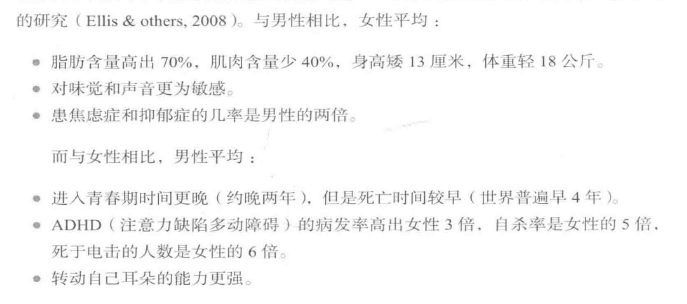
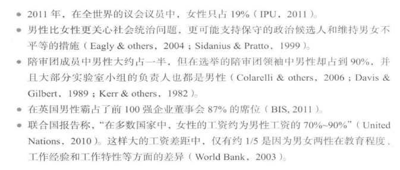
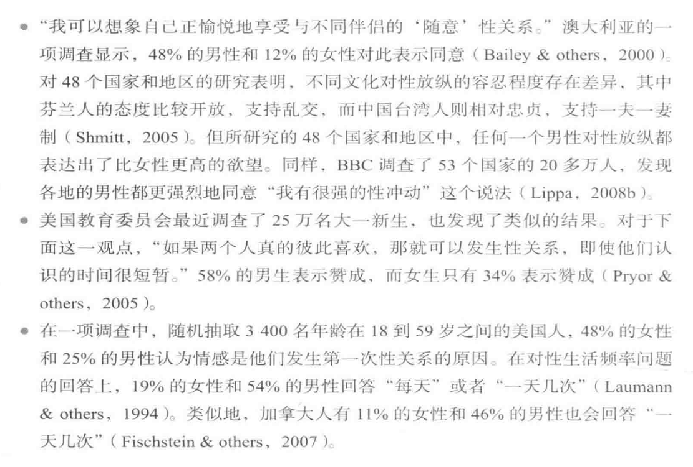

[TOC]
# 基因、文化与性别
* 世界各地的所有人都是**社会动物**
  * 他们会加人团体组织，服从并认可社会地位的差异，他们会知恩图报，惩罚冒犯行为，并且会因为孩子的夭亡而悲伤；在婴幼儿时期，他们8个月左右就表现出对陌生人的恐惧，而长大后，他们会偏爱自己所属团体的成员
  * 甚至我们的很多**道德观**都存在跨文化和跨时代的一致性；婴儿在学会走路之前，就会表现出道德感，他们不喜欢错误或淘气的行为
  * **世界各地**的人类都喜欢**集体生活**（如家庭和公共群体），而不喜欢单独生活
  * 这些共性表明，**人性是共通的**；尽管存在很大的差异，但我们的相似性更显著，我们是有着不同肤色的同类
## 基因、演化与行为
* 体现人性的普遍行为源自于我们的**生物相似性**
  * 为了适应新环境，早期人类开始产生了许多**新的变异**；根据人类学量表的测量发现，这些变异是新近产生的并且表现在**外貌**上
  * 比如，那些留在非洲的人有**较深的肤色**——哈佛大学心理学家**史蒂文·平克**称之为“热带地区所需的遮阳罩”，而那些迁徙到远离赤道的北极的人则演化出**更浅的肤色**，以便在缺少阳光直射的地区合成维生素D
  * 事实上，研究人类基因的生物学家已经发现：我们人类——甚至是看起来截然不同的人——都是**极其相似**的，很像一个部落的不同成员
* 为了解释物种特性，英国博物学家**查尔斯·达尔文**（Darwin）提出了**演化论**的观点，他主张重视基因的作用
  * 生物体有许多**不同的后代**
  * 这些后代在环境中**互相竞争**以求生存
  * 某些**特定的生理和行为变异**会提高他们在相应环境中**繁殖和存活的概率**
  * 存活下来的后代更有可能将他们的基因传递给下一代；因此，随着时间的推移，**族群特征**可能会发生变化
  * 某些基因会增加物种生存和繁衍的几率，因此自然选择意味着这些基因的数量会**越来越多**
* **自然选择**早已成为生物学研究的原则，而最近也成为**心理学**界的一条重要原则
  * **进化心理学**（evolutionary psychology，也译作“演化心理学”）不仅研究自然选择如何影响那些有利于适应特定环境的生理特征——北极熊的毛皮、蝙蝠的声呐系统和人类的色彩视觉等，而且还研究那些有利于**基因存活和延续**的心理特征以及社会行为
  * 我们作为**活动的基因机器**，继承了祖先为了适应环境而形成的**生理和心理遗产**；我们渴望拥有任何有利于祖先生存、繁衍并养育后代的事物，并以此保证自己的**生存和繁衍**
### 文化与行为
* 也许我们人类最重要的共同点（或者说人类的标志）就是我们有**学习和适应的能力**；演化使我们有能力在变幻莫测的世界里创造性地生存，并能适应各种环境，从热带雨林到北极冰原
  * 然而，正是人类共有的生理基础使得我们具有了**文化上的多样性**；它可以令一种文化（culture）里的人们珍视决断、喜欢坦率或者接受婚前性行为，而另一个文化里的人们则可以完全相反
* **进化心理学**也承认社会环境的影响，认识到**先天属性**和**后天养育**共同塑造了我们
  * 基因并不能决定一切，它们的表达还**依赖于环境的影响**
  * 对新西兰年轻人的一项研究表明，即使是那些拥有易患抑郁的变异基因的人，也只有当他们遭受重大的生活压力（如婚姻破裂）时才会患抑郁症
* 人类能**在自然选择中胜出**，不仅在于发达的大脑和强壮的肌肉，而且**文化**也起作用
  * 论我们出生在何种文化背景，自然都使得我们**更易习得此种文化**
  * 文化的观点强调了人类的**适应性**；孔子说：“性相近也，习相远也。”
#### 文化的多样性
* 人类语言、习俗和行为表现的多样性表明，我们的许多行为都**受到社会的影响**，并非与生俱来
  * 文化多样性会日益影响我们的生活；越来越多的人居住在同一个地球村中，通过电子邮件、大型客机和国际贸易等方式与同伴联系，**文化融合**已经不是什么新鲜事了
  * 当代一位不知名的学者指出，没有任何事件如戴安娜王妃之死那样突显全球化进程：“英国的王妃和她的埃及男友坐在一辆有着荷兰发动机的德国汽车里，一名喝多了苏格兰威士忌的比利时人负责驾驶汽车。后面紧跟着骑日本摩托车的意大利狗仔队。在法国隧道里发生车祸后，一名美国医生用来自巴西的药物对他们进行救治。”
* **移民或难民的搬迁**似乎在文化融合中发挥着重大的作用
  * 当我们与**来自不同文化背景**的人一起工作、玩乐或生活的时候，我们会**更容易理解文化的差异和影响力**；在充满冲突的世界里，实现真正的和平需要**求同存异**
#### 规范：期望的行为
* 正如礼仪规则所示，所有的文化都有**各自认可的得体行为**；我们经常把这些社会期望或者**规范**（noms）视为一种强迫人们盲从传统的负面力量
  * **社会规范**确实可以成功而微妙地限制和控制我们的行为，以至于我们几乎察觉不到；我们每一个人都深受**文化环境**的影响，以至于我们必须从中跳出来才能理解文化的影响
  * 了解我们文化规范的最好方法是**观察另一种文化**，看看两种文化处事方式的异同
  * 对于那些无法接受某种社会规范的人，此类规范似乎**过于专断和褊狭**；对于大多数西方人，日本人的一些礼节显得繁琐和小题大作，但对于日本人来说则并非如此
  * 不同文化在外向程度、严守时间、打破规则以及私人空间等社会规范上存在差异
    * **外向程度**：对于较拘谨的北欧（文化中的）人，热情开放的地中海（文化中的）人可能显得“热情、迷人，低效和休闲”：地中海人则觉得北欧人“高效、冷漠、过于看重时间”
    * **严守时间**：拉丁美洲的商人很可能会在一次邀约宴会迟到之后，为北美朋友如此纠结于准时而费解；去日本旅游的北美人会对行人之间缺乏眼神交流而感到困惑
    * **打破规则**：如果人们看到有人违反社会规则，比如违规在墙上乱涂乱画，他们就更可能违反其他的规则
    * **私人空间**：私人空间（personal space，也译作“个人空间”）是一种我们想要与他人维持的安全距离或缓冲的区域，随着情境的变化，安全区的大小也会变化；和陌生人在一起时，多数人都会保持相对较大的私人空间，大约12米或更大的距离
      * **个体之间**也存在差异，有些人的私人空间较大；**群体之间**也存在差异：成人比儿童的距离大，男性彼此间的距离要比女人之间的距离大
      * 不知何故，**靠近赤道的文化圈**偏爱更小的距离、更多的接触和拥抱；因此，英国和斯堪的纳维亚半岛的人比法国人和阿拉伯人更喜欢较远的人际距离，北美洲的人比拉丁美洲的人更喜欢较大的私人空间
* 文化差异不仅表现在这些行为规范上，同时也表现在**规范的力度**方面
#### 文化相似性
* 正是由于人类的适应性，才出现了**多姿多彩的文化差异**；然而在文化差异的表象下，跨文化心理学家发现了“**内在的统一性**”
  * 作为人类的成员，我们还发现**差异行为背后的机制**是相同的；例如，一个4到5岁的孩子，无论他/她来自哪里，都会具备推测他人想法的“**心理理论**”
* **普遍的友谊规范**：世界各地的人们有一些共同的友谊规范：尊重朋友的隐私，交谈时要进行眼神的接触，以及不泄漏彼此的秘密
* **普遍的特质维度**：在全世界，人们倾向于用情绪稳定性、外向性、开放性、宜人性和尽责性来形容他人
* **普遍的社会信念维度**：香港的社会心理学家梁觉和彭迈克认为存在**5个普遍的社会信念维度**；他们针对38个国家的研究发现，在各个国家中，人们在日常生活中认可和应用以下社会信念的程度不同：犬儒主义、社会复杂性、付出的回报、宗教性和命运控制
* **普遍的地位等级规范**：罗杰·布朗提出另外一种普通规范；无论人们处在何种等级系统，他们在对地位比自己高的人说话时通常会采用**较为尊敬的语气**，就好像是和陌生人聊天一样，而他们对地位较低的人说话则更像是**同熟人和朋友聊天**
  * 布朗普遍规范的**第一部分**——沟通的形式不仅反映社会距离也反映**社会地位**——与第二部分紧密相关：亲密感的进展往往控制在**地位较高的人手中**
* **乱伦禁忌**：最知名的普适规范是对乱伦的限制：父母不可以和孩子发生性关系，兄弟姐妹之间也不可以；尽管实际上乱伦的发生情况比心理学家原先估计的要多，但这一社会规范的确是**普适的**
* **战争规范**：人类甚至制定了**跨文化的战争规范**；在杀敌的过程中，会有一些已经遵循了几百年的公认规则
  * 比如，战士必须穿上可识别身份的制服，投降必须使用屈服的姿势，并且人道地对待战俘
  * 这些规范尽管是跨文化的，但是并非所有文化都是如此；伊拉克的部队打出投降旗号后转而又进攻，以及把士兵伪装成平民百姓以安排伏击，他们就违反了这些规范
* 因此，有些规范具有文化特异性，也有些规范则是普适的，文化可以改变规范，但我们的遗传倾向——人类本性——却可以解释某些规范的普适性；因此，我们认为人性是普遍一致的，而后天教养具有文化特异性
## 性别的相似性和差异性
* 人类的差异表现在很多方面——身高、体重、发色等等；但是对于自我概念和社会关系而言，最重要和最先适应的两个维度是：**种族**和**性别**
* 与北美文化一样，很多文化中都推崇：每个人都必须有**指定的性别**；如果婴儿诞生时同时具有两性的性器官，医生和家人往往都会迫切地为这一双性孩子**指定某一性别**，通过手术消除性别的模糊性
* **跨性别者**（transgender）是一个例外，他们自己认为的性别与其生物性别**不一致**；他们可能觉得自己是一个长着男性身体的女性，或者长着女性身体的男性
### 性别和基因
* 在**身体特征和发育阶段**的很多方面，男女两性**非常类似**，比如开始坐立、长牙和行走的年龄；同样，两性在很多**心理特征**上也极其相似，包括词汇量、创造性、智力、自尊和幸福感等
  * 男女之间仍然存在着一些差异：

### 独立性与联系性
* 男性在残酷竟争和养育关爱等见解和行为上存在个体差异，女性也一样；但是女性比男性**更重视亲密关系**
  * **游戏**：埃莉诺·麦科比经过数十年对性别的发展研究发现，与男孩相比，女孩之间的谈话更加**亲密**，而且游戏也更少攻击性；女孩更偏向于在**小群体**中开展游戏，往往与一个朋友交谈，而男孩则更常进行**大群体的活动**
  * **友谊**：对成年人而言，个人主义文化的女性更经常用**人际关系**的词汇来描述自己，更乐于接受别人的帮助，体验到更多与人际关系有关的情感，并努力使自己与他人的关系更加协调
    * 在**电话**方面，女性通话的时间更长，女孩发短信的数量是男孩的两倍多；她们花在**社交网站**的时间也多于男性
    * 在群体中，女性之间会**相互分享**她们各自的生活，为他人提供更多的支持；面临压力时，男性倾向于以“战斗或逃跑”回应，通常以反抗来应对威胁，而女性向家人和朋友**寻求支持**
  * **职业**：总体上，男性总是会被那些**增强性别不平等**的工作所吸引（检察官，广告策划人等）；女性则被那些**减少性别不平等**的工作所吸引（公设辩护人，慈善工作的宣传者）
    * 对64万人**工作偏好的研究**发现，男性更看重报酬、晋升、挑战和权力，而女性则更看重工作时长、私人关系及助人机会
    * 在世界范围内，与男性相比，女性的职业兴趣更多地指向**人**而非物
  * **家庭关系**：拥有母亲、女儿、姐妹或祖母身份的女性可以很好地维系家庭；在孩子出生后，父母（尤其是母亲）在与性别有关的态度和行为方面会变得**更加传统**，女性用在购买礼物和贺卡的时间是男性的3倍，用2——4倍的时间处理私人信件，并且给朋友和家人打长途电话的次数要多10%~20%
  * **微笑**：微笑会随着情境而变化；在400多项研究中，女性因为微笑频次更高而更容易受到关注
  * **同理心**：受调查时，女性倾向于将自己描述为更具“**同理心**”（empathy，也译作“共情”），即**能够感受他人的感觉**——为他人的喜悦而高兴，为他人的悲伤而哭泣；看到别人因犯错而痛苦，女性与同理心相关的脑区会显著激活，但是男性不会
  * 与男性的友谊相比，男女两性都认为与女性的友谊**更加亲密、愉悦并且更易维持**
  * 对两性同理心差异的一种解释是女性**解读他人情绪**的能力更强；女性**回忆他人外貌**的能力也显著优于男性；女性更擅长以**非言语的方式**表达情绪，这一特点在表达**积极情绪**时尤为明显
### 社会支配性
* 从亚洲到非洲，从欧洲到澳洲，人们对男人的评价离不开**强势、进取和攻击**等描述；而且，对70个国家近80000人的研究表明：男人比女人更为重视权力和成就
  * 几乎所有的社会**男性都处于统治地位**；而在已知的社会中，女性通常很难居于统治地位
  * 从古至今，男性的名字都是**排在前面**的，例如“国王和王后”、“他的和她的”、“先生们女士们”、“比尔和希拉里”等

  * 很多研究发现，人们觉得领导者具有更多**传统文化中的男性化特质**，更自信、强势、独立和坦率；在写推荐信时，针对男性候选人，人们通常更多地使用这些“**主观能动**”的形容词，而在描述女性候选人时，则更多地使用“**群体性**”形容词
   男性**交流的方式**可以加强他们的社会权力；在领导角色并未清晰界定的情境下，男性倾向于采取**专断**的领导方式，而女性则倾向于采取**民主**的领导方式
  * 男性比女性更强调胜利、领先以及控制他人；这也许能够解释为什么相比于群体内冲突，**群体间竞争**（如国际战争）发生时人们更偏好男性领导者
  * 男性还表现得更冲动，更爱冒险
* 在写作方面，女性更多使用**联系性介词**（比如with）以及**现在时态**，更少使用**数量性名词**；一个根据**词汇使用和句型结构**来判断性别的程序成功识别出920本英国小说及非文学作品中**作者的性别**，其准确率高达80%
* 男性谈话的方式可以反映出他们**对独立的关注**，而女性更**重视关系**
  * 男性更可能表现出**权力欲**——自信地谈话、直接打断他人、相互握手、更多地注视对方以及较少微笑；从女性角度考虑，她们更多采用**间接方式**影响他人——较少打断他人、更敏感、更礼貌、更兼虚
* 男女之间不同的交谈方式可能与**社会背景**有关；我们赋予男性的大多数特征往往是属于那些处于更高社会地位的人的特性（不论男女）
### 攻击
* 心理学家把**攻击**（aggression）定义为**意图伤害他人的行为**
  * 调查显示，男性承认自己比女性有**更多的攻击行为**；在实验中，男性确实表现出**更多的身体攻击**，比如实施（自以为真的）高强度电击
  * 但是，性别差异会随着情境的不同而不同；在**挑衅情境**下，男女性别差异会**大大缩小**，而且在一些**伤害性较小**的攻击形式中，比如说扇家人耳光、摔东西或者言语攻击等，女性的攻击行为并不比男性少
### 性特征
* 在**性态度和主张**方面，也存在男女差异

* 两性在性态度上的差异还反映在**行为层面**上
  * 与女同性恋相比，**男同性恋**报告：对**随意的性关系**更感兴趣，性爱频率更高，对视觉刺激的反应更强烈，更关心伴侣的性魅力；女同性恋中有47%会结婚，而这几乎是男同性（24%）的两倍
  * **史蒂文·平克**（Pinker，1997）观察说，“并不是说男同性恋性爱次数更多，他们只是表现了正常男性的性需求，只不过对象也是男人罢了
  * 男性不仅有更多的**性幻想**，**性态度**也更开放，会寻找更多的性伴侣，也更容易引发性唤醒，渴望更频繁的性生活，手淫次数更多，更不善于独身生活，更少拒绝性爱，更容易冒险，花费更多的资源以便满足性需求，且更偏爱形式各异的性行为
  * 一项以18到25岁大学生为样本的研究显示，男生想到性的频率中数为大约每小时一次，而女生中数约为每两小时一次，尽管同性之间存在较大的个体差异
* 各地的文化都更重视**女性**而非男性的性行为，正如卖淫与求爱过程中所表现出来的**性别不对称**；男人一般提供金钱、礼物、赞美和承诺，含蓄地换取女性的性顺从
  * 在人类的性经济中，女性**很少为性买单**；大多数女性都会反对其他女人提供“廉价的性”，这会**降低她们自身性行为的价值**
* **性幻想**也存在性别差异；在以男性为受众的色情作品中，女性通常**未婚且充满欲望**：以女性为主要市场的爱情小说中，温柔的男主角总是会**全身心地爱自己的心上人**