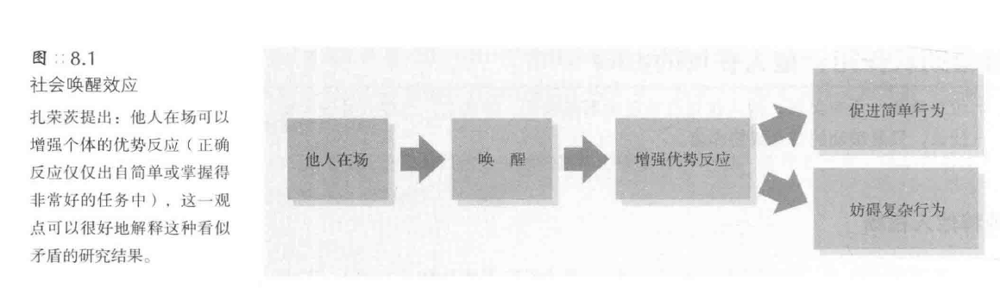
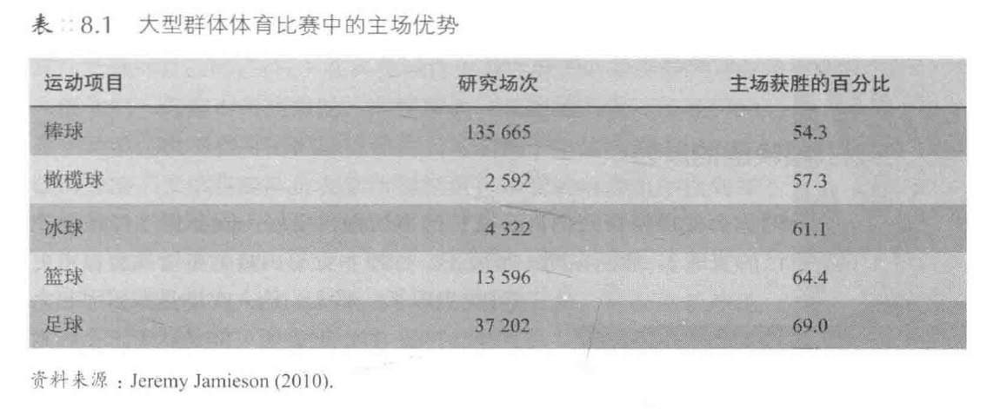
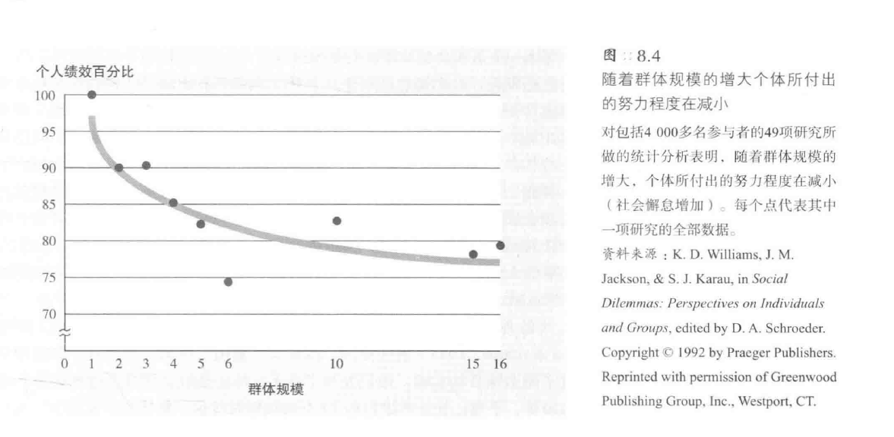
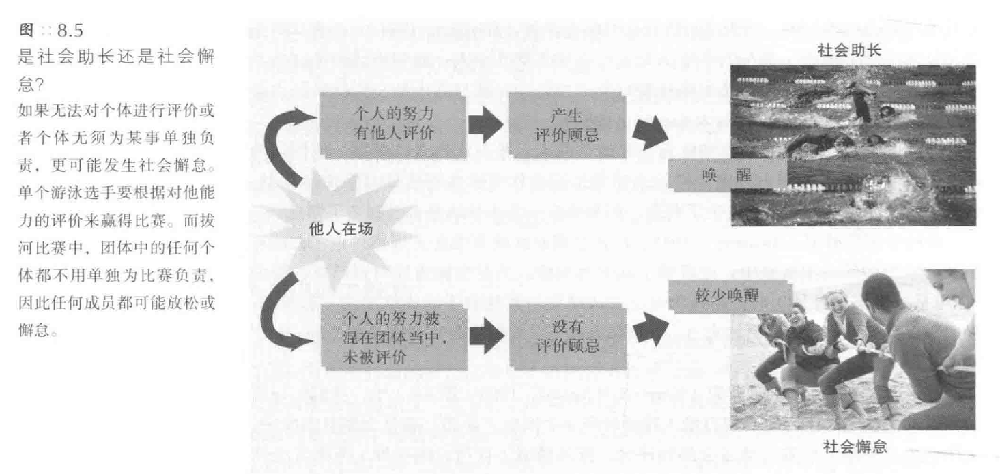
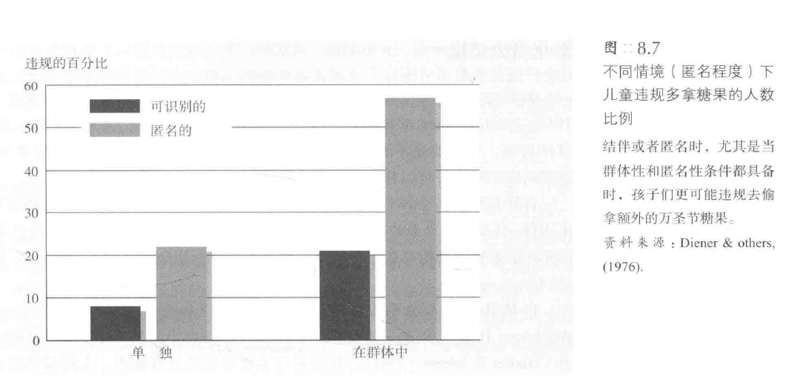
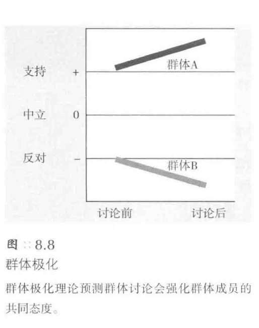
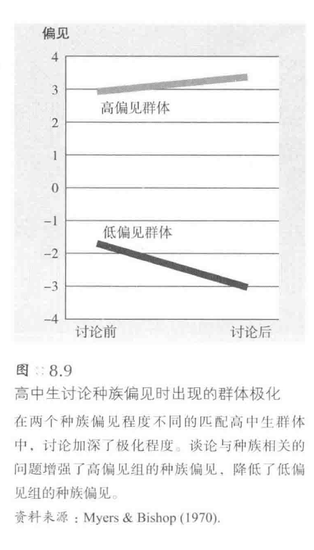
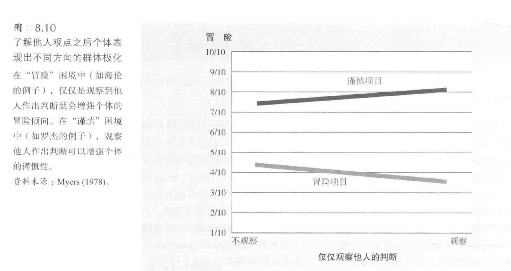
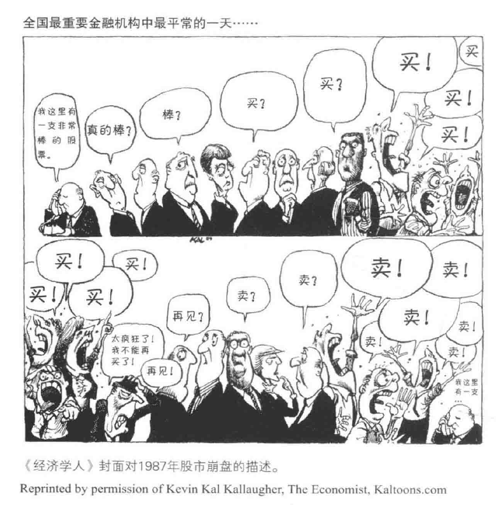
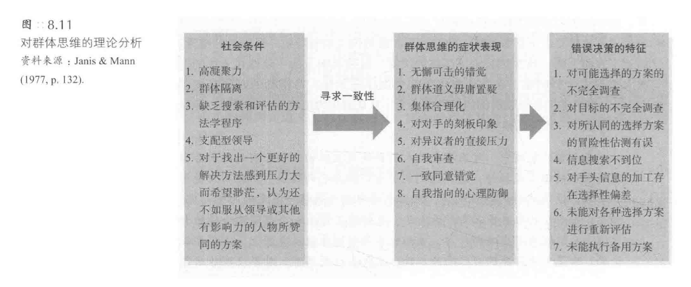

[TOC]
# 群体影响
## 群体的概念
1. **群体的定义**：
   - 群体的定义并不简单，涉及**多种情境和互动**
   - 群体可能指彼此认同、有共同目标的人群
   - 群体可能是有组织、长期关系的人群

2. **群体的共同特点**：
   - 群体成员间存在**互动**
   - 群体成员把同一群体中的人看做“**自己人**”
   - 群体满足人的交往需要、成就需要和获得社会认同的**需要**

3. **群体与集合的区别**：
   - 仅在**同一地点**的人不一定构成群体，如计算机房的学生
   - 群体成员间有**互动**，而集合的个体可能没有互动

4. **群体的影响**：
   - 有其他人在场可能会**影响个体**，如体育比赛中的支持者
   - 本章将探讨集体影响的实例，如社会助长作用、社会懈怠、去个性化、群体极化、群体思维和少数派影响

## 社会助长作用：他人在场的影响
### 纯粹他人在场
1. **纯粹他人在场的观察**：
   - 特里普利特观察到**自行车手在比赛中的成绩比单独骑行时好**
   - 实验中，儿童在一起绕线的速度比单独绕线快
   - 特里普利特认为**其他竞争者在场可以激发选手的潜能**

2. **社会助长作用**（social facilitation）：
   - 他人在场可以**提高人们完成简单任务的速度和准确性**
   - **动物**在同类在场时也会表现得更好，如蚂蚁、小鸡和老鼠

3. **他人在场的干扰效应**：
   - 在某些任务中，**他人在场可能会妨碍表现**
   - 例如，蟑螂、小鹦鹉和金丝雀在迷宫中的速度会变慢

4. **扎荣茨的社会助长理论**：
   - 扎荣茨试图将看似矛盾的发现**融合**
   - **唤醒**可以增强**任何优势反应的趋势**
   - 唤醒会**提高简单任务的成绩**，但可能**降低复杂任务的成绩**

5. **运动员和主场优势**：
   - 主场队在体育比赛中通常有优势，可能因为**对主场的熟悉和观众的支持**，加上发挥熟悉技能对于他们是**简单任务**

### 拥挤现象：众多他人在场
1. **拥挤现象的影响**：
   - **他人在场**可能会引起人的**唤醒状态**，如出汗、呼吸加快、心跳加速等
   - 在**有挑战性的任务**中，观众的在场可能会导致**表现下降**
   - 在**特定情境**下，如第一次钢琴独奏会，观众的在场可能**不会提高表现**

2. **人数与反应的关系**：
   - 他人的影响效应**随人数的增加而增强**
   - 在**大群体**中，个体的积极或消极反应都会被**放大**
   - **例子**：口吃者在大群体前更容易口吃

3. **亲密度与反应的关系**：
   - 当人们坐得很近时，友善的人**更受欢迎**，不友善的人**更令人讨厌**
   - 在拥挤的环境中，人们**更容易被诱导**发笑或鼓掌
   - 拥挤的环境使人们**更容易融入**他人的笑声和掌声中

4. **拥挤与唤醒状态的关系**：
   - 拥挤能**增强唤醒状态**，如心率加快和血压升高
   - 在拥挤的环境中完成复杂任务时，人们**更容易出错**
   - 唤醒能**促进优势反应**

### 他人在场引起唤醒的原因

#### 评价顾忌（evaluation apprehension）
   - 人们**担心他人如何评价自己**，这种评价顾忌可能导致**焦虑**
   - 当人们**认为他人正在评价自己**时，他们的表现可能会**改善**
   - **过分的自我关注**可能会**干扰熟练的自动化行为**

#### 分心
   - 人们在**考虑他人如何行动或反应**时可能会**分心**
   - 分心可能会导致认知系统的**负荷过重**，从而引起**唤醒**
   - 不仅他人的在场，**其他的分心物**也可能引起唤醒

#### 纯粹在场
   - 即使没有评价顾忌或分心，**他人的纯粹在场**也可能引发唤醒
   - 动物也可能受到**社会助长效应**的影响
   - 人们可能会因为有人与他们一起做某事而受到**激励**

## 社会懈怠：群体中的个人减少努力
1. **社会助长与社会懈怠**：
   - **社会助长作用**常发生在**人们为个人目标努力**时，他人可以对个人努力做出评价
   - 群体中的任务，如群体拔河、集资筹款等，个人努力**难以单独评价**

### 人多未必力量大
1. **人多未必力量大**：
   - 在**群体拔河**中，选手的努力可能仅为**单独努力的一半**
   - 小组成员在群体任务中的**努力程度可能较小**，他们会受到**搭便车**（free-ride）的诱惑

2. **社会懈怠的实验研究**：
   - 人们在群体中**叫喊或鼓掌**的声音可能比单独时小
   - 参与者在群体中可能**不认为自己懈怠**，但实际上他们的**努力程度可能较低**

3. **评价与激励**：
   - 个体在群体中可能**不会受到单独的评价**，导致**努力程度降低**
   - 当个体的行为**可以单独评价**时，他们可能会**付出更大的努力**

4. **社会助长与评价顾忌**：
   - 个体**受他人观察**时，评价顾忌**增强**，导致**社会助长作用**
   - 个体**在人群中消失**时，评价顾忌**减小**，导致**社会懈怠**（social loafing）

### 日常生活中的社会懈怠
1. **社会懈怠的普遍性**：
   - 社会懈怠在**实验室中的各种任务**中都有出现，如拔河、叫喊、鼓掌等
   - 考虑是否这些实验结果可以**推广到日常工作中**

2. **实验与日常工作中的社会懈怠**：
   - 当可以**对个人行为进行评价**时，工人的**产出可能增加**
   - 在某些工作场合如泡菜厂，**难以识别个人的产出**，可能导致**社会懈怠**

3. **社会懈怠与文化**：
   - 社会懈怠在**不同文化中**都有出现，如苏联、匈牙利和中国的农业产量
   - 亚洲的**集体主义文化**可能导致**社会懈怠现象较弱**

4. **社会懈怠的原因与解决方法**：
   - 当任务具有**挑战性、吸引力**时，社会懈怠可能**减少**
   - 当群体成员**彼此熟悉或有共同的目标**时，社会懈怠可能**减少**
   - **小规模的工作群体**可能更容易使成员感到**自己的贡献是必要的**

## 去个体化：群体中的个体失去自我感
1. **去个体化的定义及环境**：
   - 群体中的个体**失去自我感**
   - 由**群体引发的兴奋感**导致的行为
   - 群体能使成员的**身份模糊化**

2. **社会行为的困惑**：
   - 骚乱者对自己的行为**感到困惑**
   - 一些被捕者在法庭上对自己的行为表示困惑
   - 人们在群体中可能的失控行为

### 群体失控：法不责众
1. **群体失控的原因**：
   - 群体能引发人们的**唤醒状态**和**分散责任**
   - 人们在群体中可能**抛弃道德约束**
   - 人们可能因为群体规范而**忘记个人身份**

#### 群体规模
   - 群体规模与**成员的身份模糊化**有关
   - 人群规模**大**时，人们更可能**诱劝他人做出危险行为**
   - 暴徒团伙的规模越**大**，成员越有可能**实施暴行**

#### 匿名性
1. **匿名性的影响**：
   - **津巴多的实验**：女学生穿上白色衣服和帽兜后，对另一个女性实施电击的时间加倍
   - **互联网上的匿名性**：人们在网络上的行为**更加激进和敌对**
   - 互联网社区的**匿名特点**可能助长人们的**卑劣与冷漠**

2. **匿名性与攻击性行为**：
   - **美国马里兰大学的实验**：敞篷车与4×4轮子车司机的喇叭声行为差异
   - **万圣节前夕的实验**：孩子们在群体和匿名情境下偷拿糖果的行为

3. **身体匿名性的两种效果**：
   - **部落斗士的装扮**：匿名袭击者与未伪装袭击者相比，表现出**更严重的袭击行为**
   - **护士制服实验**：穿**护士制服**的参与者在匿名情境下的攻击性**减弱**

4. **匿名性与群体意识**：
   - 匿名性使人们的**自我意识减弱**
   - **群体意识**在匿名情境下**增强**
   - 人们在匿名情境下更容易**对情境线索作出回应**

#### 唤起和分心活动
   - 集体喊叫、高歌、鼓掌或跳舞，这些活动可以令人们**热情似火**，同时**减少其自我意识**
   - **迪纳的实验**：扔石头、小组合唱等活动可能成为其他**更放肆行为的前奏**
   - 当人们看到**别人和自己做出同样的行为**时，会对自己做出冲动性的举动产生一种**自我强化的愉悦感**

### 弱化自我觉察
1. **弱化自我觉察的影响**：
   - **去个体化的人**更难自控、更难自律、更可能毫不顾及自己的价值观就采取行动
   - **自我觉察实验**：**自我觉察**的人会表现出**更加的自控**，行为能够清晰地反映他们的态度
   - 自我觉察的人**不太可能做出欺骗行为**

2. **自我意识与行为的关系**：
   - **具有自我意识的个体**能保持**情境外的日常言论**和**情境内的实际行动**高度一致
   - 喝酒情境：会**降低**个体的自我觉察，**增强**个体的去个体化
   - **增强自我觉察的情境**：如镜子、相机、明亮的光线等，可以**减弱个体的去个体化**

3. **日常生活中的应用**：
   - 小城镇的居住环境、醒目的姓名标签、凝神静思等，都可以增强自我觉察，减弱去个体化
   - 父母的忠告：和大家伙一起享受欢乐的同时要**保持自我觉察**，保持独特个性，**小心去个体化**

## 群体极化：群体对我们观点的强化
1. **群体互动的双重效果**：
   - 群体互动可能导致**破坏性行为**，如警察暴力和团伙暴力
   - 支持型群体领导和管理顾问强调群体互动的**积极效果**
   - 社会活动和宗教活动鼓励群体成员与思想相近的人交流，**增强群体认同**

2. **群体极化的概念**：
   - 群体讨论通常会**强化其成员最初的意向**
   - **科学探索**的过程展示了如何从错误的结论**转向更准确的结论**
   - **群体极化**（group polarization）正是一个有趣的科学谜题

### “风险转移”的案例
1. **风险转移的定义**
   - 群体决策往往**更加冒险**，称为“**风险转移**”
   - 风险转移效应在不同的群体、年龄、职业和国家中**都有所体现**

2. **风险转移的案例研究**：
   - **斯托纳**的研究发现群体在决策时**往往比个人更冒险**
   - **海伦**的情境：作家海伦考虑写一部可能产生重大影响的小说
     - 参与者为海伦提供关于写这部小说的建议
     - 群体决策后，**倾向于鼓励海伦冒险**

3. **风险转移的普遍性与限制**：
   - 风险转移**并不是普遍适用**的，有时群体决策会**更为谨慎**
   - **罗杰**的情境：罗杰考虑卖掉人寿保险进行投资
     - 参与者为罗杰提供关于投资的建议
     - 群体决策后，**倾向于建议罗杰谨慎行事**

4. **讨论加强人们最初的看法**：
   - 讨论通常会**加强人们最初的意向或看法**
   - 群体在讨论后的决策往往**与他们最初的看法一致**
   - 讨论的效果在不同的情境中可能**有所不同**

### 群体对我们观点的强化
1. **群体对观点的强化**：
   - 群体讨论倾向于**加强群体成员的初始观点**
   - 这种观点强化被称为**群体极化**
   - 群体极化：讨论通常可以**强化群体成员的普遍倾向**
#### 群体极化实验
1. **群体极化的实验研究**：
   - 群体讨论可以**引发个体观点的变化**
   - 群体中的冒险者可能变得更冒险，顽固者可能变得更顽固，乐于助人者可能变得更乐善好施
   - 群体极化理论**预测了这种观点的变化**

2. **群体极化现象的实证研究**：
   - 莫斯科维斯和扎瓦罗尼发现讨论可以加强法国学生对总统的积极态度和对美国的消极态度
   - 矶崎发现日本大学生讨论交通事故后，更倾向于给出“有罪”判定
   - 布劳尔等人发现法国学生讨论后会对某些人持有更强烈的消极印象

3. **观点分歧的群体讨论**：
   - **观点相似**的人们讨论后，他们的共同观点可能会**得到加强**
   - 讨论可能会**加深两种不同态度之间的鸿沟**
   - 毕晓普教授和Myers的研究发现观点相似的学生群体讨论后，两个群体之间的**观点差距会加大**

4. **群体讨论对积极或消极倾向的放大**：
   - 当人们分享消极印象时，讨论会**加强这种消极印象**
   - 讨论可以**增强人们对某一群体的歧视**
   - 当人们分享对不公正的关注时，讨论可以**增强他们的道德关注**

#### 日常生活中的群体极化
1. **日常生活中的群体极化**：
   - 人们倾向于与**观点相似的人**交往
   - 与观点相似的朋友之间的交流可能会**强化共同的观点**
   - 这种交流可能会**使得某些特质更加明显**，如讨厌的人变得更可憎，纯真的人变得更纯真

2. **性别隔离与群体极化**：
   - 男孩群体和女孩群体的性别隔离能够**加强性别差异**
   - 男孩们在一起时会变得**更加富有竞争性**
   - 女孩们在一起时会变得**更加关系取向**

3. **法庭中的群体极化**：
   - 共和党任命的法官与民主党任命的法官有**不同的选择倾向**
   - 和观点相似的法官在一起会**强化他们的倾向**
   - 共和党法官和民主党法官在一起时的**审判倾向会有所不同**

4. **学校中的群体极化**：
   - 大学生群体之间的**差异会随时间扩大**
   - 无党派人士在大学生活中的**政治态度会逐渐形成**
   - 群体成员会**强化他们彼此的态度倾向**

5. **社区中的群体极化**：
   - 人们的**自我隔离**导致社区中的极化现象
   - 社区开始成为**回声壁**，观点在志趣相投的朋友之间流转
   - 社会心理学家认为，志趣相投的群体在内部互动时可能会变得**更极端**

6. **互联网上的群体极化**：
   - 电子邮件、博客和聊天室为人们提供了**与志趣相投的伙伴交流的新媒介**
   - 多数人喜欢看**支持自己的博客**，这些博客多数会**链接观点相近的博客**
   - 互联网上的极化现象**随着宽带的普及而增加**

7. **恐怖组织中的群体极化**：
   - 恐怖主义是拥有**相同不满情绪**的人们走到一起而产生的
   - 恐怖主义的过程是**把个体和其他信念系统隔离开**
   - 恐怖组织中的成员将世界分为“**我们**”和“**他们**”两类

8. **大屠杀与群体极化**：
   - 大屠杀是**杀人者相互怂恿**而**逐步加剧**的群体现象
   - 恐怖分子在“**恐怖主义样体的高压之下**”很难再受其他因素的影响
   - 控制恐怖组织的**征募活动**是**最有效的反恐政策**

### 对极化的解释
1. **对极化的解释**：
   - 群体形成的观点往往比个体的平均观点**更夸大**
   - 研究者希望通过解决群体极化的谜题来为此提供思路
   - 解答小谜题可能为大谜题提供线索

2. **群体极化的理论**：
   - **信息影响**：由于**接受了事实的证据**而产生的影响
   - **规范影响**：基于人们**希望被他人接受或敬仰的愿望**而产生的影响

#### 信息影响
1. **信息影响的细节**：
   - 群体讨论可能产生与主导性观点一致的**一系列观点**
   - 讨论中可能会提及一些群体成员之前**没有考虑到的**有说服力的观点
   - 人们不仅仅会因为**听到他人的观点**而改变态度，而是会因为**积极参与讨论**而**更容易改变态度**

2. **言语的使用与观点的强化**：
   - 当群体成员**重复他人的观点**时，他们**更可能认同这些观点**
   - 人们的大脑并非像白板那样被说服者填写，而是**如何看待**某条信息是关键
   - 仅仅对某个观点**思考几分钟**也可能强化观点，例如当人们仅仅想起某个他们喜欢或不喜欢的人时
   - 当人们设想与**持有相反观点**的专家讨论某一事件时，他们可能会采取**更极端的立场**
#### 规范影响
1. **规范影响的概念**：
   - **与他人的比较**涉及规范影响
   - 人们常常被“**参照群体**”中的人们所**说服**，即与我们观点相一致的群体

2. **社会比较理论**（social comparison）：
   - 人们希望能够**评价自己的观点和能力**，因此与他人进行比较
   - 当人们发现**其他人和自己持有相同观点**时，他们会**更强烈地表达自己的观点**
   - **人众无知**（pluralistic ignorance）：人们误以为其他人会**更支持**社会普遍认同的倾向，害怕自己的观点太过极端

3. **人众无知的例子**：
   - 人们都希望外出游玩，但都害怕迈出第一步，担心其他人对此没有兴趣
   - 在一个群体中，大家都沉默，直到有人打破沉默，大家发现都支持彼此的观点
   - 当教授问有什么疑问时，没有人反应，因为每个学生都怕别人认为他是唯一一个没听懂的人

4. **社会比较的实验研究**：
   - **斯坦福大学的实验**：人们阅读难懂的文章，可以寻求帮助，但没有人寻求，他们认为其他人不需要帮助
   - 为克服人众无知，需要有人**打破沉默**，使其他人能**发现并强化**共同的观点和反应
   - 当开始讨论时，大部分人都发现自己的观点**并没有想象的那样出众**，事实上，其他一些人比自己**更为超前**；于是他们不再受群体规范的错误约束，而是**更加自由强烈地**表达自己的偏好

1. **社会比较理论的进一步探讨**：
   - 人们面对他人的立场时，会**改变自己的反应**来**迎合社会认同的立场**
   - 仅仅**了解他人的选择**也会产生**随大流效应**，如流行歌曲变得更受欢迎，不流行的歌曲变得更不受欢迎

2. **群体极化的研究**：
   - **社会心理学研究的复杂性**：一种理论**很少能解释**所有数据
   - 在群体讨论中，有说服力的论点决定了**涉及事实**的问题，而社会比较会影响**涉及价值判断**的反应

## 群体思维：群体对决策的影响
1. **群体思维的定义与起因**
   - 贾尼斯对20世纪美国总统及其顾问的群体决策进行研究
   - 群体**为了维护和睦而压制异议**，称为**群体思维**（groupthink）
   - 群体工作中的团队精神有助于鼓舞士气，但在决策时可能**反而不利**

2. **历史上的群体决策失误**
   - **珍珠港事件**：美军对日本的袭击毫无准备，导致重大损失
   - **猪湾事件**：肯尼迪总统试图用CIA训练的古巴流亡者袭击古巴，结果失败
   - **越南战争**：美国扩大对越南的战争，导致大量伤亡和社会动荡

### 群体思维的症状表现
1. **群体思维的症状表现**
   - **无懈可击的错觉**：群体过分自信，忽视危险警报
   - **群体道义毋庸置疑**：群体成员接受群体的道义，忽略其他伦理问题
   - **合理化**：群体通过集体投票将决策合理化
   - **对对手的刻板印象**：看待对手时过于简化和刻板
   - **从众压力**：群体成员抵制提出疑问的人
   - **自我审查**：人们将自己的疑虑压制下来
   - **一致同意的错觉**：表面上的一致性加强了群体的决策
   - **心理防御**：某些成员保护群体，阻止质疑群体决策的信息

2. **产生群体思维的条件**
   - **友善的**、**凝聚力强**的群体
   - 对异议的**相对排斥**
   - 从自己的喜好出发做决策的**支配型领导**

3. **群体思维在现代决策中的体现**
   - **伊拉克战争**：群体思维可能解释了伊拉克战争的起因
   - 无论是萨达姆还是布什，都有一大群和他们**具有同样目的的进言者**

### 对群体思维的批评
1. **贾尼斯的观点受到质疑**
   - 贾尼斯的证据都是**回溯性的**，可能存在**选择性偏见**
   - 后续研究对贾尼斯的某些观点表示支持，但也有反驳的声音
   - 友情**并不一定**导致群体思维

2. **群体思维的表现**
   - **支配型的领导方式**与**糟糕**的决策相关
   - 群体中的**每个人都有话语权**时，决策更为**明智**
   - 群体倾向于**支持极富挑战性的信息**
   - 群体成员希望**获得接纳和赞许**时，可能**压抑**与他人不同的想法
   - **各种观点都有**的群体胜过**观念类似**的专家组
   - 群体中**共享的信息**更容易占据主导地位

3. **群体决策的实例**
   - 希特勒的顾问斯皮尔描述了**希特勒周围的从众氛围**
   - 宾夕法尼亚大学的研究发现，即使是**良好的群体交流过程**，也可能做出**错误的决策**

### 预防群体思维
1. **促进英明决策的条件**
   - 贾尼斯分析了马歇尔计划和肯尼迪政府对古巴导弹危机的处理，提取了**有效的群体过程**

2. **预防群体思维的建议**
   - **公正**，不偏向任何立场
   - 鼓励**批评性评价**，设置“魔鬼代言人”
   - 将群体**划分成小组**，再重组表达不同意见
   - 欢迎**局外的**专家和伙伴提出批评
   - 在实施之前召开“**第二次机会**”会议

3. **采用预防措施的好处**
   - 虽然决策时间可能**更长**，但更少犯错，**更有效**

### 群体问题的解决
1. **群体决策的优势**
   - 在特定条件下，群体决策**优于**个体决策，如手术室和执行委员会会议室
   - 劳克林和艾达摩浦勒斯教授通过**智力任务**证明群体决策的优势
     - 类比问题中，多数学生在讨论后选择正确答案
     - 6人中有2人最初答对，他们大多数时候能说服其他人
   - 目击证人的报告中，**群体目击者**比单独的个体**更准确**
   - 即使是**简单的知觉判断**，两个人的成绩也优于一个人
   - **体育裁判**在不确定时，最好在裁决前商量

2. **群体创意的产生**
   - 多个人的**相互批评**可以避免认知偏见并产生高质量的点子
   - 科学领域中，不同观点的人合作导致更多的“**团队科学**”
   - **面对面的头脑风暴法**并不总是最有效的
     - 鼓励人们**讨论不同的想法**可以激发创造性思维
     - 小组成员在群体中提出想法时，会有**更大的成就感**
     - 但**单独工作的人**通常比在团队中工作能产生**更多好点子**
   - **促进群体头脑风暴的方法**
     - **结合**群体和个体的头脑风暴
     - 通过**书面互动**让小组成员交流
     - 利用**联网的计算机**进行电子头脑风暴

3. **群体智慧的实例**
   - **气象预报**中，两个气象员合作比单独工作更准确
   - Google利用“群体智慧”成为首要的**搜索引擎**
   - **游戏节目**中，观众的选择通常比参赛者的直觉更准确
   - “**心中的人群**”中，同一个人不同猜想的平均值的正确性超过此人的单次猜想
   - **市场预测**中，最后一轮的民意调查和爱荷华州的选举市场都能较好地预测大选结果

4. **结论**
   - 当来自众人的不同信息**综合在一起**时，群体的智慧通常**超过任何单个个体**
   - 通过相互紧密地联结，**鸟群**的飞行航线可以达到十分精准，因此鸟群始终比一只鸟更聪明
## 少数派影响：个体对群体的影响
1. **个体对群体的影响**
    - 文化背景既**塑造了我们**，也是我们**选择和创造的结果**
    - 从众压力可能会影响我们的判断，但公然的压力也可能激发**逆反心理**
    - 说服的力量很强，但我们可以通过**公开承诺**和预估说服的感染力来抵制

2. **少数派的影响**
    - 电影《**十二怒汉**》中的孤立陪审员说服其他陪审员的例子
    - **社会运动**通常是由**少数人**开始的，如哥白尼、伽利略、马丁·路德·金和苏珊·安东尼
    - **美国民权运动**是由拒绝在公共汽车上让座的黑人妇女帕克斯点燃的

### 一致性
1. **一致性的影响**
   - 少数派的**坚持**可以促使多数派**重新考虑自己的立场**
   - 少数派的**一致性意见**对多数派的**说服力更强**，如坚持认为蓝色幻灯片是绿色的
   - 少数派的**一致性**会激起**更深刻的讨论**，并提升**创造力**

2. **少数派面临的挑战**
   - 成为群体中的少数派可能会让人**感到不舒服**
   - 少数派往往**更慢地表达他们的观点**，这被称为**少数派缓慢效应**（minority slowness effect）
   - 多数派可能会因为少数派的反对而**讨厌此人**，即使多数派**知道**反对的人在事实或道德上正确

3. **少数派的实际影响**
   - 3M公司的报事贴便笺纸和书签的创意都来自于少数派的观点
   - 少数派的观点有时能**赢得挑剔的市场**

4. **如何增强少数派的说服力**
   - 施莱辛格为了使肯尼迪等人考虑他的观点，需要坚持自己的立场，展现自信，并提供有力的证据和论据
   - 个体不需要通过辩赢朋友来影响他人，而是通过**坚持和提供有价值的观点**来说服他人

### 自信
   - **一致性**和**坚定性**是自信的重要标志
   - 少数派的自信行为，如坐在席位的上座，会使多数派产生**自我怀疑**
   - 少数派通过**坚定有力的行为表现**，可以促使多数派重新考虑他们的立场
   - 少数派的这种说服力在关注**态度**时比关注**事实**时更强

### 背叛多数派
1. **少数派的影响因素**
   - **背叛多数派**：少数派中的某个人**从多数派中投奔过来**的话，他的说服力会更强
   - **滚雪球效应**：一旦开始出现背叛行为，其他人常常也会**紧紧追随**

2. **社会力量的普遍性**
   - 一致性、自信和背叛不仅能加强少数派的影响，也能**加强多数派的影响**
   - 信息影响和规范影响可以**同时增强群体极化和少数派影响**
   - 任何立场的社会影响力取决于它的**力量、即时性以及支持者的数量**

3. **少数派影响的研究**
   - 少数派能够动摇多数派的观点曾是社会心理学领域**少数人的看法**
   - 莫斯科维斯、内梅斯、马斯、克拉克等研究者已经**说服了群体影响研究中的多数人**，认为少数派影响是一个值得研究的现象
   - 马斯对少数派如何影响社会变革产生兴趣的原因与她的成长背景有关；内梅斯的兴趣则源于与其他研究者的合作经历

### 领导是否属于少数派影响
1. **领导的定义与起源**
   - 阿蒙森和斯科特的南极探险体现了**有效与无效的领导**
   - 阿蒙森形容领导是**特定个体动员和引导群体的过程**
   - 领导者可以是**正式任命或选举**产生的，也可以是**非正式产生**的
2. **领导的类型**
   - **任务型领导**（task leadership）：组织工作、设置规范、聚焦于目标的实现
     - 通常是**支配型**的，目标取向，将群体的注意力放在**任务**上
     - **特定的、有挑战性的目标**和**周期性的进程报告**会促进**高成就**
   - **社会型领导**（social leadership）：建立团队、调解矛盾、表达支持
     - 通常具有**民主风格**，代表权威，接纳团队意见，避免群体思维
     - 这种领导风格有利于**鼓舞士气**，提高群体成员的**满意度**
     - **女性**比男性更惯于采用民主型领导
3. **领导的特质与风格**
   - 有效的领导风格强调“**我们**”而非“我”
   - 有效的领导者代表**群体同一性**，负责提升和维护
   - 有效的领导者具有**吸引人的愿景**，尤其在集体面临压力时
4. **转变型领导**（transformational leadership）
   - 能**激励他人认同**并**承诺**完成团队工作任务
   - 转变型领导中的绝大多数都是**有魅力、充满活力、自信而且外向的**
   - 这类领导风格最经常的结果是形成**参与度高、相互信任和有效率**的工作团队
5. **群体对领导的影响**
   - 群体也会影响他们的领导者，领导者需要**察觉事态的走向**
   - 能够**代表群体观点的人**更有可能被选为领导者
   - **过于偏离群体规范**的领导者可能会被**抵制**
6. **伟大领导的产生**
   - **恰当的特质与情境相匹配**可以产生伟大的领导者
   - 伟大的领导者如丘吉尔、撒切尔、托马斯·杰斐逊、马克思、拿破仑、林肯或马丁·路德·金都需要恰当的人、地点和时间
   - 当才智、技术、决心、自信和社会领导气质结合，并遇上机会，结果可能是冠军、诺贝尔奖或社会革命