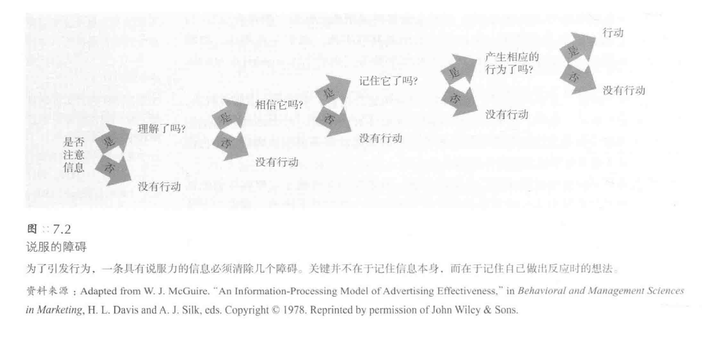

# 说服
* 说服的两种形式：
   - **蛊惑人心**：采用意险恶的手段进行说服
   - **教育启发**：基于事实和启发性的说服，较少使用强制手段
   - 通俗理解：根据个人信仰将说服分为“教育”和“蛊惑”
- 说服的**普遍存在**：
   - 说服在多个领域如政治、营销、求爱、教养、谈判、传教和庭审判决中的普遍存在
   - 社会心理学家探讨影响说服效果的因素和如何有效进行“教育”式的说服
- 社会心理学家对说服的研究：
   - 社会心理学家通过**实验**研究说服，类似于地质学家研究侵蚀
   - 通过**观察各种因素的影响**来理解说服的效果
   - 这些因素虽小，但能**在长时间内产生显著影响**，尤其对于不涉及核心价值观的中立态度更有效
## 说服的路径
- 人们**对信息的看法**影响说服效果：
   - 清晰易懂但含**不可信论据**的信息易被反驳
   - 提供**有力论据**的信息更易**获得认同和信服**
   - “认知反应”方式解释了某些情境下更易说服他人的原因
- 说服过程中的**障碍与增强因素**：
   - 说服要生效需清除若干障碍
   - 有助于清除障碍的因素能增强说服力
   - 吸引人注意的信息更有可能令人信服

### 中心路径
* **中心路径说服理论**（central route to persuasion）：
   - 提出两种主要的说服路径
   - 中心路径说服：积极主动、全面系统地思考问题，**关注有力论据**
   - 论据苍白无力时，思维缜密的人会**快速注意并反驳**
### 外周路径
*  **外周路径说服**的特点与应用：
   - 描述：在人们不能全神贯注或不愿深思的情况下，依赖于**外部线索和直观感受**来接受信息
   - 特点：不侧重于论据的合理性，而是通过**易于接受的表述和外部线索**来影响人们
   - 实例：熟悉和易懂的表述对于**心不在焉或不积极思考的人**更有影响力
* **广告行业**中的外周路径应用：
   - **消费行为**：很多消费行为是未经深思熟虑的，受到细微因素的影响
   - **商品广告**：依赖于视觉线索和感性因素，而非逻辑和证据
   - 例子：食品、饮料、烟草和服饰广告常使用外周视觉线索，而计算机广告则提供产品特点和价格信息
- **说服路径**与“**双加工**”模型：
   - 描述：两种说服路径（中心路径和外周路径）预示了人类心智的“双加工”模型
   - 中心路径：**迅速改变**人们的**外显态度**，依赖于有力的**论据和系统思考**
   - 外周路径：**缓慢建立内隐态度**，通过将态度目标与**情绪**反复关联来实现
### 不同目的选用不同路径
* 说服路径与行为改变的关系：
   - 目的：说服的最终目的是**改变人们的行为**，如购买商品或更有效的学习
   - **中心路径**：引起**更持久的行为变化**，因为人们基于深思熟虑和信息的说服力来做决策
- **外周路径**的效果与局限：
   - 描述：通常只能导致**肤浅和短暂的态度改变**
   - 例子1：禁欲教育能改变态度但很少有长期影响
   - 例子2：预防艾滋病教育更多地影响对避孕套的态度而非实际使用
   - 需求：态度和行为的改变需要人们**主动加工和反复推敲信念**
- **外周路径的常见应用**和**启发式策略**：
   - 描述：在**没有时间仔细分析问题**时，人们倾向于使用外周路径和启发式策略
   - 例子：在投票时依赖于简单的启发式策略，如信任朋友或专家的意见
   - **启发式策略**：一些简单而具有启发性的**经验法则**，包括“相信专家”或“长信息更可信”等
   - **说服者特点**：清晰流利、富有魅力、用意良善和论据充分能增强外周路径的说服效果