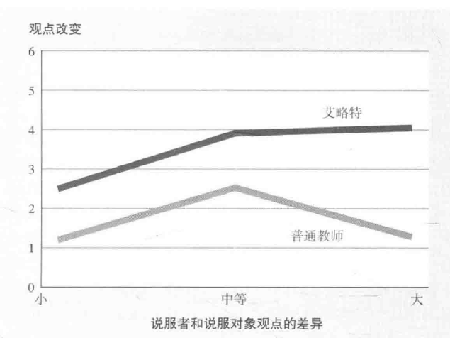
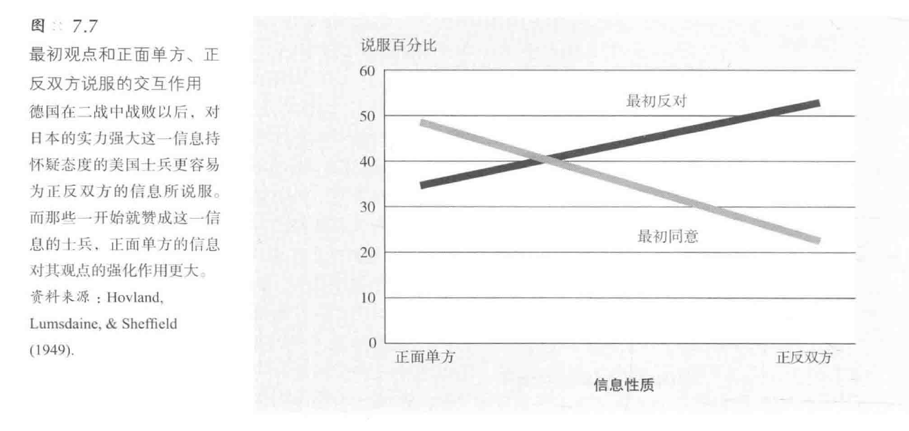
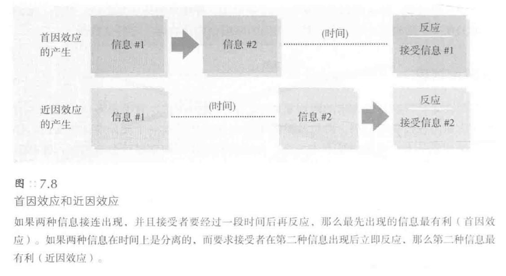
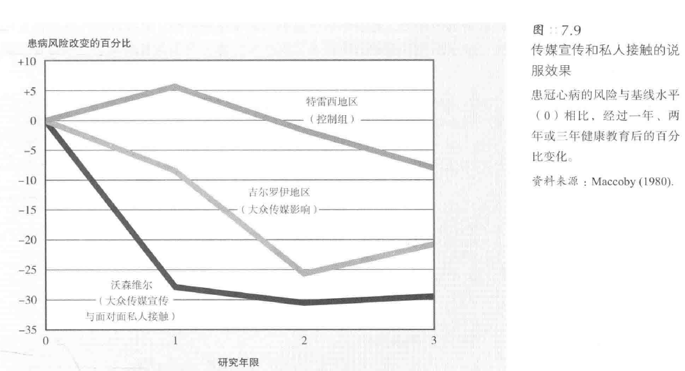
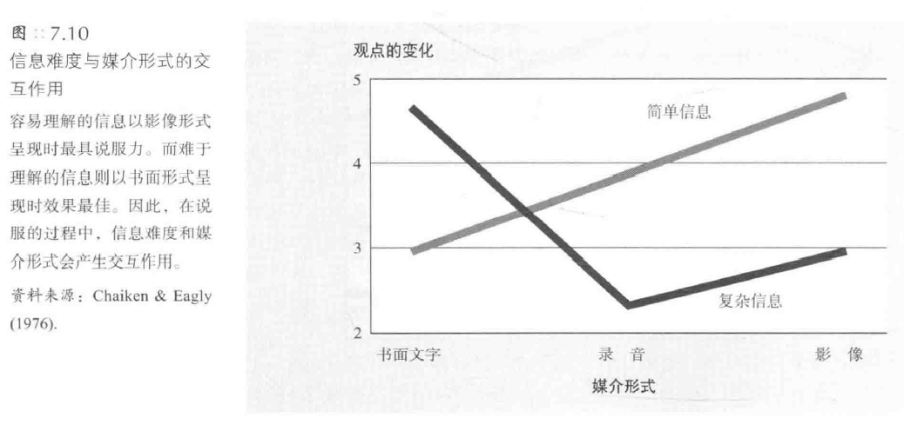
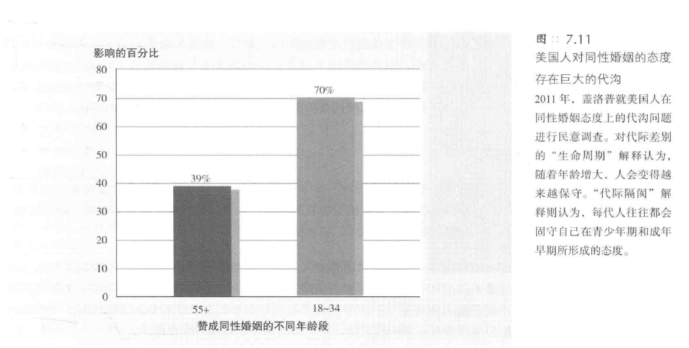
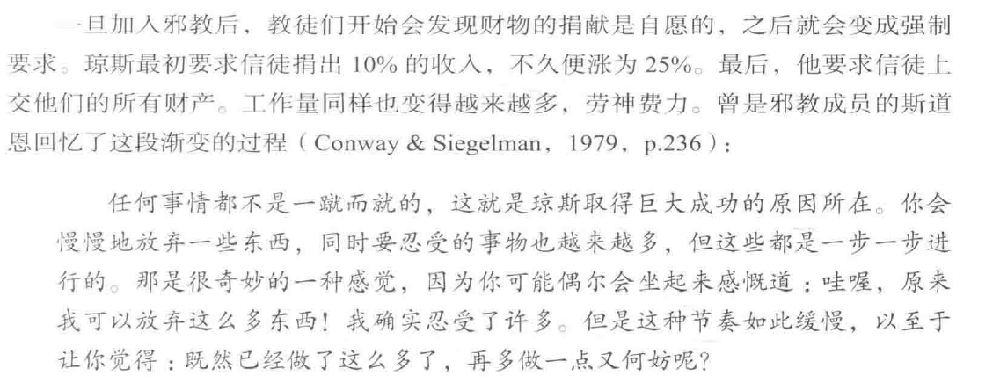
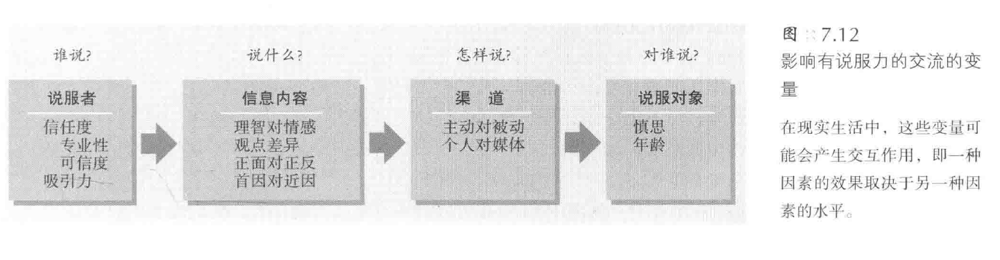
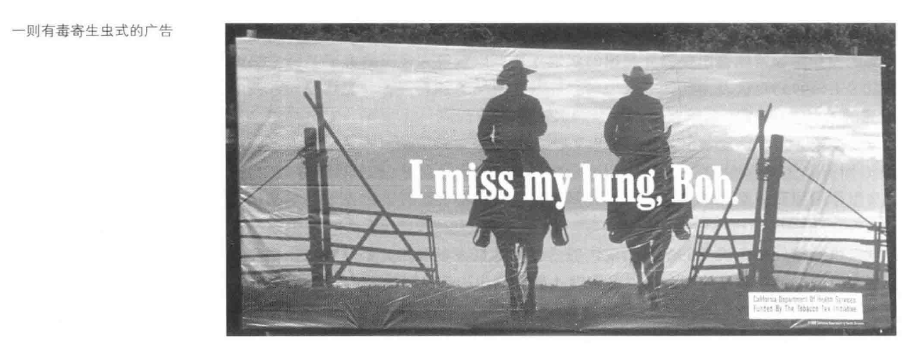

[TOC]
# 说服
* 说服的两种形式：
   - **蛊惑人心**：采用意险恶的手段进行说服
   - **教育启发**：基于事实和启发性的说服，较少使用强制手段
   - 通俗理解：根据个人信仰将说服分为“教育”和“蛊惑”
- 说服的**普遍存在**：
   - 说服在多个领域如政治、营销、求爱、教养、谈判、传教和庭审判决中的普遍存在
   - 社会心理学家探讨影响说服效果的因素和如何有效进行“教育”式的说服
- 社会心理学家对说服的研究：
   - 社会心理学家通过**实验**研究说服，类似于地质学家研究侵蚀
   - 通过**观察各种因素的影响**来理解说服的效果
   - 这些因素虽小，但能**在长时间内产生显著影响**，尤其对于不涉及核心价值观的中立态度更有效
## 说服的路径
- 人们**对信息的看法**影响说服效果：
   - 清晰易懂但含**不可信论据**的信息易被反驳
   - 提供**有力论据**的信息更易**获得认同和信服**
   - “认知反应”方式解释了某些情境下更易说服他人的原因
- 说服过程中的**障碍与增强因素**：
   - 说服要生效需清除若干障碍
   - 有助于清除障碍的因素能增强说服力
   - 吸引人注意的信息更有可能令人信服

### 中心路径
* **中心路径说服理论**（central route to persuasion）：
   - 提出两种主要的说服路径
   - 中心路径说服：积极主动、全面系统地思考问题，**关注有力论据**
   - 论据苍白无力时，思维缜密的人会**快速注意并反驳**
### 外周路径
*  **外周路径说服**的特点与应用：
   - 描述：在人们不能全神贯注或不愿深思的情况下，依赖于**外部线索和直观感受**来接受信息
   - 特点：不侧重于论据的合理性，而是通过**易于接受的表述和外部线索**来影响人们
   - 实例：熟悉和易懂的表述对于**心不在焉或不积极思考的人**更有影响力
* **广告行业**中的外周路径应用：
   - **消费行为**：很多消费行为是未经深思熟虑的，受到细微因素的影响
   - **商品广告**：依赖于视觉线索和感性因素，而非逻辑和证据
   - 例子：食品、饮料、烟草和服饰广告常使用外周视觉线索，而计算机广告则提供产品特点和价格信息

- **说服路径**与“**双加工**”模型：
   - 描述：两种说服路径（中心路径和外周路径）预示了人类心智的“双加工”模型
   - 中心路径：**迅速改变**人们的**外显态度**，依赖于有力的**论据和系统思考**
   - 外周路径：**缓慢建立内隐态度**，通过将态度目标与**情绪**反复关联来实现
### 不同目的选用不同路径
* 说服路径与行为改变的关系：
   - 目的：说服的最终目的是**改变人们的行为**，如购买商品或更有效的学习
   - **中心路径**：引起**更持久的行为变化**，因为人们基于深思熟虑和信息的说服力来做决策
- **外周路径**的效果与局限：
   - 描述：通常只能导致**肤浅和短暂的态度改变**
   - 例子1：禁欲教育能改变态度但很少有长期影响
   - 例子2：预防艾滋病教育更多地影响对避孕套的态度而非实际使用
   - 需求：态度和行为的改变需要人们**主动加工和反复推敲信念**
- **外周路径的常见应用**和**启发式策略**：
   - 描述：在**没有时间仔细分析问题**时，人们倾向于使用外周路径和启发式策略
   - 例子：在投票时依赖于简单的启发式策略，如信任朋友或专家的意见
   - **启发式策略**：一些简单而具有启发性的**经验法则**，包括“相信专家”或“长信息更可信”等
   - **说服者特点**：清晰流利、富有魅力、用意良善和论据充分能增强外周路径的说服效果
## 说服的要素
* 说服的主要要素：
   - 描述：包括**四个部分**，即说服者、说服内容、说服渠道和说服对象
   - 释义：即什么人用什么方法将什么信息传递给了谁
### 说服者：信息的传达方
* 社会心理学家的发现：
   - 描述：**信息的传达方**会影响接受方对信息的接受
   - 例子1：荷兰两党领袖在议会上用相同的话语表达观点，但各自的论点只对本党成员有影响
   - 例子2：南非前首相维沃尔德解释种族隔离制度时的言论“接受人与人之间存在差异"显示，说服者的身份和特点也会影响说服效果
#### 可信度（credibility）
* 信息源的**可信度和影响**
   - **可信度**定义：可知觉到的专业性和可靠性
   - **可信度的变化**：随时间的流逝，可靠信息源的影响可能减弱，而不太可靠的信息源的影响可能增强，即**睡眠者效应**（sleeper effect）
   - **睡眠者效应**（sleeper effect）：人们因遗忘信息源或其与信息的关系而产生的**延迟性说服**
##### 知觉到的专业性
* 如何成为可信的“专家”
   - **赞同对方观点**：使你看起来更睿智
   - **突出专家身份**：例如，詹姆斯博士介绍的牙刷比高中生吉米更可信
   - **信息源的可靠性**：可靠的信息源可以更有效地减少不良行为，如吸毒
   - **信心和魅力**：信心十足和有魅力的人更有说服力，直截了当的目击证词更可信，更有说服力
##### 知觉到的信赖性
* 说服者的**表达方式**
   - **目击者的表现**：直**视质问者**而非低头看地被认为更可信
   - **无意图的传达**：如果接受方认为传达方**没有努力说服的企图**，信赖度会增加
   - **真诚的表现**：站在**自身利益对立面**的说话者被认为是真诚的
   - **语速的影响**：**语速较快**的说服者被认为更专业、更有见地和更有说服力
-  **广告中的可信度表现**
   - **专业和信赖的人物形象**：如身穿白大褂的人在止疼药广告中
   - 广告的影响：受外周线索影响的人可能不会仔细分析论据，而是**简单推断产品的价值**
#### 吸引力与喜好
* **明星效应**与**吸引力**（attractiveness）
   - 明星推荐产品的影响：虽然**大多数人否认**会受影响，但实际上受影响的可能性**很大**
   - 明星的吸引力：利用明星的吸引力作为说服的一种手段
* **个人喜好的影响**
   - 个人喜好对回应的影响：更容易**对喜好的事物做出回应**
   - 个人喜好与说服路径：可以通过**中心路径说服**（central route persuasion）或**外周路径说服**（peripheral route persuasion）来影响人们的反应
   - 喜好引发的说服原则：与可信度一样，是一种有效的说服原则
- **吸引力的表现途径**
   - **外貌吸引力**：长相俊美的人在表述某些论点时具有更大的影响力
   - 吸引力在**肤浅判断**时的影响：在进行肤浅判断时，吸引力的影响最大
* **相似性的吸引力**
   - 相似性与喜好：我们**更喜欢与我们相似的人**，并**受他们的影响**
   - 相似性在广告中的应用：例如反吸烟运动利用青年偶像来质疑烟草公司的营销活动
   - 相似性在销售中的应用：例如销售人员模仿顾客的行为来增强影响力
   - 相似性在群体中的影响：例如来自同一群体的信息更容易得到好的回应
- **相似性与可信度的比较**
   - 相似性和可信度**在不同情境下的影响**：例如在购买油漆时，相似的普通顾客比专家更有影响力；而在讨论牙齿卫生时，专业的牙医比普通学生更有说服力
   - **未知因素的影响**：根据**说服主题的侧重点**，相似性和可信度的重要性会有所变化
   - 未知因素的**具体表现**：如果说服涉及**个体的品味或价值观**，**相似**的说服者更有影响力；如果是**判断事实**，**不相似**的人能提供更独立的判断，从而增强信心
### 说服内容：信息特点
* **针锋相对的问题**
   - **逻辑与情感的信息对比**：探讨纯逻辑信息和情感丰富的信息哪种更有说服力
   - **观点差异的影响**：比较相近的观点和截然相反的观点哪种更有说服力
   - **表达观点的策略**：是只表达自己的观点还是先接受对方观点再反驳
   - **发言顺序的影响**：在双方同时在场的情况下，先发言还是后发言哪种更有优势
#### 理智与情感
* **说服对象的特性**
   - **教育背景和分析能力**：**教育背景好和善于分析的人**更易接受**理性说服**
   - **主动性**：**有思想和积极参与**的人选择**中心路径**，对逻辑论点回应更好；**不感兴趣**的人选择**外周路径**（peripheral route），更易受到对说服者的喜好影响
- **选民参与度和投票倾向**
   - **选民参与度**：许多选民参与度不高，更易受情感反应影响
   - **投票倾向的预测**：可以通过选民对候选人的情感反应和对候选人特质的了解来预测投票倾向
- **态度形成**（attitude formation）的影响
   - **情感和理智**对态度形成的影响：情感影响下形成的态度更易受**情感诉求**影响，理智影响下形成的态度更易受**理性论证**影响
   - **新情感体验和信息**的影响：**新的情感体验**会影响基于情感的态度，而改变基于信息的态度则需要**更多新信息**
##### 好心情效应
* **好心情效应**：
  * 当心情**愉快**时，信息的**说服力**更强
* **实验研究**：
  * 贾尼斯等人发现：在享受花生和可乐的同时阅读信息，耶鲁大学的学生更容易被说服
  * 加利佐和亨德里克发现：有吉他伴奏的民歌比无伴奏的民歌对学生的说服力更强
  * 一队荷兰研究小组进行了实验，发现配有幽默漫画的广告产品更受喜爱
* **好心情的影响**：
  * 好心情可以增强说服力，因为它促进**积极思考**，并将好心情与信息联系在一起
  * 心情愉快的人会透过快乐的“**粉色眼镜**”看世界，但他们决策时**更冲动**，更**依赖外部线索**
  * 心情不好的人在做决策前会**更加深思熟虑**，不容易被没有说服力的论据影响
* **实际应用**：
  * 如果论证不够强，最好先为说服对象创造一个**轻松愉快的气氛**，这样他们可能对信息产生好感，而不会过多思考
##### 唤起恐惧效应
* **唤起恐惧效应**：
  * 能引发说服对象的**消极情绪**反应，增强说服效果
* **实验研究**：
  * 呈现**能唤起恐惧情绪的信息**，如吸烟的危害，对减少吸烟、刷牙、注射疫苗等有积极影响
  * 加拿大政府要求烟草厂商在香烟上**图示吸烟的危害**
  * 唤起恐惧的信息能促使人们进行**体检**，如乳房X光摄影检查
* **恐惧情绪的强度**：
  * 实验结果显示，通常恐惧程度**越高**，说服效果**越好**
  * 生动的“现实”广告，如货车卸下裹尸袋在烟草公司门前，有强烈的说服效果
  * 菲利普・莫里斯公司的理智广告效果不佳，而更生动、尖锐的广告能减少吸烟行为
* **恐惧信息的有效性**：
  * 既要让人们**害怕威胁的严重性和可能性**，又要让他们**知道解决之道并感到有能力实施**，这样的恐惧信息更有说服力
* **形象化的宣传**：
  * 利用人们的恐惧心理，如施特莱歇尔的《**先锋报**》利用未经证实的奇闻铁事，引起对犹太人的恐慌
  * 生动的故事可以也用在好的方面，如卢旺达的胡图族和图西族之间的种族灭绝冲突后听**广播肥皂剧**，促进了宽容
#### 观点差异
* **观点差异与说服**：
  * 当人们面对与自己**观点不同**的信息时，可能会产生**不适**，这种不适感可能促使他们**改变自己的观点**
* **观点差异的大小**：
  * 分歧**越大**，可能导致的改变也**越大**
  * 但**过大的分歧**可能导致说服者被视为有偏见、不客观，从而**减少其说服力**
* **信息来源的可靠性**：
  * 如果信息来源**非常可靠和权威**，那么与说服对象的立场差别很大的论点能**最大限度地改变**他人的观点

* **参与程度的影响**：
  * 如果说服对象**不太关心**某个话题，那么采取**极端立场**可能更有说服力
  * **深度卷入**的人**更难被说服**，他们可能只接受**与自己观点相近**的信息
  * 对于这些人，稍有差异的信息可能被视为激进和愚蠢
  * 需要**在已有信念的基础上建构信息**，以使那些顽固的人更容易接受
* **结论**：
  * 在尝试说服他人时，需要考虑观点差异的大小、信息来源的可靠性和说服对象的参与程度
#### 正面说服与正反说服
* **承认反对观点的双面性**：
  * 可能会使说服对象感到**疑惑**，削弱自己的观点
  * 也可能使说服对象觉得说服者**客观公正**，消除他们的戒心
* **正反两方面的信息的实验效果**：
  * 简单的正反两方面的信息能提高铝制罐头盒的回收率
  * 美国军方使用正反两方面的说服策略，确保士兵不会因德国投降而松懈
* **正反说服的效果取决于说服对象**：
  * 对已经**持赞成态度**的人，**正面说服**更有效
  * 对最初**持反对意见**的人，**正反两方面的说服**更有效
  * 如果人们**已经或将要了解反面观点**，正反两方面的论证效果**更持久**

* **应用**：
  * **被告**在原告之前提出不利于自己的证据，被告的辩护更可信
  * **政治候选人**面向见多识广的群体时，对反面观点作出回应是明智之举
* **说服的复杂性**：
  * 大多数变量的影响都很复杂，情境的变化可能会增强或削弱说服力
#### 首因对近因
* **首因效应与近因效应的定义**：
   - **首因效应**（primacy effect）：**最先呈现的信息**最具**说服力**，第一印象很重要
   - **近因效应**（recency effect）：我们对**最近的信息**记得更好，可能会对决策产生更大的影响
- **首因效应的实例**：
   - 描述同一个人的特质的顺序会影响对其的评价
   - 在猜测任务中，先猜对的人看起来更有能力
   - 在政治选举中，名单前面的候选人更受欢迎
   - 在模拟法庭中，先读到的证词会影响人们的判断
* **近因效应的实例**：
   - 米勒和坎贝尔的实验：学生在一周后阅读另一组民事诉讼文件的证词，近因效应出现，最新的证词影响了他们的判断
-  **首因效应与近因效应的条件**：
   - 当两种信息**有足够的时间间隔**和在接受第二种信息后**立即做决策**时，近因效应更为明显
   - 如果两种信息**连续呈现**并有**一段时间间隔**，首因效应更为明显
   - 如果第一种信息**引发了思考**，首因效应更为明显

- **事物呈现顺序对偏好的影响**：
   - 事物的呈现顺序会影响简单的偏好
   - 在多个实验中，人们更偏爱最先看到的目标
### 说服渠道
* **说服的渠道**：
   - 面对面的诉求
   - 书面标示或文件
   - 媒体广告
#### 主动参与或被动接受
* **书面文字的影响力**：
   - 校园活动通告
   - 路牌上的“小心驾驶”
   - 校园反对乱扔垃圾的通告

* **口头与书面诉求的对比**：
   - 口头诉求**不一定**总是比书面诉求更有说服力
   - 公众演讲者可能**高估了自己的话语力量**
   - 布道的实例显示，口头诉求**可能不会**改变人们的态度
* **被动接受的信息的效果**：
   - **有时有效**，如广告中的阿司匹林
   - **有时无效**，如反对乱扔垃圾的活动
   - **媒体的力量**在选举中的影响
   - **重复的信息**可能增加其可信度；甚至句子**押韵**也能增加流利度和可信度
* **被动说服的局限性**：
   - 在**小问题**上，如选择哪个牌子的阿司匹林，媒体的影响力较大
   - 在**重要和熟悉的问题**上，如战争态度，媒体的说服力较弱
* **主动经历与被动接受的对比**：
   - **主动的经历**会**强化人们的态度**
   - 基于经历的态度**更持久**，更不容易改变
   - 预防艾滋病的实例显示，**行为训练**比单纯的知识介绍更有效
#### 个人与传媒的影响
* **人际接触与传媒的对比**：
   - **人际接触**在说服中的作用往往**超过了传媒**
   - **现代营销策略**如“病毒式营销”和“播种营销”试图**利用人际影响力**
   - 例如，哈利·波特系列的成功部分归因于孩子们之间的**口耳相传**
* **人际影响的实验研究**：
   - 安阿伯市的政治说服研究显示，**面对面的劝说方式**比仅依赖传媒或邮件更有效
   - 在三组市民中，私人拜访的组有75%的人投了赞成票，而仅依赖传媒的组只有19%的人投了赞成票
* **冠心病预防的实验研究**：
   - 斯坦福大学的研究试图减少中年人冠心病的发病率
   - 特雷西地区的居民仅接受常规传媒，吉尔罗伊地区的居民接受了为期两年的媒体宣传，沃森维尔地区的居民既受传媒影响又有私人接触
   - 结果显示，沃森维尔地区的高危人群数量减少最明显，而特雷西地区的高危人群数量几乎未变

##### 媒体影响：两步流程
* **媒体的间接影响**：
   - 面对面的人际接触的影响力一般**比媒体大**，但媒体仍然是**重要的信息来源**
   - 影响我们看法的人，其思想往往**来源于媒体**
* **两步流程的沟通**（two-step flow of communication）：
   - 媒体的影响首先**作用于意见领袖**，然后再**由意见领袖影响普通大众**
   - 市场营销人员和政客通常试图**说服那些有影响力的人**，如意见领袖和潮流引导者
   - 意见领袖被视为**专业人士**，他们的建议和意见往往受到大众的信赖
* **意见领袖的影响**：
   - 医生在选择药物时，往往会参考他们社交圈子里的意见领袖的建议
   - 大型医药公司投入大量资金在意见领袖身上，因为他们知道意见领袖对销售量有很大的推动作用
* **媒体的微妙影响**：
   - 媒体对文化的影响是**微妙的**，慢慢渗透，逐层推进
   - 即使媒体对态度的直接影响很小，它仍然会产生**巨大的间接作用**
   - 例如，没有看过电视的儿童仍然会受到电视的间接影响，如模仿电视中的游戏或要求购买电视广告中的玩具
##### 媒体的比较
* **媒体形式与说服力**：
   - 不同的媒体形式具有**不同的说服效果**
   - 媒体形式**越贴近生活**，其传递的信息就**越有说服力**
   - 从强到弱的说服力排名是：**现场**（面对面人际接触）、**影像**、**录音**、**书面文字**
* **书面信息的优势**：
   - 虽然书面文字的**直接说服力**可能较弱，但其在**信息理解和回忆**方面的效果最好
   - 当信息**难以理解**时，书面表达的说服效果**最佳**，因为读者可以按照**自己的节奏**阅读
* **电视媒体的特点**：
   - 电视**控制了信息传递的节奏**，使观众成为较被动的接受者
   - 观众的注意力可能会从信息转移到**其他外围线索**，如主播的魅力
* **信息难度与媒体形式**：
   - 对于**难以理解的信息**，**书面**形式最具说服力
   - 对于**简单的信息**，**影像**形式的呈现效果最佳

### 说服对象：信息的接受方
#### 年龄与说服
* **年龄与社会政治态度**：
   - 人们的**社会和政治态度**与其**年龄**有关
   - **不同年龄段**的人持有**不同的社会和政治态度**

* **态度变化的解释**：
   - **生命周期**解释：随着年龄增长，人们的态度可能会发生变化，例如变得更为保守
   - **代际隔阂**解释：老年人的态度与其年轻时相似，但与当代年轻人的态度存在差异
* **态度的稳定性**：
   - 虽然年轻人的态度可能会发生变化，但一旦形成，这些态度通常会**持续到中年**
   - 人们在青少年和成年早期形成的观点和态度可能会**影响他们的一生**
* **重要事件的影响**：
   - 人们往往会记住在其**16-24岁期间发生的重大事件**，并认为这些事件是**历史的转折点**
   - 例如，那些在经济大萧条或二战期间处于这个年龄段的人会深刻记住这些事件
* **年龄与态度的变化**：
   - 虽然年纪大的人可能会**有所变通**，但他们的性观念和种族态度在**五六十岁时**可能会变得**更为开放**
   - **接近生命尽头的老年人**的态度可能会**再次变得容易改变**
#### 慎思与说服
* **中心路径说服的关键**：
   - 说服的效果不仅仅在于信息本身，而是**是否能激发接受者的积极思考**
   - 人的大脑不能接受所有信息，只有当信息**激发了有利的思考**时，才能实现说服
##### 避免打草惊蛇一一如果你不想遭人反驳，请勿引起对方警觉
* **避免引起反驳**：
   - 如果说服对象**预先知道**有人试图说服他们，他们可能会产生**反驳的心态**
   - 事先警告的人**不太可能改变他们的观点**，而未被警告的人则**更容易被说服**
##### 分心会减少反驳
* **分心对说服的影响**：
   - 当人们**受到干扰或分心**时，他们可能**无法反驳**，从而增强了言语的说服力
   - 政治广告常常通过**吸引观众的注意力**来避免他们仔细分析文字信息
   - 当说服信息**简单**时，分心的效果尤为明显
* **广告的效果与节目内容**：
   - 在某些情况下，特定的节目内容，如**暴力或色情**，可能会影响广告的效果
   - 观众可能**不太记得**或受到这些广告的影响
##### 不太投入的说服对象会使用外周线索
* **说服的两种路径**：
   - **中心路径**：系统性的思考，类似于穿越城区的干道
   - **外周路径**：利用启发式线索，类似于环城的高速公路
* **认知需求与选择路径**：
   - **善于思考**的人有**高认知需求**（need for cognition），偏好中心路径
   - **喜欢节省脑力资源**的人有**低认知需求**，更容易被外周线索所吸引
* **激发人们思考的方法**：
   - 使用**反问句**
   - 使用**多个演说者**
   - 使人们**感到有责任**传递和评价信息
   - **重复**信息
   - 吸引人们**集中注意力**
* **激发思考的效果**：
   - 激发思考可以**增强有说服力的信息的效果**
   - **使无说服力的信息更令人怀疑**
* **教育与说服**：
   - 最好的教师能够**鼓励学生积极思考**
   - 教师可以通过提出问题、举例和挑战学生来**建立中心路径的说服**
* **实际应用**：
   - 在政治竞选中，有效的说服者会使用反问句来激发选民的思考
   - 引导人们选择中心路径可以增强说服的效果
## 极端说服：邪教的洗脑方法
* **邪教的极端行为**：
   - 马修·阿普尔怀特及其信徒认为可以**通过自杀搭乘飞碟前往天堂**
   - 在圣卡西米尔的爆炸中，5人死亡，他们是**太阳神教徒**
* **人们加入邪教的原因**：
   - 是否是因为他们的**奇特人格**
   - 是否是**社会影响和说服作用的正常动态变化**
* **信仰的解释与辩护**：
   - **解释信仰的原因**并不等于**证明信仰的正确性**
   - 人们的信仰受到他们的受教养和成长方式的影响
* **近代邪教的例子**：
   - 文鲜明的**统一教团**：混合了基督教、反共思想和对自己的赞颂
   - 琼斯的**人民圣殿教**：914名信徒在圭亚那集体自杀
   - 科瑞什的**大卫分支教**：信徒交出财产，科瑞什与信徒的妻子和女儿发生关系
   - 阿普尔怀特的**天堂之门**：信徒通过阉割追求宗教虔诚，与家庭断绝关系并承诺用飞船拯救他们
* **邪教背后的心理因素**：
   - 是否可以归咎于受害者的**性格特质**
   - 是否是我们熟悉的从众、顺从、失调、说服和**群体影响的原理**
### 态度依从行为
* **邪教的策略**：
   - 人们通常会内化自主、公开和反复的承诺
   - 邪教领导者利用这一点来吸引和控制成员
#### 顺从导致了接纳
* **顺从与接纳**：
   - 新加入的成员很快会被要求**在组织内活跃**
   - **典礼、仪式和公开活动**增强了新成员的**认同感**
   - 人们逐渐**相信自己所经历的事情**，从而成为邪教的忠实拥护者
#### 登门槛现象
* **登门槛现象**：
   - 人们**很少会突然决定**加入邪教
   - 邪教的征募策略是**逐步的**，从简单的活动开始，逐渐增加要求
   - 一旦加入，教徒们会发现**要求逐渐增加**，从财物捐献到工作量
- **逐渐的变化**：
   - 一开始的要求和活动**相对简单和自愿**
   - 随着时间的推移，要求逐渐增加，变得**更为严格和强制**
   - 这种变化是**缓慢的**，使得成员逐渐适应并接受更高的要求

### 邪教说服的因素

#### 说服者
* **说服者的特点**：
   - 邪教群体通常有一个**魅力超凡的领导者**
   - 领导者在教徒心中是**专家和值得信赖的人**
   - 利用**各种策略**建立自己的信誉，如“读心术”
   - **轻信的人**更容易被说服，中产阶级的白人青年更容易受骗
#### 说服信息
*  **说服信息的特点**：
   - 提供**生动、感性的信息**
   - 提供**群体的温暖和包容感**
   - 信息通过**各种渠道**传达，如演讲、小组讨论等
#### 说服对象
- **说服对象的特点**：
   - 新成员通常年轻，**思想开放**，态度和价值观不稳定
   - 有些人**受教育程度低**，有些则是**受过教育的中产阶级**
   - 可能的加入者正处于人生的转折点或面临**个人危机**
   - **社会和经济的剧变**为邪教提供了吸引人的机会
- **特定环境和情境**：
   - 在中东地区和其他地方，**自杀炸弹袭击者**通常是年轻人
   - 他们受到权威的、有宗教导向的说服者的影响
   - 为了克服求生的意愿，他们会做出**公开承诺**
   - 这通常发生在**小团体**中，**群体影响**会加强对敌人的憎恨
### 群体效应
* **群体效应的影响**：
   - 邪教通过**群体效应**塑造其成员的观点和行为
   - 成员与外部社会支持**系统分离**，增强群体内部的联系
   - **社会内爆现象**：外部联系减弱，群体的社会性作用完全指向内部
* **邪教的社会孤立策略**：
   - 邪教切断新成员与外部的联系，使其感觉**孤立无援**
   - 新成员为群体的利益**投入时间**，遵从群体的要求
   - 群体为新成员**提供认同感**，混淆事实，消除怀疑
* **邪教的说服与控制策略**：
   - 利用增强行为的**忠诚度、说服和群体孤立**的方法
   - 有时会使用**胁迫、暴力和药物**来控制成员
* **群体效应的其他应用**：
   - 兄弟会、妇女联谊会、自助组织和心理治疗中也存在群体效应
   - 这些组织形成强凝聚力的“**社会茧子**”，对成员产生深刻影响
* **说服的双重性质**：
   - 说服可以用于**启发或欺骗他人**
   - 说服本身**没有本质的善恶**，其效果取决于**运用的目的和方法**
## 抵制邪教说服的方法
* **抵制说服的重要性**：
   - 武术教练教授防守技巧与进攻技巧同等重要
   - 研究者更关注进攻型说服而忽略了**防御型说服**
- **说服过程的自然性**：
   - 人们更容易**接受有说服力的信息**而不是怀疑它
   - 理解一个观点意味着**至少暂时地相信它**
* **逻辑推理与信息搜寻**：
   - 通过**逻辑推理和信息搜寻**可以抵制谬误和谎言
   - 反思对权威的习惯性反应，**对不明白的事情提出质疑**
### 加强个人承诺
* **加强个人承诺**：
   - 在他人劝说之前**公开表态**可以增强个人对自己观点的信念
   - **公开表达的坚定立场**可能导致审判过程陷入僵局
#### 挑战信念
* **挑战与加强信念**：
   - 对方对自己**温和的攻击**可以使人们**更坚定自己的观点**
   - **辩论中的争论**可能导致双方观点**走向极端**
#### 引发反驳
* **引发反驳与态度免疫**：
   - **温和的攻击**可以引发**反驳**，从而形成对该观点的**态度免疫**（attitude inoculation），为**更强烈的反击**做好准备
   - **有效的免疫**应**激起防御但不摧毁防御系统**
* **抵制说服的策略**：
   - 抵制说服会**消耗个体的自我控制能量**
   - 对方**适当的反驳**是抵制说服的有效方法
   - 利用“**有毒寄生者**”（强有力的反驳+唤起式记忆线索）式的反驳策略可以增强反驳效果

### 现实生活中的应用：免疫工程
#### 给孩子免疫以抵制吸烟的同伴压力
* **抵制吸烟的同伴压力**
  - 德克萨斯大学研究小组对中学七年级学生进行“态度免疫”，教育他们对抗吸烟广告的影响
  - 学生们通过角色扮演游戏学习如何回应同伴的吸烟压力
  - 经过持续的活动，接受“免疫”的学生吸烟率显著降低
#### 给孩子免疫以抵制广告的诱惑
* **抵制广告的诱惑**
  - 许多国家对儿童广告进行了严格限制
  - 美国儿童每年会看到大量的商业广告，这对他们的消费观念产生影响
  - 研究显示，儿童很难分辨电视节目和广告，容易受到广告的影响
  - 为了减少广告的影响，研究者探讨如何使儿童对电视广告产生免疫力
  - 加州大学洛杉矶分校的研究小组对小学生进行广告分析课，帮助他们建立对广告的现实理解
  - 为了更好地保护消费者，有人提议在学校里禁止广告，不针对8岁以下的儿童做广告，不在电影和电视节目中播放针对儿童和青少年的商品广告
* **消费者权益保护**
  - 消费者权益保护者担心，仅仅预防可能还不够充分
  - 广告商会采取各种策略，如将商品放在商店较低的货架上，吸引孩子的注意
  - 母亲应对广告商组织提出了一系列要求，如不在学校里做广告，不针对8岁以下儿童做广告，不在电影和电视节目中播放针对儿童和青少年的商品广告等
### 态度免疫的意义
* **态度免疫的概念**：
   - 抵制洗脑的方法**不是加强当前信念的灌输**
   - 父母应教育孩子**了解并抵制邪教的诱惑**：
   - 在教堂和学校里应**避免**建立“无菌意识形态环境”
   - 能**接触到多种观点的人**有更强的辨别能力
* **邪教的策略**：
   - 邪教**提前警告**成员外界会攻击其思想
   - 成员在挑战出现时已**做好反驳准备**
* **说服的效果与风险**：
   - **低效的说服**可能导致**反效果**
   - **拒绝某种说服**可能**增强个体对该观点的信念**
   - **之前拒绝过的劝说**可能导致**对后续劝说产生免疫**
* **实验案例**：
   - 学生们拒绝写支持严格限制着装的文章，即使有报酬
   - 拒绝后，学生们的观点变得**更加坚定和极端**