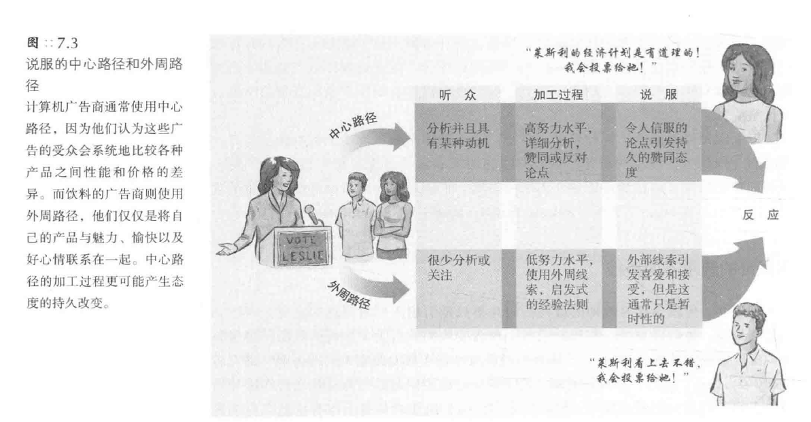

[TOC]
# 说服
* 说服的两种形式：
   - **蛊惑人心**：采用意险恶的手段进行说服
   - **教育启发**：基于事实和启发性的说服，较少使用强制手段
   - 通俗理解：根据个人信仰将说服分为“教育”和“蛊惑”
- 说服的**普遍存在**：
   - 说服在多个领域如政治、营销、求爱、教养、谈判、传教和庭审判决中的普遍存在
   - 社会心理学家探讨影响说服效果的因素和如何有效进行“教育”式的说服
- 社会心理学家对说服的研究：
   - 社会心理学家通过**实验**研究说服，类似于地质学家研究侵蚀
   - 通过**观察各种因素的影响**来理解说服的效果
   - 这些因素虽小，但能**在长时间内产生显著影响**，尤其对于不涉及核心价值观的中立态度更有效
## 说服的路径
- 人们**对信息的看法**影响说服效果：
   - 清晰易懂但含**不可信论据**的信息易被反驳
   - 提供**有力论据**的信息更易**获得认同和信服**
   - “认知反应”方式解释了某些情境下更易说服他人的原因
- 说服过程中的**障碍与增强因素**：
   - 说服要生效需清除若干障碍
   - 有助于清除障碍的因素能增强说服力
   - 吸引人注意的信息更有可能令人信服

### 中心路径
* **中心路径说服理论**（central route to persuasion）：
   - 提出两种主要的说服路径
   - 中心路径说服：积极主动、全面系统地思考问题，**关注有力论据**
   - 论据苍白无力时，思维缜密的人会**快速注意并反驳**
### 外周路径
*  **外周路径说服**的特点与应用：
   - 描述：在人们不能全神贯注或不愿深思的情况下，依赖于**外部线索和直观感受**来接受信息
   - 特点：不侧重于论据的合理性，而是通过**易于接受的表述和外部线索**来影响人们
   - 实例：熟悉和易懂的表述对于**心不在焉或不积极思考的人**更有影响力
* **广告行业**中的外周路径应用：
   - **消费行为**：很多消费行为是未经深思熟虑的，受到细微因素的影响
   - **商品广告**：依赖于视觉线索和感性因素，而非逻辑和证据
   - 例子：食品、饮料、烟草和服饰广告常使用外周视觉线索，而计算机广告则提供产品特点和价格信息

- **说服路径**与“**双加工**”模型：
   - 描述：两种说服路径（中心路径和外周路径）预示了人类心智的“双加工”模型
   - 中心路径：**迅速改变**人们的**外显态度**，依赖于有力的**论据和系统思考**
   - 外周路径：**缓慢建立内隐态度**，通过将态度目标与**情绪**反复关联来实现
### 不同目的选用不同路径
* 说服路径与行为改变的关系：
   - 目的：说服的最终目的是**改变人们的行为**，如购买商品或更有效的学习
   - **中心路径**：引起**更持久的行为变化**，因为人们基于深思熟虑和信息的说服力来做决策
- **外周路径**的效果与局限：
   - 描述：通常只能导致**肤浅和短暂的态度改变**
   - 例子1：禁欲教育能改变态度但很少有长期影响
   - 例子2：预防艾滋病教育更多地影响对避孕套的态度而非实际使用
   - 需求：态度和行为的改变需要人们**主动加工和反复推敲信念**
- **外周路径的常见应用**和**启发式策略**：
   - 描述：在**没有时间仔细分析问题**时，人们倾向于使用外周路径和启发式策略
   - 例子：在投票时依赖于简单的启发式策略，如信任朋友或专家的意见
   - **启发式策略**：一些简单而具有启发性的**经验法则**，包括“相信专家”或“长信息更可信”等
   - **说服者特点**：清晰流利、富有魅力、用意良善和论据充分能增强外周路径的说服效果
## 说服的要素
* 说服的主要要素：
   - 描述：包括**四个部分**，即说服者、说服内容、说服渠道和说服对象
   - 释义：即什么人用什么方法将什么信息传递给了谁
### 说服者：信息的传达方
* 社会心理学家的发现：
   - 描述：**信息的传达方**会影响接受方对信息的接受
   - 例子1：荷兰两党领袖在议会上用相同的话语表达观点，但各自的论点只对本党成员有影响
   - 例子2：南非前首相维沃尔德解释种族隔离制度时的言论“接受人与人之间存在差异"显示，说服者的身份和特点也会影响说服效果
#### 可信度（credibility）
* 信息源的**可信度和影响**
   - **可信度**定义：可知觉到的专业性和可靠性
   - **可信度的变化**：随时间的流逝，可靠信息源的影响可能减弱，而不太可靠的信息源的影响可能增强，即**睡眠者效应**（sleeper effect）
   - **睡眠者效应**（sleeper effect）：人们因遗忘信息源或其与信息的关系而产生的**延迟性说服**
##### 知觉到的专业性
* 如何成为可信的“专家”
   - **赞同对方观点**：使你看起来更睿智
   - **突出专家身份**：例如，詹姆斯博士介绍的牙刷比高中生吉米更可信
   - **信息源的可靠性**：可靠的信息源可以更有效地减少不良行为，如吸毒
   - **信心和魅力**：信心十足和有魅力的人更有说服力，直截了当的目击证词更可信，更有说服力
##### 知觉到的信赖性
* 说服者的**表达方式**
   - **目击者的表现**：直**视质问者**而非低头看地被认为更可信
   - **无意图的传达**：如果接受方认为传达方**没有努力说服的企图**，信赖度会增加
   - **真诚的表现**：站在**自身利益对立面**的说话者被认为是真诚的
   - **语速的影响**：**语速较快**的说服者被认为更专业、更有见地和更有说服力
-  **广告中的可信度表现**
   - **专业和信赖的人物形象**：如身穿白大褂的人在止疼药广告中
   - 广告的影响：受外周线索影响的人可能不会仔细分析论据，而是**简单推断产品的价值**
#### 吸引力与喜好
* **明星效应**与**吸引力**（attractiveness）
   - 明星推荐产品的影响：虽然**大多数人否认**会受影响，但实际上受影响的可能性**很大**
   - 明星的吸引力：利用明星的吸引力作为说服的一种手段
* **个人喜好的影响**
   - 个人喜好对回应的影响：更容易**对喜好的事物做出回应**
   - 个人喜好与说服路径：可以通过**中心路径说服**（central route persuasion）或**外周路径说服**（peripheral route persuasion）来影响人们的反应
   - 喜好引发的说服原则：与可信度一样，是一种有效的说服原则
- **吸引力的表现途径**
   - **外貌吸引力**：长相俊美的人在表述某些论点时具有更大的影响力
   - 吸引力在**肤浅判断**时的影响：在进行肤浅判断时，吸引力的影响最大
* **相似性的吸引力**
   - 相似性与喜好：我们**更喜欢与我们相似的人**，并**受他们的影响**
   - 相似性在广告中的应用：例如反吸烟运动利用青年偶像来质疑烟草公司的营销活动
   - 相似性在销售中的应用：例如销售人员模仿顾客的行为来增强影响力
   - 相似性在群体中的影响：例如来自同一群体的信息更容易得到好的回应
- **相似性与可信度的比较**
   - 相似性和可信度**在不同情境下的影响**：例如在购买油漆时，相似的普通顾客比专家更有影响力；而在讨论牙齿卫生时，专业的牙医比普通学生更有说服力
   - **未知因素的影响**：根据**说服主题的侧重点**，相似性和可信度的重要性会有所变化
   - 未知因素的**具体表现**：如果说服涉及**个体的品味或价值观**，**相似**的说服者更有影响力；如果是**判断事实**，**不相似**的人能提供更独立的判断，从而增强信心
### 说服内容：信息特点
* **针锋相对的问题**
   - **逻辑与情感的信息对比**：探讨纯逻辑信息和情感丰富的信息哪种更有说服力
   - **观点差异的影响**：比较相近的观点和截然相反的观点哪种更有说服力
   - **表达观点的策略**：是只表达自己的观点还是先接受对方观点再反驳
   - **发言顺序的影响**：在双方同时在场的情况下，先发言还是后发言哪种更有优势
#### 理智与情感
* **说服对象的特性**
   - **教育背景和分析能力**：**教育背景好和善于分析的人**更易接受**理性说服**
   - **主动性**：**有思想和积极参与**的人选择**中心路径**，对逻辑论点回应更好；**不感兴趣**的人选择**外周路径**（peripheral route），更易受到对说服者的喜好影响
- **选民参与度和投票倾向**
   - **选民参与度**：许多选民参与度不高，更易受情感反应影响
   - **投票倾向的预测**：可以通过选民对候选人的情感反应和对候选人特质的了解来预测投票倾向
- **态度形成**（attitude formation）的影响
   - **情感和理智**对态度形成的影响：情感影响下形成的态度更易受**情感诉求**影响，理智影响下形成的态度更易受**理性论证**影响
   - **新情感体验和信息**的影响：**新的情感体验**会影响基于情感的态度，而改变基于信息的态度则需要**更多新信息**
