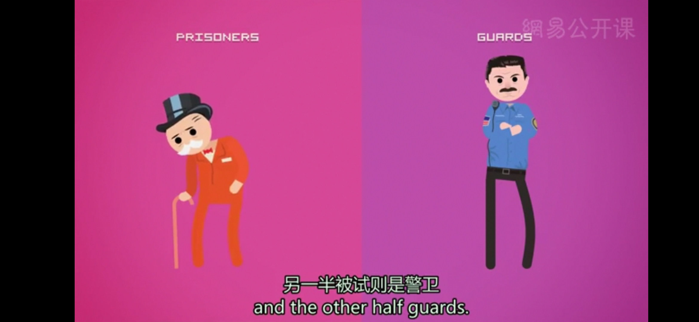

# 社会思维
* **社会心理学**：致力于研究情境的力量，研究我们在特定的情境下如何思考，如何影响他人，如何与他人联系
  *  社会心理学不仅能够带给我们所需的方法和手段来理解他人为何做出残忍的行为，它同样还能帮助我们理解，为什么我们有时候会做出英雄的壮举
* **社会思维**（Social Thinking）
  * **归因理论**（Attribution Theory）：奥地利心理学家弗里茨·海德在1920年左右提出，认为我们能够对他人的行为进行解释，通常将他们的行为归因于他们的**性格**，或是归因于他们当时所处的**情境**，并且我们对他人行为的归因要么是前者，要么就是后者
    * 高估人格因素的力量，同时低估情境的力量的现象，叫做**基本归因错误**（Fundamental Attribution Error），这种错误趋势能严重地扭曲你对其他人的意见和看法，从而导致草率错误的判断
  * **有效说服的双过程理论**
    * **中央说服路径**（Central Route Persuasion）：唤起他人的思考和推理来进行说服；当人们对内容感兴趣，并关注于观点的支撑证据时，会容易被信息本身合乎逻辑的内容说服
    * **周边说服路径**（Peripheral Route Persuasion）：指通过额外的线索对他人进行说服，比如讲话者的外貌吸引力，或是他与你的关系，这其中并不涉及严谨的深思熟虑，更多是一种直觉反应
    * 行为反过来也会影响我们的态度；如果你在实际上很悲伤的时候努力微笑，强颜欢笑的动作本身会逐渐调整你的态度，直到你的心情真正变好
  * **登门槛效应**（Foot-in-the-door Phenomenon）：人们倾向于更容易接受一个相对更大的要求，在他们已经答应了一个相对较小的、无伤大雅的要求之后
  * **斯坦福监狱实验**： 道德的行为确实会巩固道德的信念，就像不道德的行为会巩固不道德的态度那样
    *  所有这些负面情绪和残忍行为都是情境性的，而这个事实强调了一个重要的概念，那就是**特定的情境力量**能够轻而易举地凌驾于个体的人格差异之上

 * **认知失调理论**（Cognitive Dissonance）：我们会体验到不舒服、不协调，当我们的思想、信念或行为之间出现不一致时，简单来说，我们不喜欢让自己感到矛盾和困惑（布鲁诺一般被认为是一个性情温和的人，但有一天他在一次小型车祸中揍了自己的朋友一拳）
   * 我们会设法减轻这种不适感，通过**调整自己的观念**（看来，归根结底我并不是一个很善良的人），从而使自己的信念变得与他的所作所为保持一致，也可能会缓解这种内部冲突，通过**改变自己对于当时情境的看法**（他那天心情很不好，而那辆车又是他妈妈的新车，或者他的朋友实在很可恶，简直讨打）
---
[Crash Course](https://www.bilibili.com/video/BV1Ax411N75Q?p=38)