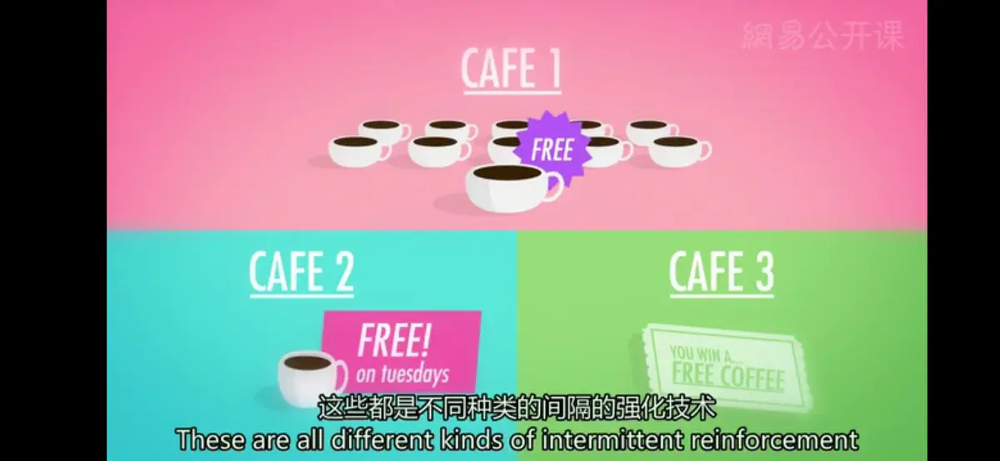

# 行为主义学习方式
* **行为主义**（Behaviorism）
  * **定义**：将心理看作一门严谨的，以实证分析为手段的科学，研究人们可观察的行为表现，而不是那些无法观测到的内部心理过程
  * **代表人物**：伊凡·巴甫洛夫、B·F·斯金纳、约翰·B·华生
* **伊凡·巴甫洛夫**：1849年出生于俄罗斯，在放弃了最开始想成为一名和父亲一样的俄罗斯东正教牧师的愿望之后转而学习医学，并获得学位，花了将近20年研究消化系统；50多岁时，他获得了俄罗斯人的第一个诺贝尔奖，由于他的出色研究拓宽了我们对胃的工作机制的理解
---
* **学习**：通过经验（或其他方式）获得一种崭新的、相对持久的信息或行为的过程
* **联想学习**（Associative Learning）
  * **定义**：在条件作用过程中将特定的事件，行为或刺激联系起来；这大概是大脑可以做到的最基础的学习形式，动物也能做到
  * **分类**
    * **经典条件作用**（巴普洛夫条件作用/条件反射）（Classical Conditioning）：建立刺激间的联系
      * **著名实验**：
        * 巴甫洛夫先向狗呈现肉粉饲料，使狗开始流口水；随后再呈现不同的**中性刺激**（Neutral Stimulus），也就是通常不会让你流口水的东西；然后观察到，在数次将饲料和中性刺激配对之后，狗会开始变得在接受中性刺激之后流口水，即使环境中并没有真正会让他们流口水的肉粉饲料
        * 华生对一位叫做“小艾尔伯特”的男孩使用了条件作用，通过一遍又一遍地将老鼠和巨大的骇人的噪音配对呈现，来让他害怕白鼠，从而证明了，孩子的恐惧可以培养；这个实验在今天显然是被禁止的
      * **步骤**
        1. **非（无）条件刺激**（食物）→→流口水（**非（无）条件反射或者自然反射**）  
       **中性刺激**（铃声）→→**无**
        1. **习得**（行为获得，Aqusition）：**非条件刺激**＋**中性刺激**→→流口水
        2. **中性刺激**（现**条件刺激**）→→流口水（**条件反射**）
      * **意义**：展示了学习这种加工过程可以通过对行为的直接观察来进行研究，而无需“唯心主义”的概念；新的条件刺激可能撤销过去旧的条件刺激，从而获得治疗
    * **操作性条件作用**（Operant Conditioning）：建立我们自身的行为和结果的联系
      * **著名实验**
        * “斯金纳箱”，一个封闭的空间，里面有压杆或者按钮。动物可以通过按压杆和按钮来得到一些奖励，通常来说是食物，箱子中还有记录动物反应的装置
      * **原理**：受到强化或者奖励时，行为表现会增加；受到惩罚时，行为表现会减少
      * **行为塑造**（behavior shaping）：通过强化手段，矫正人的行为，使之逐渐接近某种适应性行为模式的强化治疗手段
        * **过程**：连续接近，即在一系列朝着所期望的行为的方向产生的**连续接近行为**（Successive Approximations）中，仅仅在做出你想要的行为时给予奖励
---
* **正强化**（Positive Reinforcement）：在所期望的行为发生之后给予奖励来促进这个反应
* **负强化**（Negative Reinforcement）：通过移除厌恶的或者让人难受的刺激来增加行为出现的频率
   * 负强化并不是**惩罚**；惩罚的目的是减少行为出现的频率，不管是正向的或者是负向的，但是负强化是通过移除惩罚性的事件来增加行为出现的频率（例如通过消除恐怖的哔哔声强化安全带意识）
* **初级强化物**（一级强化物，Primary Reinforcer）：不需要学习，单纯地满足先天的生理需求；如饼干
* **条件强化物**（二级强化物，Conditioned Reinforcer）：只有在同初级强化物产生联系时才会起作用；如薪水
* **强化程式**（强化程序，Reinforcement Schedule）：因为强化物的种类有很多，强化程式也有许多种类
  * **连续的强化**：例如箱子里的老鼠，它们每一次按压杆时都会获得食物，所以它们很快就学会这个动作；但如果有一天按压杆后没有食物，这个联系会很快减少，老鼠会停止按压杆，这个过程叫做**消退**（Extinction）
  * **间隔的强化**（Partial /Intermittent Reinforcement）：例如现实生活，在这种条件下学习需要花更长的时间，但长远的来说，行为保持的要更好，也更不容易产生消退

---
[Crash Course](https://www.bilibili.com/video/BV1Ax411N75Q?p=12)