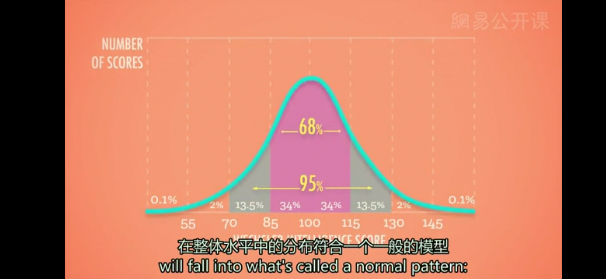
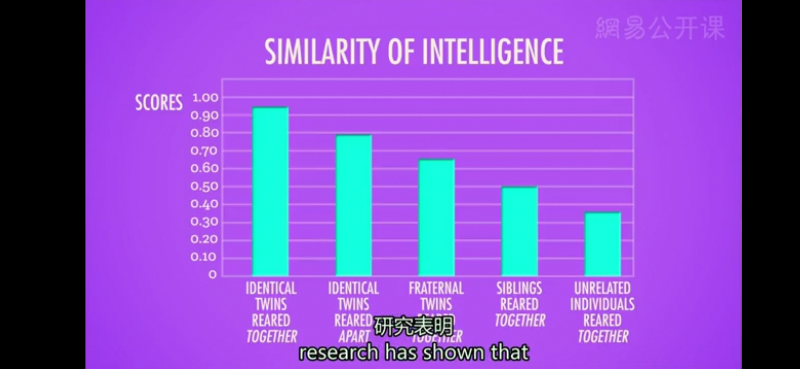
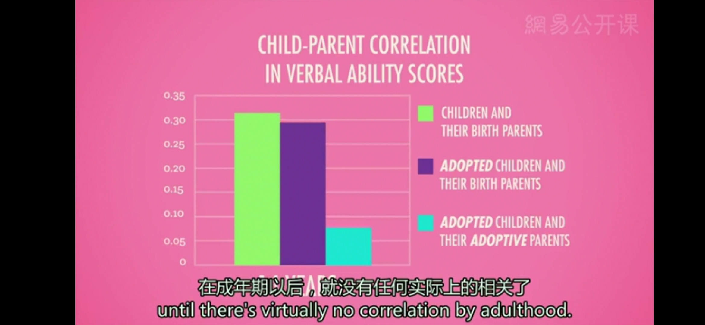

# 认知测验
* **韦克斯勒成人智力测验**（Wechsler Adult Intelligence Scale，**WAIS**）和**韦克斯勒儿童智力测验**（**WISC**）：最初由心理学家大卫·韦克斯勒在1955年编制发行。韦克斯勒现在的版本包含15种不同的子测验，测量内容包括词汇理解、物体和概念之间的相似点、以及字母和数字的规律
* **认知测验**：通常分为两类，一是**成就测验**（Achievement Test），即反映学习和知识掌握情况的测验；二是**能力测验**（Aptitude Test），即判断是否具有某种潜力或能力倾向的测验
  * 例如，WAIS和WISC都是能力测验，你在学校所接受的数学期末测验是成就测验
---
**测验标准**
  * **标准化**（Standardized）：结果具有可比较性
    * 为了使测量结果能够进行比较，我们首先要对具有代表性的样本群体进行**施测**，从而得到具有代表性的标准结果，使得以后的测验可以与之比较
    * **正态分布**（Bell-Curve）：通常假设你测量的每个人在整体水平中的分布符合一个一般的模型，大多数人的得分会落在中间的区域，少数人的得分会落在两个极端

    * 智力测验的主要目的正是要有效地测量这一部分极端值，这能够帮助教育者识别有特殊天赋的学生，还能有效地帮助医生进行临床诊断，识别出那些可能具有某方面特殊障碍的人
  * **信度**（Reliability）：测验总是能得到稳定一致的结果
    * 研究信度的一个方法就是让同一批被试把相同的测验做两遍，或者做同一个测验的另一版本；如果两次测验的结果比较接近，得分具有较高的**相关性**（Correlate），那么这个测验的信度就比较高
  * **效度**（Validity）：测验能够测量出其目标品质的程度
    * **预测/校标效度**（Predictive/Criterion Validity）：测验对预测某种行为的有效性程度，其效标资料需过一段时间才能取得（如果我做WAIS智力测验，测验分数能够准确地预测出我以后在大学里的表现）
    * **结构效度**（Construct Validity）：是指实验与理论之间的一致性，即实验是否真正测量到假设（构造）的理论（如果我的测验成绩和我在另一个测量同样品质的认知测验中的成绩具有强相关性，比如斯坦福比奈测验）
---
**对测验分数进行解释**
* **基因的作用**
  * 研究表明，被一起抚养长大的同卵双生子智力测验分数的相关性比其他任何群体都要高，只有50%共同基因的异卵双生子智力测验分数的相关性比同卵双生子要低得多，即使他们从小生活在同一个家庭中

  * 同样，神经影像学研究表明，一些特定的脑区，比如那些和言语有关的部位，在同卵双生子中具有结构性的相似，当进行同样的心理任务时，他们脑区的活动也是相似的；在同一个家庭中成长的异卵双生子有一些脑区的活动十分相似，其他部位则不太一样，但一起长大的同卵双生子大脑结构几乎一样，至少根据神经影像来看是这样
  * 这种智力的相关随着年龄的增长还在逐渐升高，从童年中期就开始增加，到青春期、过渡期，在成年期以后仍然在持续增加
  * 随着收养儿童的不断长大，他们与收养家庭中的成员心智上的共同点实际上随着时间在逐渐减少，在成年期以后就没有任何实际上的相关了；相反，他们在心理能力等方面的倾向随着时间和亲生父母变得更接近，即使他们从未见过面

* **环境的作用**
  * 美国心理学家J.米克维克·亨特在1970年左右在一所贫穷的伊朗孤儿院做研究，基本上，孩子们成长的过程中没有任何看护者耐心的教导，他们的行为也没有产生任何相应的后果和回应。结果就是他们不会与人进行沟通，没有适宜的环境刺激或来自他人的回应，环境的剥夺碾轧了一切可能的先天智力
  * 所以，亨特训练孤儿院的看护者们与婴儿进行真正的交流，让他们教小宝宝学习发出声音，做出动作，最后教给孩子们当地语言的发音和单词；孩子们开始非常快地学会新东西，简直活了过来，充满生机
  * 尽管这是一个极端的例子，亨特的研究表明童年早期的智力是具有丰富的可塑性的，特别是对于那些处于恶劣和压力环境中的儿童
* **测验偏差**（Testing Bias）：基本上，如果一个测验所测量出的结果差异是由文化经历或社会因素所导致，与我们所说的“先天智力”无关，那么你就可以说这个实验是有偏差的
  * 问题本身就可以使测验结果出现偏差（贫穷乡村的儿童可能非常聪明，但他的测验成绩可能会很低，如果测验中的问题涉及到城镇、更高阶层的生活概念）
  * 监考者带来的测验偏差（女性在监考官同为女性时测验结果要更好；非洲裔美国人的得分通常会更高，如果他们测验时的指导者也是非洲裔美国人）
  * 受测者自身期望的影响：**刻板印象威胁**（Stereotype Threat），最早由社会心理学家克劳德·斯蒂尔和约书亚·艾伦森提出，对被试自我实现意图的干扰，这种不经意间表露出的消极的刻板印象会影响被试的表现
---
[Crash Course](https://www.bilibili.com/video/BV1Zs411c7W6?p=25)