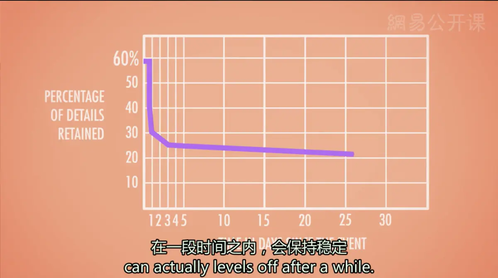
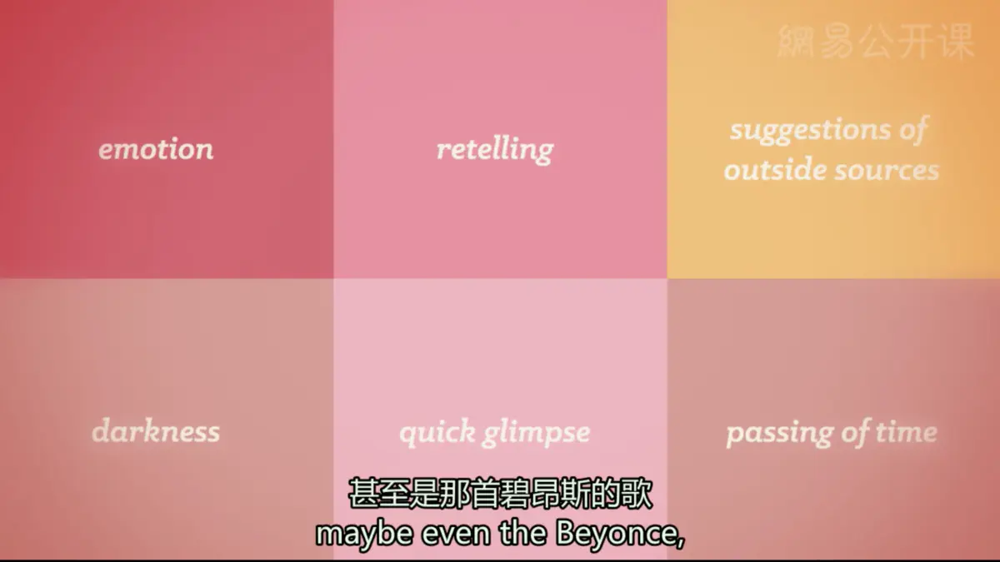

# 记忆与遗忘
* **记忆的特点**：一系列相互交错的联结将各种各样的事情串联起来，信息点与信息点之间会相互交叠缠绕（蜘蛛网）
* **启动**（Priming）/**“无记忆的记忆”**（“Memoryless” Memory）：一种激活无意识联结的方法，即用你不知道你拥有的那些“隐形记忆”（如天气、歌、车牌等），唤起旧的记忆联结
* 所有信息点都在记忆的网中，可以作为提取信息的**线索**（Retrieval Cues），指引我们到达特定的记忆位置；你在构建记忆时不经意间留下的或是有意制造的提取线索越多，你在回忆时找到你想要的记忆就会越快越好
* **情境依赖记忆**（Context-dependent memory）：使用启动的方法唤起的记忆
*  有些记忆是依赖于**情境**的，其他记忆则是依赖于个体的**精神状态**（State-dependent），也和个体的**心情**有关（**心境一致效应**，Mood-congruent）；也就是说，我们的精神状态和情绪也能够作为提取记忆的线索
* **系列位置效应**（Serial Position Effect）：一种和我们接收新信息的顺序有关的记忆线索
  * **首因效应**（Primary Effect）：接收较早的信息有更多时间来进行复述，从而转入长时记忆中
  * **近因效应**（Recency Effect）：接收较晚的信息由于仍保持在工作记忆中而被我们记住
---
* **遗忘**
  * **编码失败**（fail to encode it）：在最开始的时候，信息就没有进入编码加工当中；例如那些我们没注意到的东西，我们倾向于不对其进行编码，因此就不会记住
  * **贮存消退**（experience storage decay）：信息自然地随着时间而被遗忘；尽管我们忘记事情的速度非常快，我们记住的那部分信息，在一段时间之内会保持稳定

  * **提取失败**（fail to retrieve it）:信息不能在需要的时候被准确回忆
    * **前摄抑制**（前摄干扰，Proactive Interference）/**正向干扰**（Forward-acting Interference）：旧的记忆会妨碍你回忆起最近的记忆
    * **倒摄抑制**（后摄抑制，Retroactive Interference）/**反向干扰**（Backward-acting Interference）：刚学的新知识会妨碍对旧的信息的回忆
---
* 当试图重现某一段记忆时，我们的记忆会发生重组，并加入许多猜测，记忆的内容会发生变化
* **误导信息效应**（Misinformation Effect）：带有误导性质的信息会被纳入我们的记忆中，从而扭曲真相
  * 例：伊丽莎白·洛夫特斯的实验：两组被试观看了车祸事故影片，那些被问道“这两辆车在相互发生'冲撞'时的速度是多少”的被试，比那些被问道“这两辆车发生'碰撞'时的速度是多少”的被试对车速的估计要高得多；一周后两组被试都被问及在影片中是否看见任何玻璃碎片，那些一周前听到“冲撞”这个词的被试中回答看到的人数，是另一组的两倍；“冲撞”是引导词，从根本上改变了目击者们的记忆
* 一个非盈利的合法组织“无辜者保护计划”提出，在整个美国，由于DNA证据支持而被无罪释放的被告人中，有75%的人由于被目击证人错误地指认而成为了嫌犯
* 记忆不仅是过去事件的重建，也是对过去事件的再创造；我们不能确定一段记忆是否是真的，仅仅凭它感觉很真实

---
[Crash Course](https://www.bilibili.com/video/BV1Zs411c7W6?p=15)

