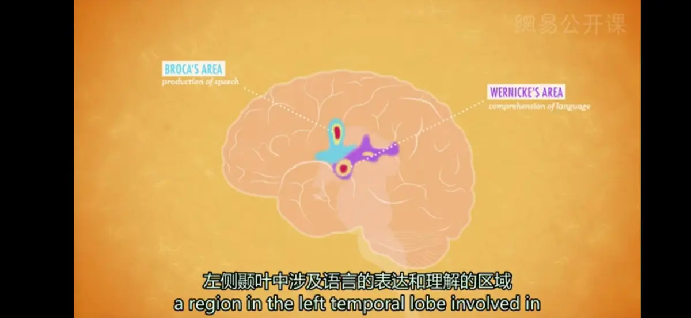

# 语言
* **语言**（Language）： 技术层面上，被定义为一整套，包括说、写或符号化的文字，以及组合这些文字用来表达意义的过程
*  坎齐是第一个猿类，证明语言可以从自发的观察行为中获得，不需要有计划的训练；它也是第一个表现出具备初步的语法、句法和语义理解能力的动物
*  声音、手势、视觉符号等多种语言形式，使我们能够理解那些我们从来没有亲眼见过的事物，并快速有效地与其他人交换信息
*  全人类拥有大约7000种不同的语言
---
**语言的基本结构**：
* **音位**（Phonemes）：可辨别的最短的语音单位（如a,t,ch,sh,f）；英语中大约有40个音位
* **语素**（Morphemes）：最小的具有意义的单位，由音位组合在一起；可以是一个单词，也可以是单词的某个部分，比如单词的前缀或后缀（如：单词“Speech”是一个语素，包含4个音位，s/puh/ee/ch）
* **语法**（Grammar）：可以把语素整理到你的语法当中，或是归纳到你的语言系统中，来说出你想说的话
* 英语中的40个音位带来了超过10万个语素，产生超过61万6千个的单词，而这些单词又可以通过组合来产生无限数量的句子、段落、吴唐诗词、莎士比亚剧作
---
**语言的学习**：
1. **“婴儿”**（Infant）来自拉丁语中的“infans”，意思是不会说话
2. **接受语言阶段**（Receptive Language）：早在4个月大时，婴儿们就能辨别不同的语言，并开始读唇语，将嘴部的动作和发出的声音相匹配；婴儿能够理解我们跟他讲的话，以及我们所说的关于他的话
3. **产生语言阶段**（Productive Language）:除了理解他人的话语，宝宝们开始发展制造词语的能力，当然这需要一段时间;但与此同时，他们会进行大量的**咿呀学语**（Babbling）的练习，大约从4个月大时起，他们就开始发出各种各样的声音
   * 咿呀学语在许多不同的语言中都有，陌生人仅仅通过听宝宝的咿呀学语，无法分辨其语言；同样的，耳聋的宝宝会观察父母的手势，然后和父母的手进行咿呀学语
4. 到了10个月大时，这些咿呀学语的声音开始变得**有意义**，这时候的“ma-ma”才可能真的是“妈妈”；此时，由于没有暴露在其他的语言环境中，婴儿会**丧失**听到和创造其他语言中特定强调和语音的能力，而只能保留家庭环境中使用的语言的一般能力
5. **单词句阶段**（One-word Stage）：通常为婴儿1周岁时，现在的他们会懂得，语音具有特定的含义，并且能够把语音和物体联系起来
6. 到了大约18个月大，他们学习新单词的能力，会从一周学一个词，跳跃到一天学一个词
7. 他们两岁时就会说**双词句**（Two-word Stage）了，这种断断续续的句子主要说的是名词和动词，比如，喝水；这些短小的句子能让人听懂，并且符合他们说的语言中的句法规则
8. 这时候开始，正常的孩子会很快学会说更长的短语和更复杂的句子
---
**语言的相关理论**：学界内存在一些针锋相对的理论，关于婴儿时期的咿呀学语如何转变为复杂的句子，以及如何获得语言
* **强化学习理论**：B·F·斯金纳提出，认为语言就是一定联结原理与操作性条件作用下的产物，儿童学会将词语和意义联系起来是因为强化作用
* **先天学习**（Innate Learning）**和普遍语法理论**（Ubiquitous Grammatical Categories）：美国语言学家诺姆·乔姆斯基提出，指出尽管世界上的千万种语言可能听起来五花八门，但它们实际上是非常相似的，拥有共同的基本元素，即”普遍语法“；乔姆斯基的普遍语法假设，人类所有的语言都包含名词、动词和形容词，而人类从出生时起，就具备天生的获得语言的能力，并且具有与生俱来的学习语法规则的素质倾向
* 对于其他物种的发展性研究已经告诉我们，语言学习中，至少某一些能力确实是天生的，同时，学习并暴露在语言环境中也非常重要
---
* **失语症**（Aphasia）：一种语言的神经性损伤；人们可以体验许多不同种类的失语症，比如可以说，但不能读；可以唱，但不能说；或是可以写，但不能读
* **布洛卡区**（Broca's area）：位于大脑的左侧额叶，与产生语言运动有关；如果大脑中这个区域受损，也许依旧能理解别人说的话或者能够唱歌，但自己却说不出话来（但对于少数左撇子的人来说，语言运动区也可以在大脑右半球）
* **威尔尼克区**（Wernicke's area）：左侧颞叶中涉及语言的表达和理解的区域，受损后也许仍然能够说话，但讲出的话会没有任何意义

* 失语症和其他的脑损伤提醒我们，思维和语言既是相互分离的，又是紧密联系在一起的；正因为语言经常帮助我们表达自己的观点，思想实际可能受到使用的语言的影响
---
[Crash Course](https://www.bilibili.com/video/BV1Zs411c7W6?p=17)