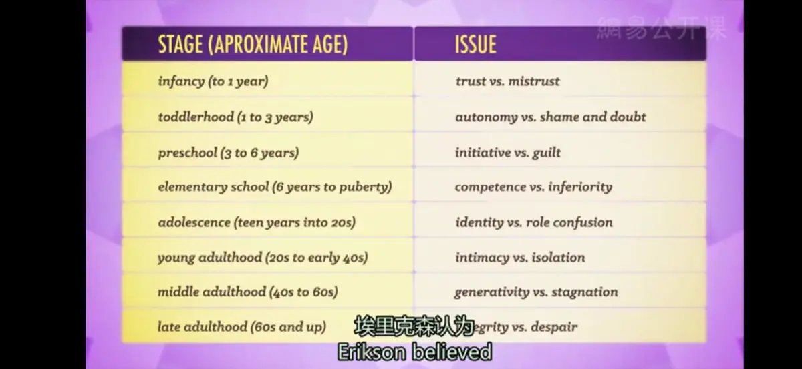

# 青春期与成年
* **《早餐俱乐部》**：一部典型的80年代的电影，描写了一群青少年因为违反校规，被处罚周六的早上去学校反省；影片中有小混混、运动员、书呆子、公主和那个所谓的“神经病”，在最开始，他们对彼此都充满冷漠和敌意，但随着时间慢慢过去，他们开始敞开心扉，分享彼此的故事，一起跳滑稽的舞蹈，度过了一段愉快的时光

* **埃里克·埃里克森的心理社会发展8阶段理论**
  * **童年阶段**
    1. **婴儿期**（0～1.5岁）：基本信任和不信任的心理冲突（trust VS mistrust）
       * 此时是基本信任和不信任的心理冲突期，因为这期间孩子开始认识人了，当孩子哭或饿时，父母是否出现则是建立信任感的重要问题
    2. **儿童期**（1.5～3岁）：自主与害羞（或怀疑）的冲突（autonomy VS shame/doubt）
       * 孩子学会了怎样坚持或放弃，也就是说儿童开始“有意志”地决定做什么或不做什么；这时候父母与子女的冲突很激烈，也就是第一个反抗期的出现
    3. **学龄初期**（3～6岁）：主动对内疚的冲突（initiative VS guilt）
       * 在这一时期如果幼儿表现出的主动探究行为受到鼓励，幼儿就会形成主动性；如果成人讥笑幼儿的独创行为和想象力，那么幼儿就会逐渐失去自信心，缺乏自己开创幸福生活的主动性
    4. **学龄期**（6～12岁）: 勤奋对自卑的冲突（competence VS inferiority）
       * 这一阶段的儿童都应在学校接受教育；如果他们能顺利地完成学习课程，他们就会获得勤奋感，这使他们在今后的独立生活和承担工作任务中充满信心，反之，就会产生自卑
  * **青春期阶段**
    1. **青春期**（12～18岁）：自我同一性和角色混乱的冲突
       * “同一性与角色混乱”的危机（The Crisis between Identity and Role Confusion），即他们刚刚形成的自我概念与其他人所期望他们所扮演的自我之间发生了冲突，于是产生了角色混乱
       * 青少年时期标志着大量的生理变化：身体的长高长大，大脑能力的增长，性激素的分泌，同时，青少年的独立意识开始萌发，但同时，他们又非常需要归属感
  * **成年阶段**
    6. ~~**始成年期**（Emerging Adulthood）（18岁左右）：青少年到成人的过渡~~
    7. **成年早期**（18～40岁）：亲密对孤独的冲突（Intimacy VS Isolation）
       * 在人生的这个阶段，大多数的我们都已经开始对亲密关系的探索，一段良好的关系会带来安全感，使人享受关爱和承诺的幸福；相反，缺乏良好的亲密关系会导致空虚寂寞冷，甚至是抑郁
    8. **成年期**（40～65岁）：繁衍对停滞的冲突（Generativity VS Stagnation）
       * 许多人都已经有工作、事业或是家庭，我们对于整个人生的意义都有了更深的理解，并通过各种生产劳动行为来奉献社会，缺少这些活动所产生的空虚和迷茫会使这个阶段的人感到生活停滞不前，没有意义，即“中年危机”
    9.  **成熟期**（65岁以上）：自我调整与绝望期的冲突（intergrity VS despair）
        * 老人们回顾过去时，可能怀着充实的感情与世告别，也可能怀着绝望走向死亡。自我调整是一种接受自我、承认现实的感受；一种超脱的智慧之感。如果一个人的自我调整大于绝望，他将获得智慧的品质
---
* **成年后的生理变化**
  * 反应速度缓慢下降，肌肉协调性慢慢变差，力气渐渐不如从前大，心输出量减少，性激素分泌减少，听力和视力的敏锐度逐渐衰退
  * 我们的智力仍然十分稳定；尽管有一种智力在青春期以后会开始减少，另一种智力在整个生命中却是不断增长的
    * **流体智力**（Fluid Intelligence）：是你解决问题的能力，与你的个人经历和教育程度都无关，它主要涉及到又快又抽象的思维活动，所以相对来说，经验缺乏的儿童通常会展现出较高的流体智力；遗憾的是，这种智力在青春期时到达顶峰，在30岁左右就开始逐渐下降
    * **晶体智力**（Crystallized Intelligence）：是基于事实的知识，通过过去的经验和学习形成的固化智力；随着年龄的增长而增长，因为我们会持续学习新的知识，对旧的事物会获得新的理解
  * **老年痴呆症**（Dementia）：并不是一种疾病，而是一系列症状，包括思维损伤、记忆力减退、糊涂以及人格的潜在变化；脑瘤、轻度中风或者长期酗酒，都会逐渐对大脑造成损害，提高患老年痴呆症的风险
    * **阿尔茨海默症**（Alzheimer's disease）:一种渐进的、不可逆转的老年痴呆症；首先记忆力会减退，然后是推理能力减弱，随着重要的脑神经数量的持续减少，最终患者会丧失基本的生理功能；全世界75岁以下的人中，有3%会得这种病，然而这个百分比每5年就会翻一倍
    * 老年痴呆症并不是一种正常的自然的衰老，人的记忆力有些变化是正常的，但我们大多数的记忆都会保持完整
---
[Crash Course](https://www.bilibili.com/video/BV1Zs411c7W6?p=21)
