# 什么是社会学
## 社会学想象力
### 社会学想象力的定义
- **社会学想象力**（sociological imagination）是由美国学者**米尔斯**（C Wright Mills）在1970年提出的概念
- 这种想象力要求我们能够**超越个人情境的局限**，将个体经历**置于更广泛的社会背景中考察**
- 它使得社会学家可以从日常生活的熟悉惯例中“**脱离出来**”，并从一个全新的角度**重新审视这些经验**
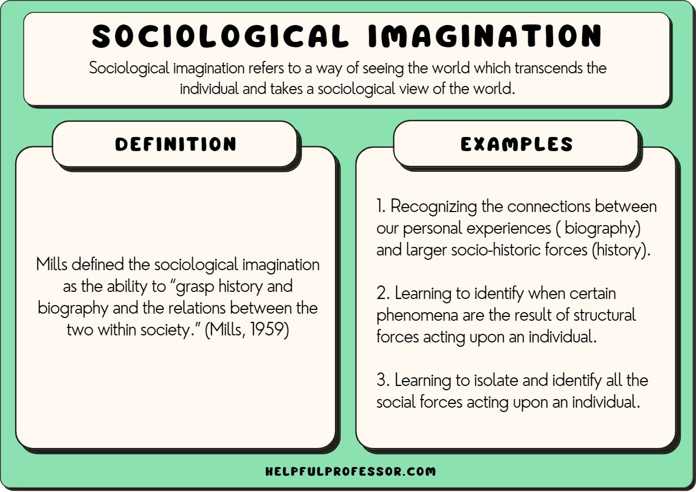

### 社会学视角下的日常行为：喝咖啡
- 咖啡在日常社会活动中不仅仅是**提神的饮料**，它还具有**重要的象征意义**
- **喝咖啡的仪式**往往比实际饮用更加重要，例如早上的第一杯咖啡象征着新一天的开始
- 咖啡消费成为**社会互动的基础**，如与人一起喝咖啡更多的是为了**社交**而非**单纯的饮用**

### 咖啡的社会与文化含义
- 咖啡因为其提神作用而**被广泛消费**，特别是在需要**长时间精神集中**的场合
- 虽然咖啡具有**成瘾性**，但它被社会**普遍接受**，不同于其他如可卡因等不被接受的致瘾物质
- 社会学家研究不同社会对咖啡和其他类似物质**接受度的差异**，以及这些**差异的形成原因**

### 咖啡的全球经济影响
- 咖啡连接了世界上的**贫穷地区与富裕地区**，是国际贸易中**仅次于石油的第二大商品**
- 咖啡的生产和消费涉及**复杂的全球社会和经济关系**
- 社会学家将咖啡作为研究**全球化及国际关系**的重要对象

### 咖啡的历史与社会发展
- 咖啡最初在**中东地区**流行，后由于**19世纪的西方扩张**而成为广泛消费的商品
- 咖啡的流行反映了**殖民时期的影响**，其生产主要在**曾被欧洲殖民的南美和非洲地区**
- 研究咖啡及其历史可以帮助理解**全球经济和文化**的长期发展过程

### 咖啡消费的现代意义
- 咖啡消费已经变得**品牌化和政治化**，成为全球化、国际公平贸易、人权和环境保护的焦点
- 消费者的选择反映了他们的**生活方式和价值观**，例如选择有机咖啡、脱咖啡因咖啡或公平贸易咖啡
- 咖啡消费的决定也可能是**政治行为**，如抵制某些国家的咖啡以反对其人权和环境保护记录

## 研究人与社会
### 社会的定义
- 社会学被称为**社会的科学**（science of society），专注于**分析和理解社会结构和行为**
- 社会通常指的是生活在具有**明确边界的地区**内，拥有**共同文化特征**如语言和价值观的人群
- 例子包括讨论“法国社会”或“丹麦社会”来强调**共享的文化和社会结构**

### 社会结构的构成
- 社会不仅包含**个人和群体**，还涵盖了诸如**政府、教育和家庭**等社会制度
- 人与人、群体与群体之间以及制度之间的关系形成了**相对稳定的社会结构**
- 这些结构模式是通过**社会、制度及其互动**构建的，为社会生活提供了**有序框架**

### 社会学想象力的应用
- **社会学想象力**（sociological imagination）帮助我们理解**个人经历与社会问题之间的联系**
- 通过这种想象力，**私人困境**如离婚和失业被视为反映更广泛社会问题的**公共话题**
- 离婚影响退休金和福利制度，失业揭示了更大的经济和社会趋势

### 个人生活中的社会学应用
- 社会学不仅限于理解复杂问题，也包括**个人决策**如学习动机的探索
- 学生选择学习社会学可能是由于要求或热情，这反映了他们**在社会中的地位和角色**
- 个人的决策，如上学和职业选择，通常与**更广泛的社会背景和趋势**有关

### 社会影响与个体行为
- 我们的社会背景**极大地影响**我们的决策和行为，但**没有完全决定**个体的行为
- 个体的行为在塑造社会也被社会塑造的**双重过程**中发挥作用
- 社会结构由个体**持续构建和重构**，人类活动不断地塑造社会环境

### 社会结构的可塑性
- 社会结构是**动态的**，不断变化而非静态或固定的
- **历史事件**如东欧共产主义政权的崩溃和阿拉伯之春突显了社会结构的**不稳定性和可变性**
- 人们的**集体行动**，如抗议和政治变革，可以**显著地重塑社会结构**

### 社会学研究的意义
- 通过研究社会学，我们不仅能**更好地理解**个人和群体的行为，还能看到**社会整体的动态变化**
- 社会学研究揭示了**个人决策如何与更大的社会力量相交织**
- 这种研究有助于我们**理解和应对社会中的各种挑战和变化**

## 社会学思想的发展
### 理论与理论视角
#### 社会学的多样性与挑战
- 社会学作为学科，**没有统一的观念体系**，理论的**多样性是常态**
- 社会学家们在研究方法和解释结果上常有**不同见解**，这是**科学探究的一部分**
- 与物理学或化学不同，社会学研究的是我们自身，经常**挑战我们长期持有的观点和态度**

#### 理论的必要性
- 社会学中，事实如购买咖啡的行为需要**通过理论来解释其背后的原因和过程**
- 理论建构需要通过**抽象的解释和逻辑相关的陈述**来描述现实情况
- 好的社会学研究**将经验研究与理论解释紧密结合**，理论帮助我们理解并检验社会现象

#### 理论与实践的关系
- 理论不仅是学术讨论，它**实际影响所有实践决策**，包括**企业管理**等领域
- 实践中的每一个决策都**隐含了某种理论假设**，即使决策者未必意识到
- 理论是理解复杂社会现象**必不可少的**，无理论支撑的研究可能**缺乏方向和深度**

### 社会学方法论的探讨
#### 方法论的重要性
- 社会学方法论问题涉及**如何研究人类意识、行动和社会制度**
- 方法论讨论还包括社会学**是否应该模仿**自然科学的研究方法
- 社会学家面对如何**避免带入个人偏见**的问题，以及他们**是否应该尝试避免这些偏见**

#### 理论思考的挑战
- 理论必须回应关于**社会生活研究的基本问题**，如何概念化人类的社会行为和制度
- 自19世纪以来，这些问题**没有简单的答案**，不同社会学家提供了不同的解答
- 理论思考是**对社会复杂性的响应**，旨在提供更全面的社会现象解释和理解

## 社会学的奠基人
### 奥古斯特·孔德
#### 社会学的创立
- **奥古斯特·孔德**（Auguste Comte, 1798-1857）**首创**“社会学”一词
- 孔德最初使用“**社会物理学**”（Social Physics）这一术语，后改用“**社会学**”以区分自己的理论与其他人的工作
- 孔德试图建立一种能够**揭示社会法则**的科学，类似于自然科学对自然界法则的揭示
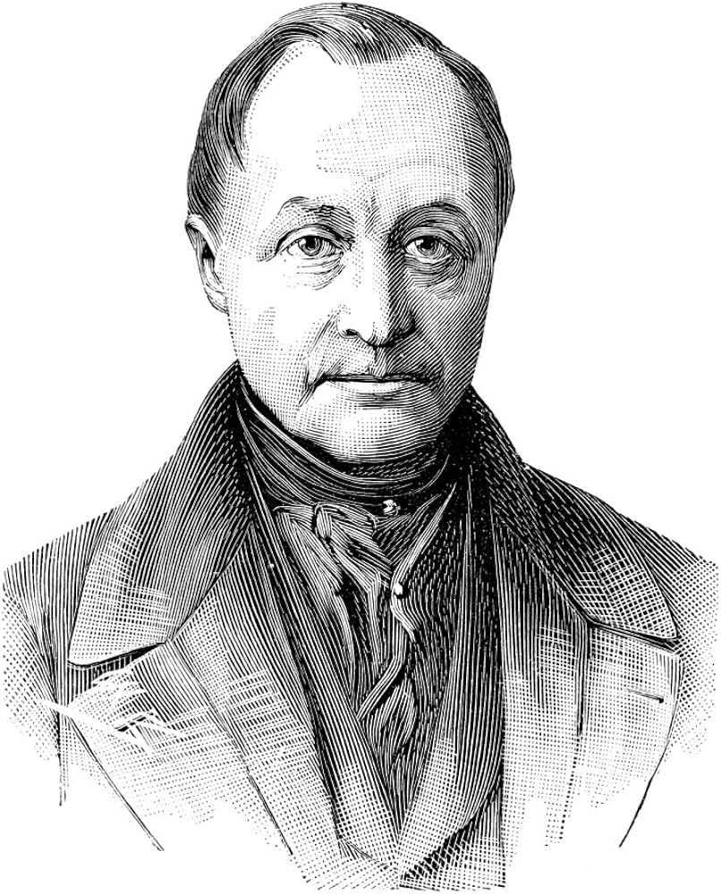

#### 实证主义的提出
- 孔德提倡将社会学建立为一种**实证科学**，通过**严格的科学方法**来探索社会现象
- 实证主义主张科学应该**仅关注可通过经验观察得到的实体**，通过**观察**推导出现象间的规律
- 社会学的目标是通过观察、比较和实验得到的证据来形成关于社会的知识

#### 社会科学的阶段
- 孔德认为人类理解世界的方式经历了**三个阶段**：神学阶段、形而上学阶段和实证主义阶段
- 社会学在**实证主义阶段**得到发展，鼓励使用**科学方法**研究社会问题
- 孔德认为社会学是**最后发展起来的科学**，也是**最复杂的科学**

### 埃米尔·涂尔干
#### 社会学的科学化
- **埃米尔·涂尔干**（Emile Durkheim, 1858-1917）将社会学建立为一门独立的科学
- 涂尔干强调要**像研究自然科学一样客观地研究社会生活**，提出“**把社会事实当作物来研究**”
- 社会事实是涂尔干社会学研究的**核心**，包括所有约束人类行为的制度和规则
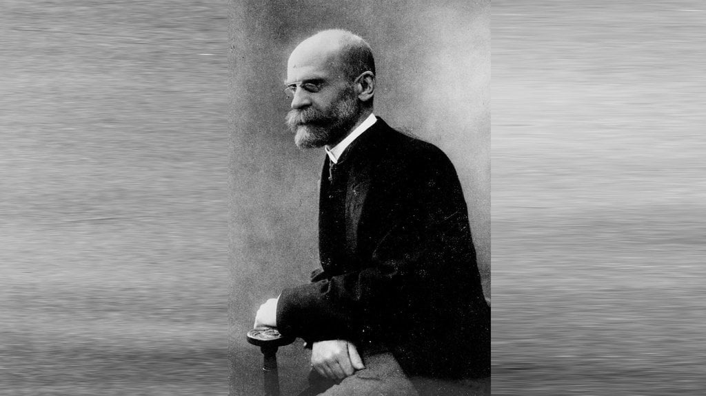

#### 社会事实的特点
- 社会事实对个体来说是**外部的压力**，大多数时间被视为**生活的自然部分**
- 例如，**货币体系**就是一个社会事实，它约束个体行为，但通常不被我们意识到
- 社会事实**独立于个体存在**，形塑个体行为

#### 社会团结的研究
- 涂尔干分析**社会团结如何在社会变迁中发挥作用**，尤其是在**工业化社会**中
- 提出**两种社会团结形式**：**机械团结**（mechanical solidarity）和**有机团结**（organic solidarity）
- 机械团结中人们通过共同的经验和信仰维持团结，而有机团结中人们因工作和社会角色的互相依赖而维持团结
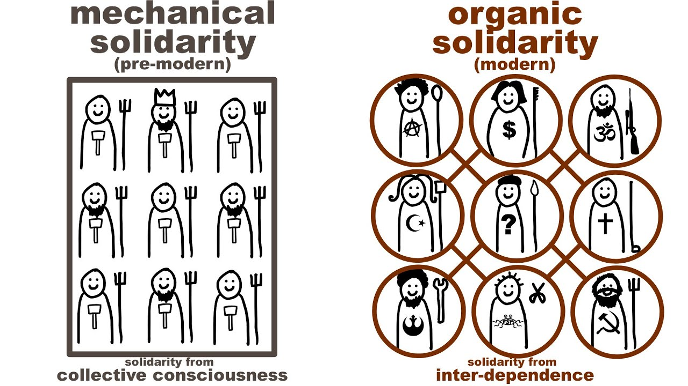

### 卡尔·马克思
#### 马克思的社会学思想
- **卡尔·马克思**（Karl Marx, 1818-1883）关注**资本主义社会和阶级斗争**
- 马克思将社会学研究与经济分析结合，深入探讨**资本主义生产方式和阶级关系**
- 强调**资本家和工人之间的关系**，描述了资本家**依靠工人劳动获取利润**的过程

#### 阶级斗争的理论
- 马克思认为历史发展是**由阶级斗争推动**的，视阶级斗争为“**历史的发动机**”
- 提出社会发展**经历多个阶段**，从**原始共产主义**到**资本主义**，最终由**无产阶级推翻资本家**
- 预见到一个**无阶级分化的共产主义社会**，强调经济体系将实行**公有制**

### 马克斯·韦伯
#### 韦伯的社会学多领域研究
- **马克斯·韦伯**（Max Weber, 1864-1920）的研究涵盖社会学、经济学、法学等多个领域
- 不同于马克思，韦伯认为不仅是经济因素，**观念和价值**也对社会变迁有重要影响
- 提出《**新教伦理与资本主义精神**》中**宗教价值**在资本主义发展中的作用

#### 理想型的应用
- **理想型**（ideal type）是韦伯用于**分析社会现象的一种工具**，帮助**理解复杂的社会行为**
- 理想型是对真实现象的**简化和纯化**，用于指导研究者**更好地瞄准研究主题**
- 例如，建构恐怖组织的理想型，分析其在政治暴力中的角色和特点
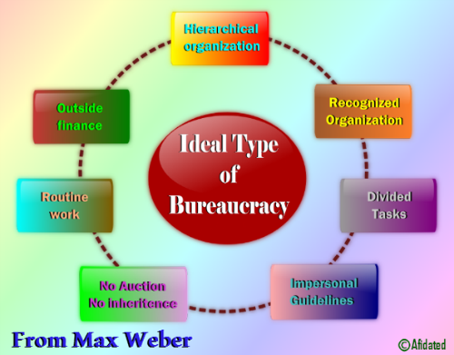

#### 理性化与现代社会的关注
- 韦伯描述**现代社会的理性化过程**，即社会生活的组织**更加依赖效率和技术性知识**
- 担心**科层制的扩张**（bureaucracy）可能**抑制个体自由**，形成难以逃脱的“坚固的铁牢笼”
- **启蒙运动**推动的理性化进程虽有益，也潜藏**使人类精神受挫的风险**

### 被忽视的社会学奠基人
#### 哈丽雅特·玛蒂诺
- **哈丽雅特·玛蒂诺**（Harriet Martineau, 1802-1876）被誉为“**第一位女社会学家**”，她的作品跨越多个学科，影响深远
- 玛蒂诺**翻译并推广**了孔德的《**实证哲学教程**》（Positive Philosophy），是**社会学在英国的先驱**
- 她的作品《**美国社会**》（Society in America, Martineau）系统研究了美国社会，并强调了包括**女性生活**在内的**社会各方面的重要性**
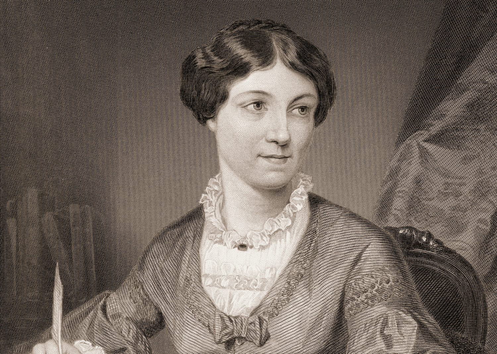

#### 玛蒂诺的社会学贡献
- 她强调在研究一个社会时需要关注其**政治、宗教和社会制度**
- 玛蒂诺是最早将社会学的关注转向**婚姻、家庭、宗教和种族关系**等以前被忽视的议题的学者之一
- 她倡导社会学家不仅要进行**观察**，还应积极**参与促进社会改革**，如**支持女权运动和奴隶解放**

#### 伊本·哈勒敦
- **伊本·哈勒敦**（Ibn Khaldun, 1332-1406）是一位**穆斯林学者**，以其在历史学、社会学和政治经济学领域的贡献闻名
- 他的主要作品《**历史绪论**》（Muqaddimah, completed in 1378）被视为**社会学早期的奠基之作**
- 《历史绪论》**批评了传统历史学的方法**，提出社会学为“**社会组织的科学**”或“**社会的科学**”，探索**事件的潜在意义**

#### 伊本·哈勒敦的社会冲突理论
- 伊本·哈勒敦提出了基于**团体感**（asabiyyah）或团结的**社会冲突理论**
- 他的理论用于解释**社会的兴起与衰落**，特别是在阿拉伯和马格里布国家
- **团体感强烈的游牧部落**能够**征服团结较弱的定居社区**，随后这些征服者自己在定居后也会**因团体感减弱而衰落**
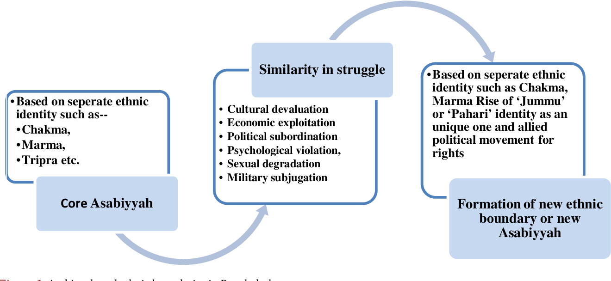

#### 伊本·哈勒敦的现代影响
- 尽管19世纪后期和20世纪初的学者**曾引用他的工作**，但直到**最近几十年**他的理论才重新被认为具有**重要的社会学价值**
- 他的研究提供了一个**分析国家形成过程的框架**，这是现代西方历史社会学的一个主要关注点
- 他的观点和理论为理解政治和社会变迁提供了**重要的社会学视角**

## 经典研究：涂尔干关于自杀率的研究
### 研究的问题
#### 自杀的社会学视角
- 涂尔干的研究在《**自杀论：一项社会学的研究**》（Suicide: A Study in Sociology）中展示了即使是**个人行为**如自杀，也**深受社会影响**
- 他挑战了以往将自杀归因于种族、气候或精神错乱的解释，提出**社会学的解释框架**
- 涂尔干指出自杀率的模式特征和社会事实的关联，说明了**社会力量对个体行为的影响**

#### 自杀率的社会模式
- 涂尔干通过分析**法国官方自杀数据**，发现自杀率在**不同社会群体和情境**下有显著差异
- 例如，涂尔干发现男性、新教徒、富人、单身者的自杀率普遍高于女性、天主教徒、穷人和已婚者
- 自杀率在**战争期间通常会降低**，而在**经济变动和社会不稳定时期则增高**
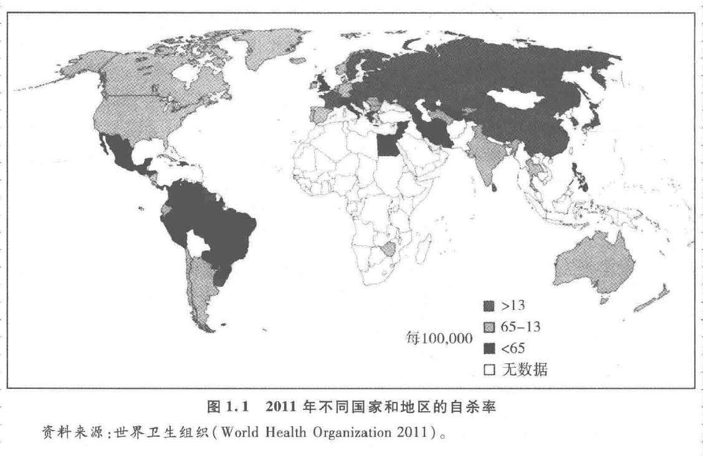

### 涂尔干的解释
#### 社会整合与规范的影响
- 涂尔干提出**社会整合**和**社会规范**的概念来解释不同自杀率，强调**社会力量对个体选择的影响**
- 他将自杀类型**分类**为利己型、失范型、利他型和宿命型自杀，每种类型都与社会联系的不同状态相关
- 社会整合度和社会规范的**缺失或过度**都可以影响个体采取自杀行为的可能性

#### 四种自杀类型
1. **利己型自杀**：由于社会整合度低，如单身者或新教徒中自杀率高
2. **失范型自杀**：由于快速的社会变化导致规范缺失，如经济危机期间
3. **利他型自杀**：由于过度的社会整合，如日本神风敢死队
4. **宿命型自杀**：在过度控制和压迫的社会结构中发生
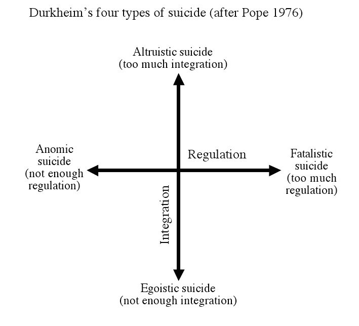

### 批评的观点
#### 批评和社会学方法的挑战
- 涂尔干的方法因其对官方数据的**无批判性使用**而受到批评，尤其是他忽视了**非社会因素对自杀的影响**
- 批评者还指出，自杀数据的社会收集过程中涉及的**法医定义和标准**，这些都可能影响记录为“自杀”的死亡数目
- 对涂尔干的自杀类型**分类也存在争议**，认为这种分类可能**过于简化**

### 当代意义
#### 涂尔干研究的持续影响
- 尽管**存在批判**，涂尔干的《自杀论》仍被视为**社会学中的经典作品**，对社会学的发展有**重要影响**
- 他的研究强调**社会事实对个体行为的影响**，挑战了简单将自杀归咎于个人动机的观点
- 涂尔干的工作帮助社会学**确立为一门独立的学科**，专注于研究社会事实和社会力量如何塑造个体行为

## 社会学的理论传统
### 功能主义（Functionalism）
#### 功能主义的核心观点
- 功能主义视社会为一个**复杂的系统**，其中各部分协同工作以维持稳定和秩序
- 此理论倾向于使用有机体类比，将社会**比作一个生物体**，其中每个部分都**服务于整体的社会利益**
- 功能主义强调**道德共识**（moral consensus）对于维护社会秩序和稳定至关重要
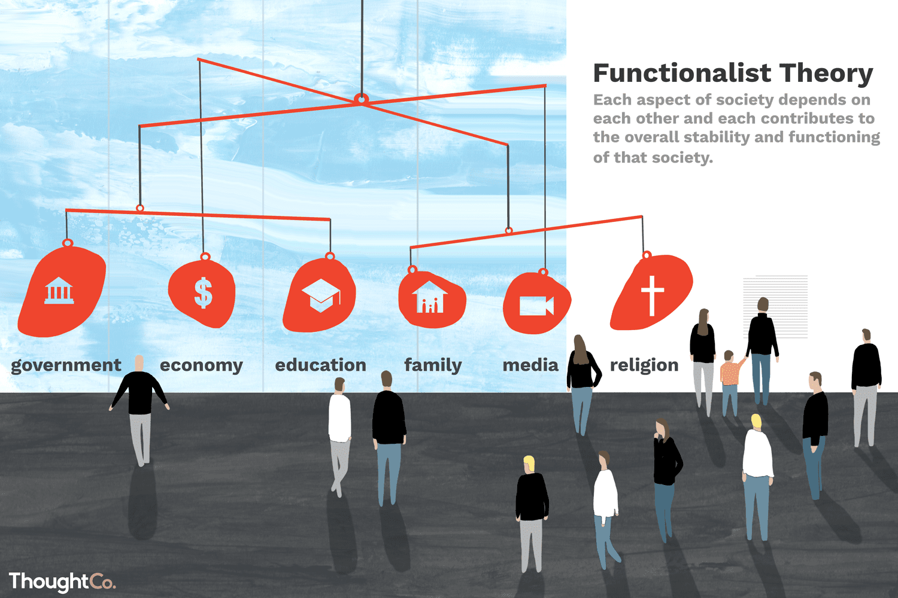

#### 功能主义的代表人物
- **塔尔科特·帕森斯**（Talcott Parsons）和**罗伯特·默顿**（Robert K. Merton）是功能主义的重要支持者
- 默顿提出了**显性功能**（manifest functions）和**隐性功能**（latent functions）的概念，强调社会活动的**预期和非预期后果**，认为社会学解释的重点在于**揭示社会活动和制度的隐性功能**
- 默顿还引入了**功能与反功能**（dysfunctions）的区分，分析社会行为的**积极和消极后果**
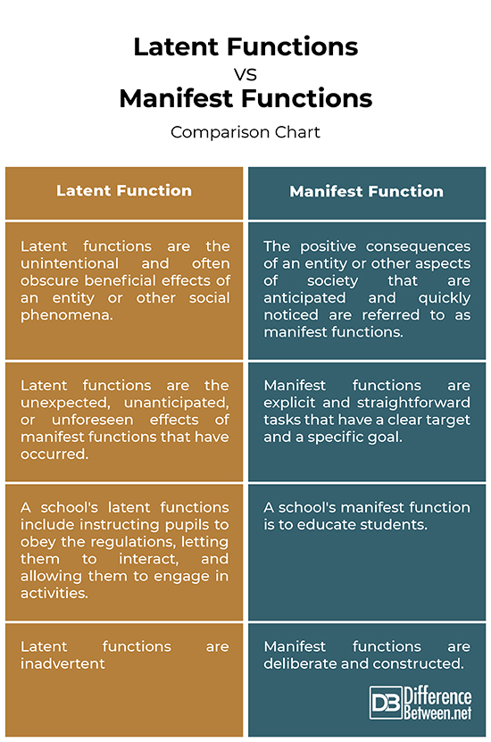

#### 功能主义的批评与局限性
- 功能主义因**过分强调稳定和秩序**而被批评，被认为**忽略了社会中的冲突和不平等**
- 此理论倾向于将社会描述为**具有自我调节的机制**，有时候**过于简化复杂的社会动态**
- 功能主义经常被看作是**保守的社会观点**，因其倾向于**维持现状**而不是推动社会变革

### 冲突理论（Conflict Theory）
#### 冲突理论的基本框架
- 冲突理论强调社会结构中的**权力差异、不平等和社会冲突**
- 此理论家们将社会视为**不同群体的竞争场**，各群体**追求自身利益**，常常**导致冲突**
- 冲突理论批判功能主义对社会共识的强调，指出社会经常**处于不平衡状态中**
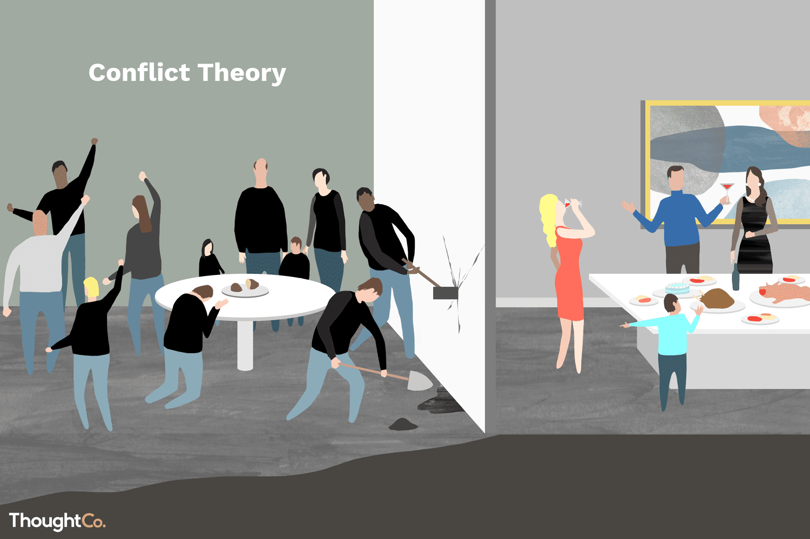

#### 冲突理论的应用
- **马克思**的观点深刻影响了冲突理论，特别是**关于阶级斗争和资本主义的批判**
- **女性主义**作为冲突理论的一个分支，集中研究**性别不平等和女性在社会中的地位**
- 女性主义理论强调性别不平等的**历史根源和持续影响**，扩展到了**社会的私密和公共领域**，包括互动中性别偏见和语言的使用，如主席（chairman）、人类（mankind）（讨论人类本身时如此）以及人造（man-made）
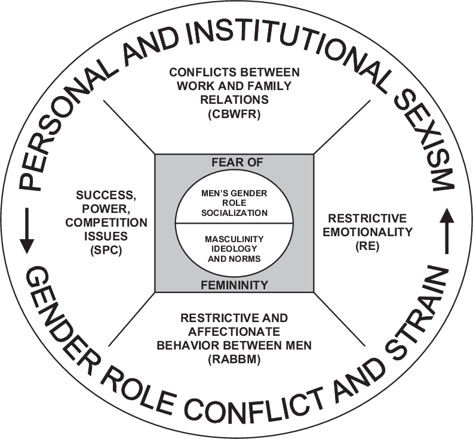

#### 冲突理论的影响和扩展
- 冲突理论揭示了社会中的**基本不平等结构**，尤其是围绕阶级、种族和性别的问题
- 此理论的观点有助于**理解社会变革和社会运动的动力**，以及**社会不平等的维持机制**
- 冲突理论鼓励社会学家不仅仅关注社会稳定，而是更多地**关注社会变化和动力**

### 符号互动论（Symbolic Interactionism）
#### 符号互动论的理论依据
- 符号互动论由**乔治·赫伯特·米德**（George Herbert Mead）提出，关注**语言和符号在社会行动中的作用**
- 此理论认为人类**通过语言和符号获得自我意识**，并能**从他人视角看待自己**
- 互动中的符号，如**言语和非言语手势**，对于理解人际关系和社会行为至关重要
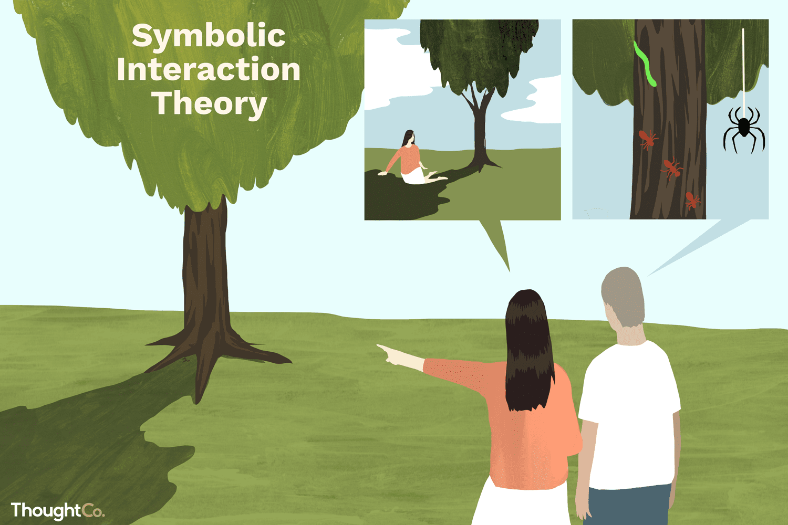

#### 符号互动论的社会学应用
- 符号互动论研究者关注**日常生活中的人际互动**，探索这些互动**如何创造和维护社会结构**
- 该理论强调**个体在社会互动中的主动性**，认为社会结构是**通过互动过程持续创造的**
- 符号互动论特别适合研究社会化过程以及社会行动背后的**微观动力**
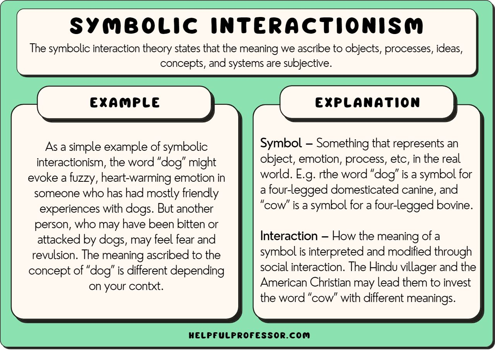
#### 符号互动论的批评与挑战
- 符号互动论因**忽视更广泛的社会结构和权力问题**而受到批评
- 该理论偶尔被视为**过分关注个体和微观层面的行动**，忽略了宏观社会力量
- 尽管存在批评，符号互动论提供了对个体日常生活和社会参与的**深入洞见**

#### 符号互动论的宏观视角扩展
- **阿莉·霍克希尔德**（Arlie Hochschild）的《**托管的心——人类情感的商业化**》（The Managed Heart: Commercialization of Human Feeling）是对符号互动论**在宏观社会问题上的应用**
- 霍克希尔德研究**服务业中的情感劳动**（emotional labor），揭示了**大规模社会结构对个体情感管理的影响**
- 此研究强调即使在**看似个体和微观的互动**中，也**深受宏观社会经济结构的制约**，如公司文化和市场经济对情感表达的要求

### 理论的多样性与社会学研究的动态性
- 社会学理论的多样性反映了对人类复杂行为的**不同理解和解释**
- 理论的多样性不是社会学的弱点，而是其**强大活力的源泉**，帮助社会学不断进步和更新
- 不同理论之间的**对立和互动**促进了对社会现象更全面和深入的理解

## 分析的层次：微观社会学与宏观社会学
### 微观社会学的重要性
- **微观社会学**（microsociology）专注于**日常生活中的面对面互动**，研究个体在**小规模情境**下的行为和社交活动
- 这种分析帮助我们理解**个体如何在日常生活中通过互动塑造社会现实**
- 微观社会学研究可以揭示如何在家庭、工作和其他直接社交环境中**构建社会关系和文化规范**

### 宏观社会学的应用
- **宏观社会学**（macrosociology）关注社会的**大规模结构、系统和过程**，例如**社会阶层、政治制度和经济系统**
- 宏观分析强调整体社会如何**通过其广泛的制度影响个人和群体的行为**
- 理解**宏观社会结构对个人选择和行为的影响**是理解全球化、社会变迁和政策制定的关键
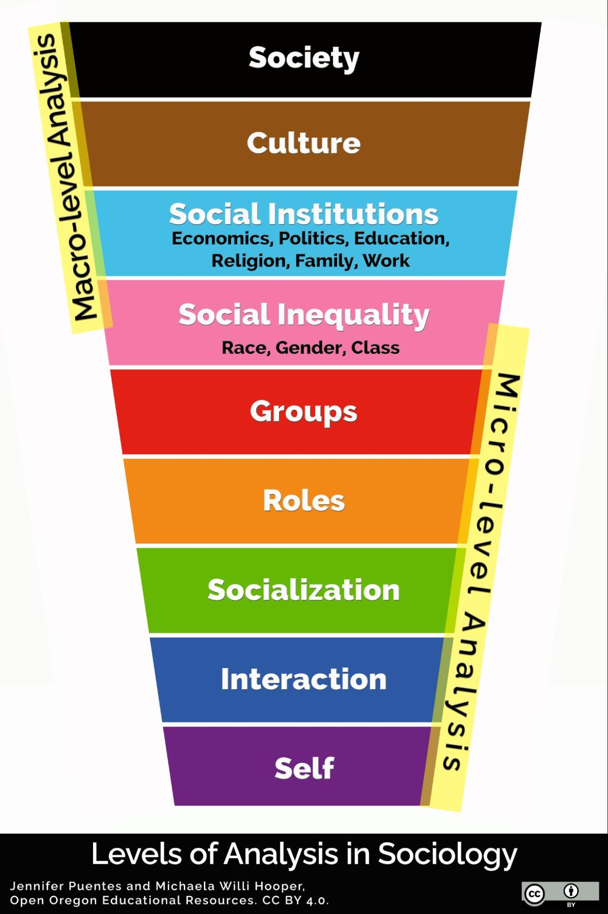

### 微观与宏观的交互作用
- 微观行为和宏观结构之间存在**复杂的动态互动**，个体的互动可以影响社会结构的形成和变迁
- 研究社会的**中观层面**（mesosociology）揭示了**微观行为和宏观结构之间的相互作用**，这在**社区研究**中尤为明显
- 社会变迁常常**从微观层面开始**，但其影响可以**扩展到宏观层面**，影响整个社会结构
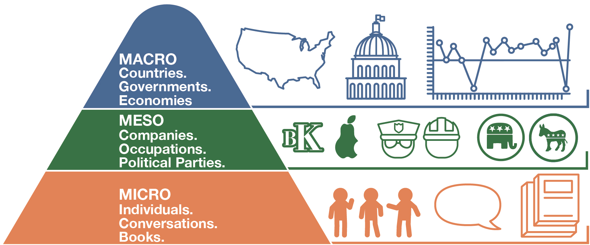
### 社会学研究的实际例子
- 英国政府在20世纪80年代减少对煤炭行业的依赖导致传统采矿社区面临失业危机，但许多前矿工通过培训转行
- 2008年的经济危机导致全球范围内的失业和生活标准下降，但也促使个人学习新技能或创业
- 这些例子表明，即使在**宏观经济政策**的压力下，个体和社区也能展现出**适应性和创造性**，这是微观与宏观分析相结合的力量

## 社会学的实用意义
### 文化意识和政策制定
- 社会学通过**增强对文化差异的理解**，帮助我们**从多个视角看待社会世界**，增进**对不同生活方式的理解**
- 对目标群体的深入理解对**政策的成功**至关重要，不恰当的政策往往因缺乏对受影响人群生活的真实了解而失败
- 例如，如果一个社会工作者对他服务的社区的文化背景和社会经验缺乏理解，可能无法赢得社区成员的信任

### 政策评估和社会改革
- 社会学研究提供了**评估政策介入效果的工具**，帮助识别政策实施可能产生的**预期和非预期后果**
- 例如，20世纪的**城市公共住房政策**初衷是**改善低收入群体居住条件**，但实际上可能导致**孤立、不快和犯罪问题**
- 通过**揭示政策的实际效果**，社会学有助于**优化社会结构**和**提高政策制定的适应性和效果**
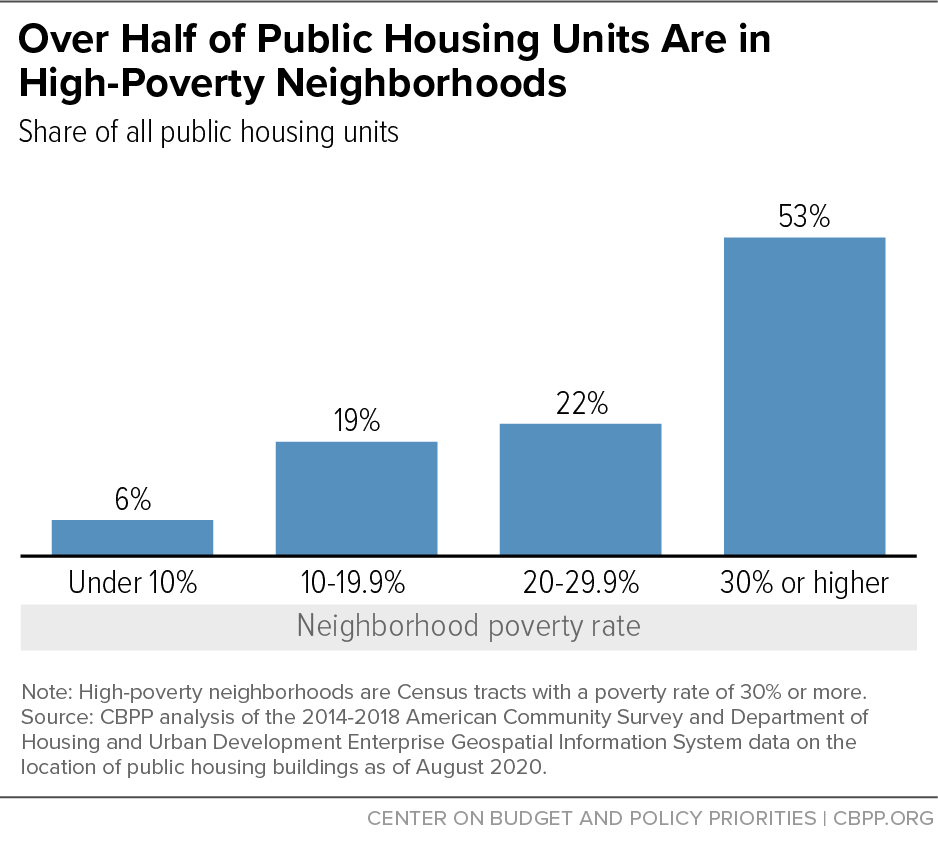

### 职业应用和社会参与
- 社会学训练**为多种职业提供了基础**，包括产业顾问、研究人员、都市规划师、社会工作者和人事管理者等
- 理解社会结构和关系对法律、新闻、商业和医疗等领域的**专业发展**也极为重要
- 社会学不仅服务于**政府和有权势的群体**，其研究成果也支持**志愿机构、慈善机构和社会运动**

### 自我启蒙和公众社会学
- 社会学提供的**自我启蒙**帮助我们**更好地理解个人行为和社会整体的运作**，从而有能力**影响未来**
- **米迦勒·布洛维**（Michael Burawoy）提倡的**公众社会学**（public sociology）强调与社会各群体的对话，超越学术界的界限
- 公众社会学促进**社会学与广泛公众的互动**，通过这种方式，社会学知识能够更广泛地服务社会，形成与非学术公众的结合

### 社会学的四种类型
- 布洛维区分了**专业社会学**（professional sociology）、**政策社会学**（policy sociology）、**批判社会学**（critical sociology）和**公众社会学**（public sociology）
- 专业社会学侧重**科学研究和学术发展**，政策社会学关注**应用研究和解决具体社会问题**
- 批判社会学**挑战现有研究和假设**，公众社会学致力于**与社会各界进行交流和对话**，共同探讨社会问题的解决方案
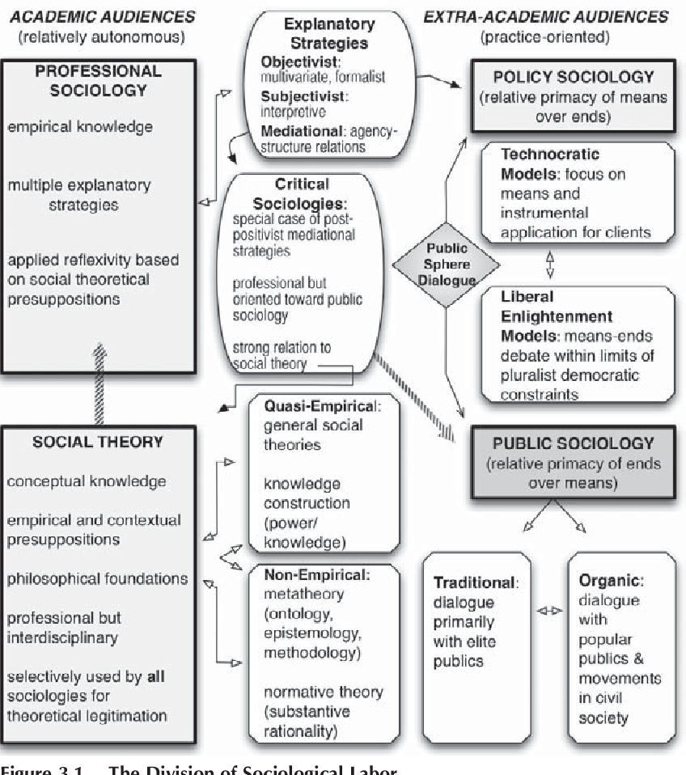

## 结论
### 社会学的发展
- 社会学作为学科**随现代社会的发展而产生**，专注于研究**社会结构和人类行为的互动**
- **早期社会学**关注**社会阶级冲突、财富分配、扶贫以及现代化进程**，这些都是社会学研究的核心议题
- 社会学通过提供**全球视角**来应对**日益全球化的世界**，需要从多个角度理解和解释社会现象

### 当代社会学的核心议题
- 社会学今天面对的议题包括**快速全球化、环境恶化、全球风险**以及**多元文化主义**和**性别不平等**等
- 这些新的挑战要求社会学家**审视早期理论的适用性**，并探索**是否需要新理论来解释当前的社会问题**
- **卡尔·曼海姆**（Karl Mannheim）提到的“**新时代的秘密**”需要社会学家设计新的理论框架以破解当代的复杂社会问题

### 社会学的实用性和学术意义
- 社会学不仅是一个**理论学科**，它对人们的**日常生活**具有实际和深远的影响
- 学习成为一名社会学家意味着将社会学的观念和发现与个人的生活实际**联系起来**，提高个人的社会意识和批判能力
- 通过**富有想象力的方式**接近社会学，可以帮助人们**更好地理解自己、社会以及更广阔的人类世界**
