[TOC]
# 理论与视角
## 迈向社会学
### 实证主义与社会演进
#### 工业革命与社会问题的诞生
- 工业革命在**18世纪晚期和19世纪**为人类社会带来了**根本的物质和生活方式的变革**
- 这一时期出现的新社会问题包括**城市过度拥挤、恶劣的卫生条件、疾病和工业污染**
- 社会改革者通过**研究和收集数据**，寻求解决这些问题的方法，这推动了**社会科学的早期发展**
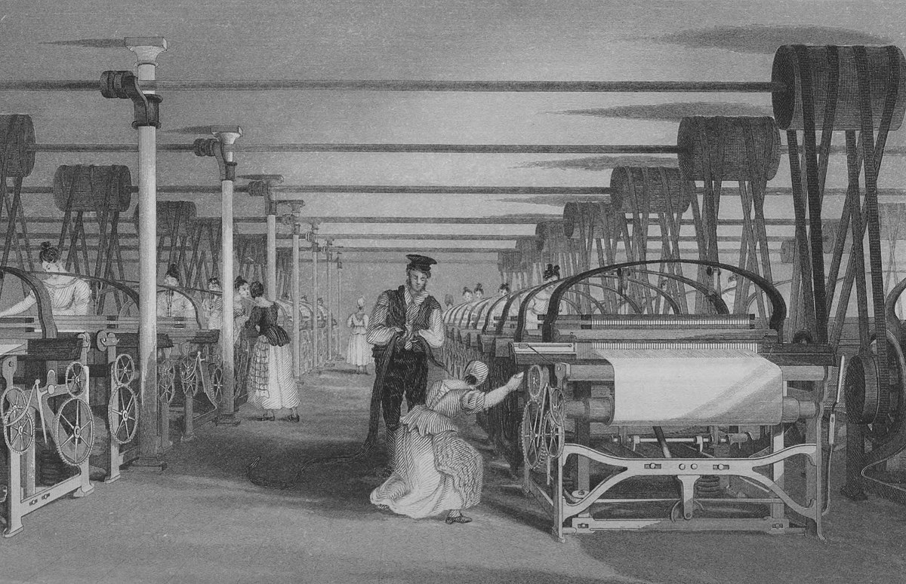

#### 法国革命与启蒙运动
- 1789年的**法国革命**结束了欧洲的**封建土地制度**和**君主专制**，引发了对自由、民主和公民权利的**广泛讨论**
- 法国革命被视为**启蒙思想的一部分**，启蒙时期强调**理智、理性和批判性思维**，挑战宗教与传统权威
- 启蒙哲学家如牛顿等**自然科学的成就**激励了对社会与政治生活**可能遵循类似自然规律**的探究

#### 奥古斯特·孔德的研究方法
- **奥古斯特·孔德**（Auguste Comte）将社会科学与自然科学**类比**，提出社会学研究应基于**观察、预测和控制社会现象**
- 孔德的**实证主义哲学**强调通过**科学方法**掌握社会规律，以**科学的预测和干预**推动社会进步
- 虽然孔德的方法深受自然科学的影响，但现代社会学家通常认为，对人类行为的科学研究应**避免过度控制和简化**

#### 赫伯特·斯宾塞的社会进化论
- **斯宾塞**（Herbert Spencer）将社会视为**生物体**，认为社会通过**结构分化和功能适应**进行进化
- 他的社会进化论包含“**适者生存**”原则，主张社会如生物一样，通过**适应环境**变得更加复杂和适应性强
- 斯宾塞**反对国家干预社会**，认为社会应**允许自然发展**，弱者的保护可能阻碍社会的整体进步
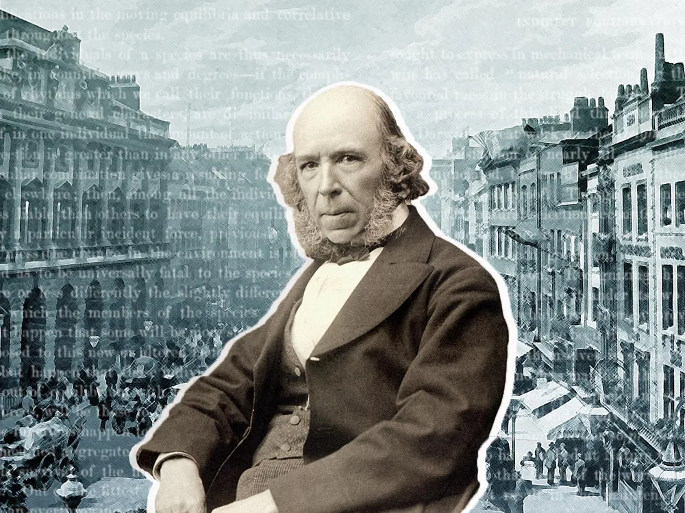

### 卡尔·马克思：资本主义革命
#### 马克思的理论思路：历史唯物主义
- 马克思认为社会的主导思想和理想主要反映其**经济基础**，尤其是**生产方式**，这反对了当时主流的**唯心主义学说**
- **唯物史观**（materialist conception of history）认为社会历史的发展是由**物质生活方式**尤其是**社会生产方式的变化**所推动的，而非由抽象的理想或概念推动
- 马克思以**自然科学的发展**为例，提出通过**相似的科学方法**，社会和政治生活的规律也能被发现和理解
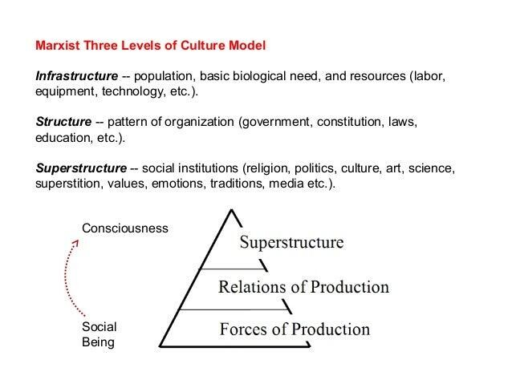

#### 阶级冲突和社会变迁
- 马克思认为社会的历史是**阶级斗争的历史**，**阶级对立**是推动社会变革的基本动力
- 从封建社会的**地主和农民的对立**转变为资本主义社会的**资本家和工人的对立**，展示了社会结构的演变
- 资本主义社会中，阶级冲突主要表现为**资本家和工人之间的矛盾**，这些矛盾预示着未来**向共产主义的转变**

#### 马克思主义的历史影响
- 马克思的思想深刻影响了20世纪全球范围内的**政治运动和政府政策**，尤其是在苏联、中国和东欧等地区的**共产党政权**
- 马克思主义被政治运动和政府用来**解释和推动社会和政治变革**，超越了学术讨论，进入**实际的政治实践**
- 马克思和恩格斯的作品，尤其是《**共产党宣言**》（The Communist Manifesto）和《**资本论**》，成为影响深远的政治和社会学理论文本
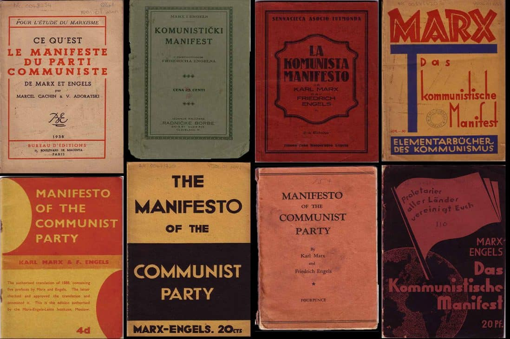

#### 对现代社会学的意义
- 马克思提供了关于如何通过**分析社会生产方式和阶级结构**来理解社会动力学的理论框架
- 马克思主义批判地分析了资本主义社会中的**阶级剥削、劳动异化**和其他社会问题，对现代社会问题提供了深刻见解
- 虽然马克思的理论存在争议，但其对社会变革和结构的分析对于理解和研究社会动态仍具有重要的理论和实践价值

### 新马克思主义：法兰克福学派的批判理论
#### 马克思主义的演变和法兰克福学派的兴起
- 在20世纪30年代，**法兰克福学派**（Frankfurt School）由**马克斯·霍克海默**（Max Horkheimer）领导，成为**西方马克思主义**的重要支流，反对苏联的共产主义版本
- 法兰克福学派原始成员在纳粹上台后**被迫离开德国**，转移到**美国和其他地方**继续他们的学术工作
- 法兰克福学派结合了**马克思、弗洛伊德的理论**以及**康德的哲学**，产生了关于资本主义、法西斯主义和消费社会的深刻批判
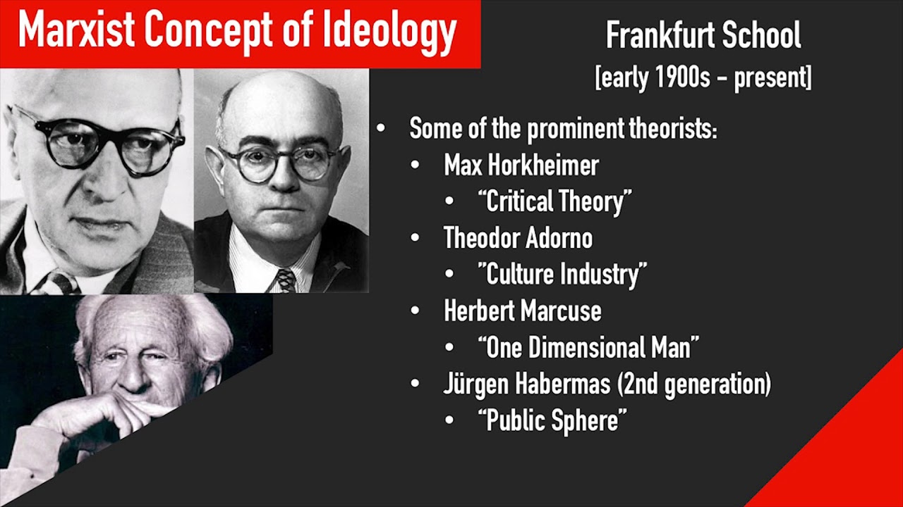

#### 批判理论的核心观点和影响
- **西奥多·阿多诺**（Theodor Adorno）和同事们研究了**法西斯主义的兴起**，将其部分归因于一种**独裁的人格类型**，易受强权领导者影响
- **赫伯特·马尔库塞**（Herbert Marcuse）在《**单向度的人**》（One Dimensional Man）中批判了工业资本主义下的**消费文化**，认为它制造了**虚假需求**，抑制了人们的批判性思维
- 法兰克福学派的研究显示了消费资本主义社会中，工人阶级革命的**障碍如何增加**，以及资本主义如何**适应并抵抗变革的尝试**

#### 尤尔根·哈贝马斯和交往行为理论
- **尤尔根·哈贝马斯**（Jurgen Habermas）发展了**交往行为理论**，强调人们在交流时的期望被理解，但通常**权力不对称**导致**沟通扭曲**
- 哈贝马斯主张通过**扩大民主**和**减少阻碍正当沟通的不平等**，来**深化现代性**，而不是放弃现代理性思维
- 哈贝马斯的理论继续了新马克思主义批判理论的传统，关注如何通过社会交往中的对话实现**更广泛的社会变革**
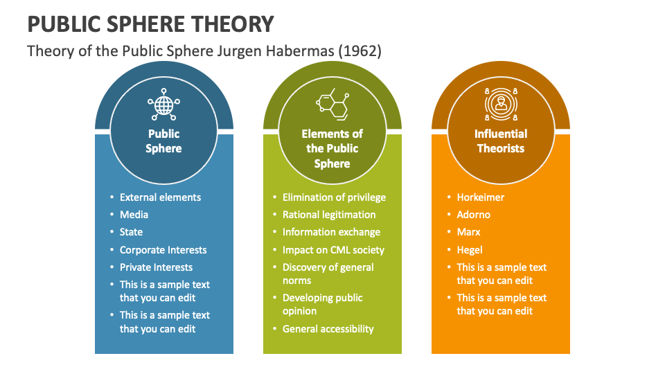

#### 马克思主义在当代的地位和前景
- 尽管马克思的革命预言**未能在预期的西方国家实现**，但2008年的经济危机再次引起人们对**资本主义经济周期性危机**的关注
- 马克思的**宽泛理论**依然为理解资本主义社会的经济动态提供了**有价值的视角**
- 现代社会学和政治分析中，马克思主义分析框架仍然被用来**解释和预测社会变革**

## 社会学的建立
### 埃米尔·涂尔干：社会事实
#### 涂尔干的学术生涯和社会学的定位
- **埃米尔·涂尔干**（Émile Durkheim）是法国的**第一位社会科学教授**，最终在**巴黎大学**担任了教育学和社会学教授，为社会学在学术界确立地位
- 他远离哲学，专注于**社会科学**，特别关注能解释当时法国社会面临的**道德和社会问题**的学科
- 涂尔干对社会学的贡献在于他**对社会学科性质的界定**，即研究**超出个体互动的社会制度和形式**，如社会运动、组织和家庭

#### 社会事实的理念和其研究方法
- 涂尔干定义了“**社会事实**”（Social Facts）作为研究的核心对象，认为它们如同自然物体一样，具有**独立于个人之外的客观实在**
- 社会事实对于个体行为有着**约束力**，是外在于个体的存在，需要通过**社会学的方法**进行**研究和理解**
- 他强调，社会事实不可以通过个体的**心理学或哲学思辨来**充分理解，因此推动了一种真正**基于社会逻辑的科学研究方法**
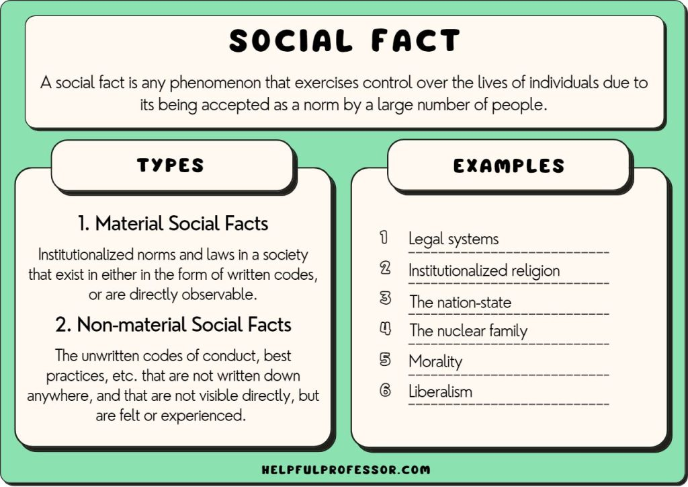

#### 社会团结的理论与现代社会的分析
- 在《**社会分工论**》（The Division of Labour in Society）中，涂尔干区分了**简单社会的机械团结**和**现代工业社会的有机团结**
- 机械团结体现在**个体服从集体**，**个人主义被弱化**，而有机团结则是通过**高度的劳动分工**，强调个性和经济上的**相互依赖**来实现社会凝聚
- 涂尔干对现代社会的**乐观评估**，认为有机团结通过**相互依赖**强化社会团结，反驳了**工业化不可避免地摧毁社会团结**的观点
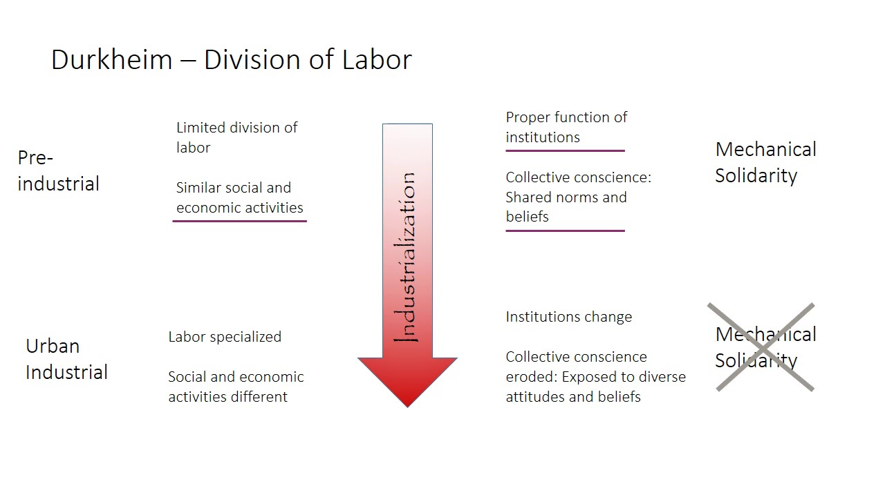

#### 涂尔干的社会学视角与当代社会问题
- 涂尔干的研究不仅是理论上的探讨，他密切关注**如何通过社会学分析解决实际的道德和社会问题**
- 他的工作展示了工业社会在**个体主义日益盛行的时代**如何达成整合，提供了**解决社会问题的新途径**
- 涂尔干的方法强调**科学的社会学分析**与当时的**道德和社会问题之间的联系**，展示了社会学研究的现实意义和应用价值

#### 功能主义的基本观点与批评
- 涂尔干的社会研究方法以**功能主义**著称一对**社会及其制度联结和变迁方式**的研究
- **功能主义**以解释社会如何**维持共性和团结**为强项，但在解释**社会冲突和快速变迁**时效果不佳
- 批评者指出功能主义过于强调**社会对个人的约束**，忽视了**个人创新的空间和可能性**
- 功能主义常被批评为归因于**社会自身**的“**意图**”和“**需求**”，如将教育系统的存在归因于社会的需求，这种解释被视为**过于简化**

### 20世纪的结构功能主义
#### 结构功能主义的发展和社会学的定义
- **结构功能主义**（Structural Functionalism）在20世纪40年代到60年代成为了**社会学的核心范式**，尽管它**从未完全占据主导地位**
- 在那个时期，社会学常常与结构功能主义视为**相同的事物**，反映了当时社会学的**单一理论趋势**
- **塔尔科特·帕森斯**（Talcott Parsons）和**罗伯特·默顿**（Robert K.  Merton）是该理论的重要代表人物，其中帕森斯尝试整合涂尔干、韦伯和帕累托的思想，建构了**宏大的结构功能主义理论**
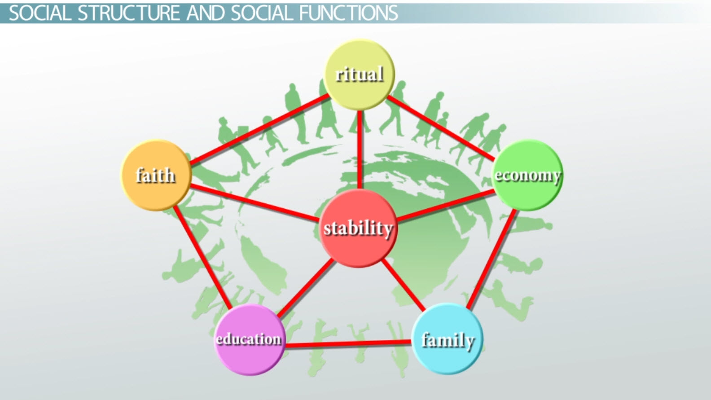

#### 帕森斯的理论与AGIL框架
- 帕森斯提出**社会秩序问题**，关注社会如何协调个体行为以达到集体和谐
- 他发展了**AGIL框架**，这是一个**按社会系统需求设计的模型**，指出社会系统需要**适应、目标实现、整合和文化传承**四个功能
- 帕森斯的视角认为社会规则通过**持续的社会化过程**得到**个体的内化**，不仅仅是外力作用
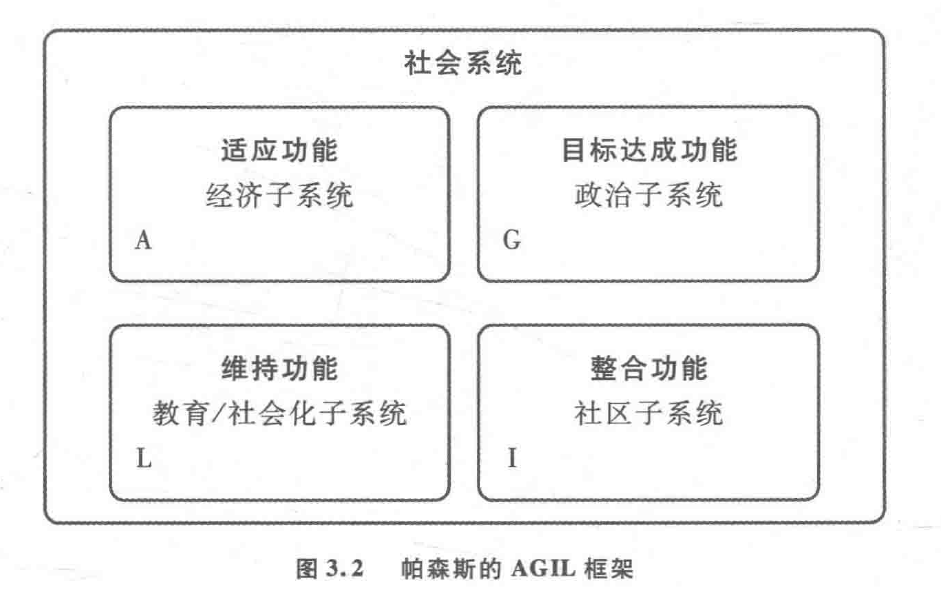

#### 默顿的中层理论和功能的分类
- 默顿提出**中层理论**（Middle Range Theory），试图纠正**仅关注宏观或微观层面的研究方法**，强调研究**特定主题和领域**
- 他区分了**显性功能和隐性功能**，前者为行为的**可观察结果**，后者为**未预见的方面**
- 默顿的理论增加了对**反功能的考虑**，即社会制度可能包含**有损社会整体的功能**
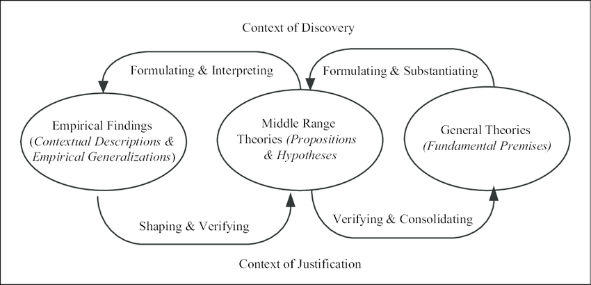

#### 结构功能主义的批评和衰落
- 结构功能主义因**过于强调共识**而被批评忽视了社会的**根本冲突和不稳定因素**
- 随着社会动荡的增加，如反核运动、反战运动等，**冲突理论**得到了**复兴**
- 20世纪六七十年代，结构功能主义理论开始**走向衰落**，帕森斯的理论影响逐渐减弱，社会学理论再次**多元化**

### 马克斯·韦伯：资本主义和宗教
#### 马克斯·韦伯的基本问题
- **马克斯·韦伯**（Max Weber）通过他的著作《**新教伦理与资本主义精神**》（The Protestant Ethic and the Spirit of Capitalism）探索了**为何资本主义首先在西方兴起的问题**
- 他分析了其他文明**在经济和技术上曾超过西方的时期**，并特别提到了**中国、印度和奥斯曼帝国**
- 韦伯的研究挑战了简单**将资本主义发展归因于对财富的渴望**的观点，指出必须有**其他因素**推动资本主义的形成
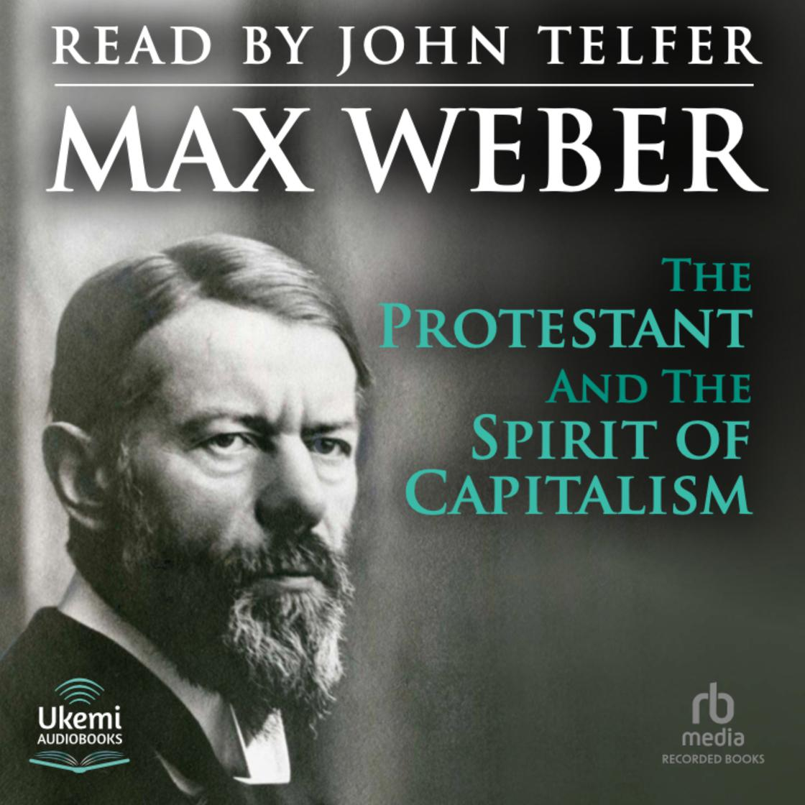

#### 资本主义精神的宗教根源
- 韦伯提出资本主义的核心在于一种特殊的**对财富积累的态度**，称为“**资本主义精神**”，这种态度在历史上的其他地方未曾出现
- 他指出早期的资本家往往**生活朴素且节俭**，与他们的财富积累目的不是为了**奢侈生活**而是**再投资于企业的扩张**
- **新教**，尤其是**清教和加尔文教派**，对**资本主义精神的形成**起到了关键作用，这与宗教观念如**预定论和天职观念**密切相关
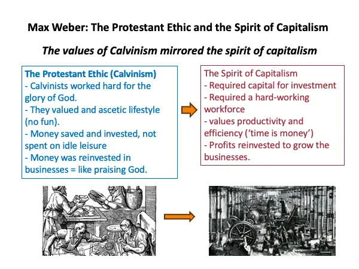

#### 韦伯的社会经济分析
- 韦伯分析了早期资本家如何**将宗教信仰转化为经济活动**的动力，将财富积累视为上帝赋予的任务
- 清教徒对财富的积累是为了**证明自己是上帝的选民**，这种信念导致了资本主义经济活动的**特有发展方式**
- 韦伯认为，虽然这些资本家**未有意图促发资本主义革命**，他们的宗教驱动行为却是现代资本主义快速发展的**无意间促进者**

#### 韦伯理论的影响和评价
- 韦伯的理论对理解现代资本主义的起源具有**深远的影响**，尽管受到了一些批评，例如关于资本主义精神**是否早于加尔文教存在**的争论
- 他的理论因其**独创性**和对经济社会现象提供**非直观的新解释**而受到高度评价
- 韦伯的分析强调了社会学中**反直觉性的重要性**，他的方法不仅揭示了资本主义的特殊起源，而且提供了理解社会变迁的一种新视角

### 符号互动论、现象学以及常人方法学的概述
#### 符号互动论
- **符号互动论**由**乔治·赫伯特·米德**（George Herbert Mead）提出，专注于**语言和符号**在社会互动中的核心作用
- **赫伯特·布鲁默**（Herbert Blumer）进一步发展了这一理论，强调**个体行动和互动**是社会结构的真实存在，而非**抽象的社会结构**
- 米德的研究显示，个体“我”是**社会互动的产物**，称为“**社会我**”（social self），强调人类沟通的象征性和符号的重要性
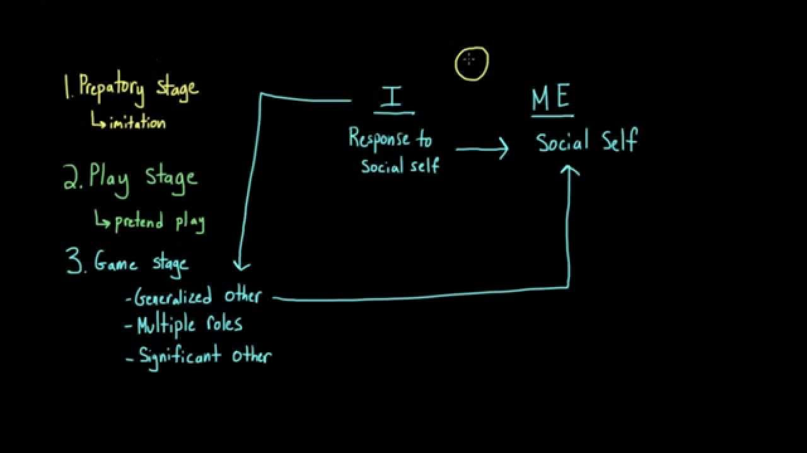

#### 现象学
- 现象学源自**埃德蒙·胡塞尔**（Edmund Husserl）的哲学，通过**阿尔弗雷德·舒茨**（Alfred Schutz）在社会学中得到应用
- 舒茨探索了**个体如何经历**并**将日常生活常态化**的过程，他称之为“**自然态度**”（natural attitude）
- 现象学关注**类型化的概念**，这是个体**基于以往经验对现象进行分类和理解**的过程，这有助于秩序的产生但也可能导致**过度刻板化**
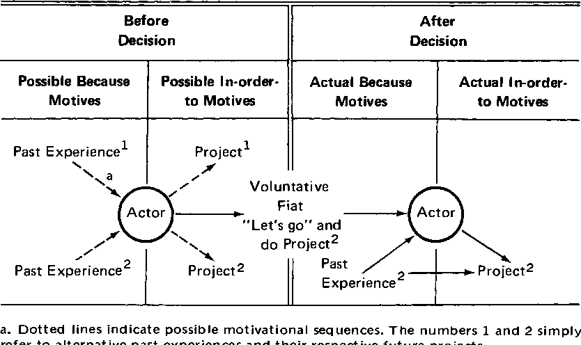

#### 常人方法学
- **常人方法学**（Ethnomethodology）由**哈罗德·加芬克尔**（Harold Garfinkel）提出，强调研究“**本土人**”如何在日常生活中构建社会现象
- 这一方法论**批评主流社会学**，尤其是**结构功能主义**的局限，认为它将人视为**被动的社会化接受者**
- 常人方法学努力揭示社会事实是如何在日常生活中**被个体创造并赋予“物”的性质**，强调互动中的**主体性和创造性**
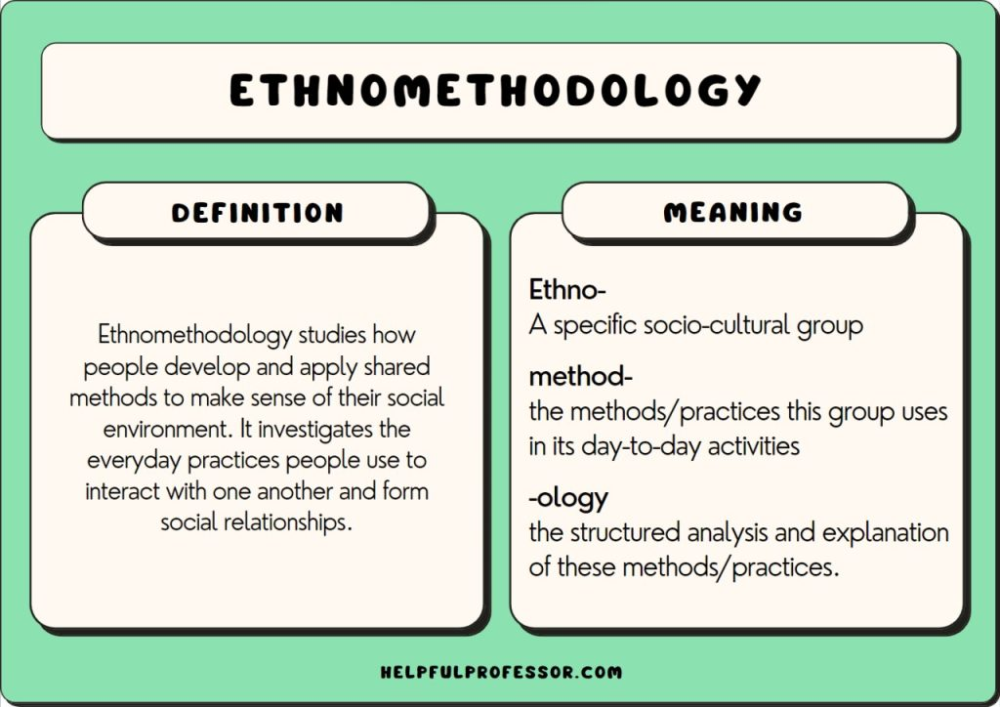

#### 社会学理论的群体性质
- 这些理论将**人类行动者**和**社会互动**置于分析的中心，与**侧重社会结构**的理论形成对比
- 它们强调社会生活的**微观层面**，特别是个体如何**在互动中构建和理解社会现象**
- 这些理论在社会学中形成了一个**重要的群体**，为**理解人类行为和社会结构**提供了**不同的视角和方法论**

## 持久的理论困境
#### 结构与行动的问题 (The issue of Structure and Agency)
- 社会学中一个经久不衰的困境是决定在**社会结构**和**人类行动**之间应该赋予何种权重
- 行动导向的方法关注个体的**创造性和能动性**，强调个体**能在多大程度上控制他们的生活条件**
- 相对地，如功能主义和某些马克思主义学派，则强调**社会结构的约束作用**，认为大多数人类行为是**普遍社会力量的结果**

#### 共识与冲突的对立 (The Dichotomy of Consensus and Conflict)
- 不同的社会理论对社会的本质有不同的解释：一些理论强调**社会的内在秩序**和**和谐**，将**持续性和共识**视为社会的显著特征
- 另一些理论则看到社会中**普遍存在的冲突和斗争**，认为社会生活充斥着**分裂和紧张**
- 这种对立表明，对社会基本结构的解释存在根本性差异，对社会学研究方向和焦点有重要影响

### 社会结构与人类行动的分析
#### 社会结构的外在性和限制性
- **埃米尔·涂尔干**（Émile Durkheim）强调**社会结构对个体行动的影响**，认为社会结构具有**外在性**和**先于个体存在的特性**
- 涂尔干通过**比喻**说明社会结构如同**房间的墙壁和门**限制个人活动一样，限制和塑造我们的行动选择
- **社会法则、货币制度、职业规范**等都是社会结构的例子，它们**独立于个体存在**，并对个体行为**产生约束**

#### 互动论的观点与批评
- **互动论者**认为社会结构是**人类行动的集合**，强调社会现象是**个体之间互动的结果**，而非独立存在的“物”
- 互动论者视角下，社会是通过**文化意义的相互作用**构建的，这意味着个体不仅仅是社会的产物，而是其**创造者**
- 这种观点强调**社会结构的相对性和变动性**，认为社会结构和文化意义是**通过互动不断重新构建**的

#### 结构与行动的互动
- 结构与行动的关系**并非绝对对立**，社会结构虽然限制行动，但个体依然可以通过选择影响社会结构
- **货币体系**虽然是一个社会结构的例子，但个体可以选择**不使用金钱**，展示了行动的自由和社会结构的可变性
- 社会事实虽然影响个体行为，但**不完全决定个体行为**，个体具有选择的自由，能够对社会事实做出不同的反应或解释

### 诺伯特·埃利亚斯与过程社会学
#### 埃利亚斯对社会学的视角
- **诺伯特·埃利亚斯**（Norbert Elias）认为社会学**继承了哲学的问题**，包括**个体与社会的二元论**
- 他反对**传统哲学在社会学中的影响**，主张社会学应成为一门**独立的理论经验科学**
- 埃利亚斯主张社会学家**不需要哲学家的评判**，应自行发展**适用于现实的知识体系**

#### 埃利亚斯的过程研究
- 他提出的**过程研究**（figurational studies）或**进程社会学**（Process Sociology）关注人们**在相互依赖的网络中的行为**
- 过程研究视社会为一个**动态变化的过程**，挑战了将社会视为**静态实体**的传统观点
- 埃利亚斯的方法强调**个体与社会之间的相互作用和互相依赖**，而非将二者视为分离的实体
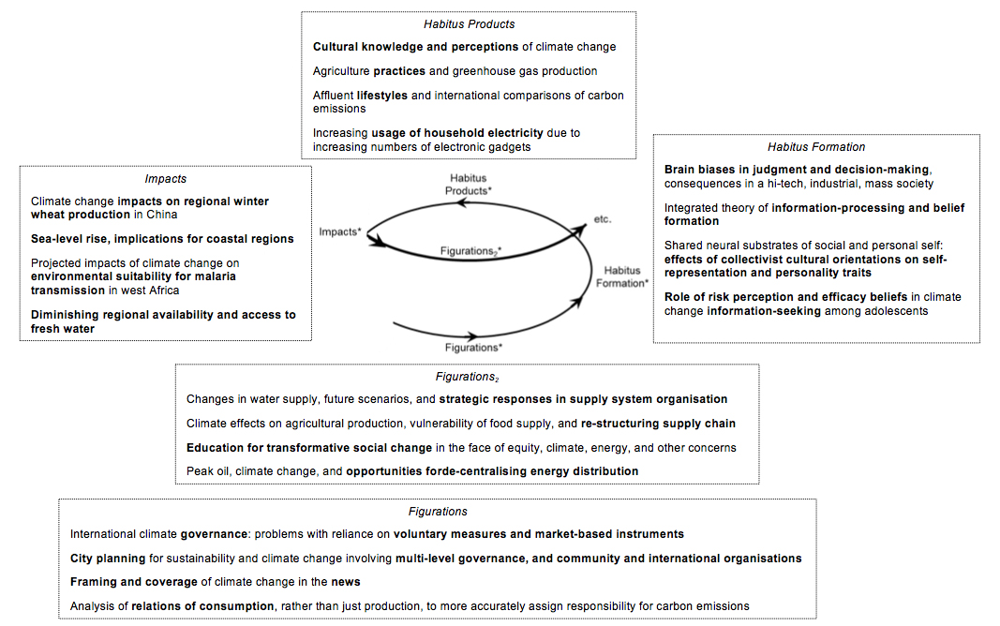

#### 埃利亚斯的理论应用
- 在《**文明的进程**》（The Civilizing Process）中，他探讨了欧洲自中世纪以来**礼仪的演变**，表明了文明行为的长期社会过程
- 他的理论提供了一种**理解社会和个人行为的历史发展的框架**
- 通过过程研究，埃利亚斯促使社会学家关注从个体行为到大型社会结构的**全方位因素**

#### 过程社会学的贡献与批评
- 埃利亚斯的理论提出了一个**全新的社会学研究视角**，强调**长期社会过程的重要性**
- 他的方法有时被批评为**过度强调无意识的社会过程**，可能忽视了**有意识的社会行为和结构的作用**
- 尽管存在争议，过程社会学在社会学中形成了一种具有影响力的研究传统

### 安东尼·吉登斯与结构化理论
#### 吉登斯对社会学与哲学的关系
- **安东尼·吉登斯**（Anthony Giddens）认为社会科学应该**直接联系哲学问题**，而不应避开
- 他强调**哲学中的争论**对于深化对社会生活的理解是**必要的**，批评那些忽略哲学贡献的观点
- 吉登斯主张社会科学**需要哲学来增强其理论的深度和广度**
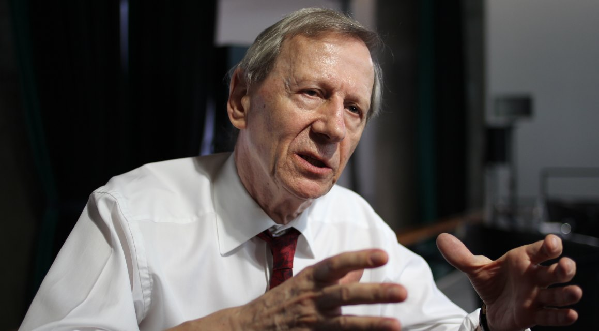

#### 结构化理论的基本概念
- 吉登斯提出**结构化理论**，强调结构和行动之间的**互动性和相互依赖性**
- **结构化**（Structuration）是他用来描述结构如何**既约束又使行动成为可能**的过程
- 结构化理论认为社会结构是通过个体的行动在不断地被**创建、维持和改变**
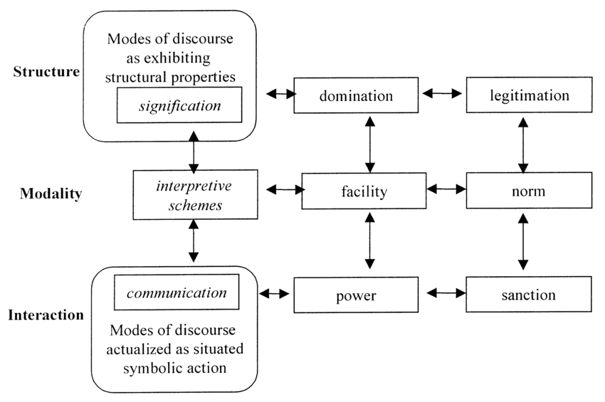

#### 结构化理论的实际应用
- **语言**的例子说明了结构化理论：语言必须**有规则性**（结构），但这些规则必须由个体**在实际使用中维持**（行动）
- 社会生活中的许多**规范和习俗**也通过个体的行动**被赋予力量和具体内容**
- 吉登斯指出，所有的社会机制如语言，尽管**具有规则性**，却依赖于**个体的持续实践和维护**

#### 结构化理论的批评与评价
- 结构化理论被一些学者批评为**过分强调个体在社会构造中的作用**，可能**忽略了更广泛的社会、经济力量**
- **玛格丽特·阿切尔**（Margaret Archer）认为吉登斯的讨论**过于描述性**，没有足够解释结构和行动的实际互动
- 尽管存在争议，结构化理论为理解结构与行动的相互关系提供了一个有用的理论框架
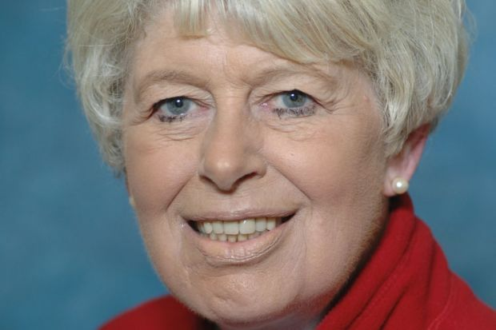

### 共识与冲突
#### 社会的功能主义视角
- 涂尔干和大多数功能主义者视社会为一个由**紧密交织的结构**组成的**统一整体**，类似于**人体的生理机能**
- 社会各制度如政治、宗教、家庭等必须**相互协调工作**以维持社会的整体运行
- 社会的持续性依赖于**制度间的合作**和**广泛的价值共识**

#### 冲突理论的观点
- 冲突理论者，如马克思，看到社会作为一个**不平等资源分布的竞争场**，其中存在着**内置的利益冲突**
- 社会被划分为不同的阶级，性别，族群，或政治派系，**冲突是社会变革的催化剂**
- 即便是最稳定的社会制度，也是**不同群体之间竞争性力量的不稳定平衡**

#### 共识与冲突的复杂关系
- 实际上，社会既包含**对某些基本价值的广泛共识**，也牵涉到**利益的冲突**
- 社会学分析需要**同时考虑**共识和冲突在社会结构中的作用和相互关系
- 例如，在阶级冲突理论中，不同阶级虽有**对立利益**，但也存在**共同利益**，如劳资之间的相互依赖

#### 意识形态的作用
- 意识形态通常服务于**维持较大权力群体的地位**，同时**压制较小权力群体的利益**
- 意识形态的主导可以促成**表面的社会共识**，尽管这可能基于**对不平等的接受**
- 权力较大的群体可能**依赖意识形态影响来维持统治**，但**在必要时也会使用武力**

#### 现代例子分析
- "**阿拉伯之春**"的发生展示了**抗议和冲突**是如何从**底层社会**的挫折和利益冲突中爆发的
- 在一些国家，当**意识形态**无法维持稳定时，掌权者转向使用**军事力量**来镇压反抗
- 这表明无论共识还是冲突，都是社会结构动态演变的一部分

## 社会的转型与社会学
### 马克思与韦伯对资本主义的分析
#### 马克思的资本主义观点
- 马克思视**资本主义**（capitalism）为一个**动态的经济体系**，以其**不断的竞争和技术革新**而著称
- 资本主义的本质在于**不断扩张**，寻求**新市场、廉价原材料和劳动力**
- 马克思强调资本主义不可避免地**向全球扩展**，看其为现代世界的一个**决定性力量**
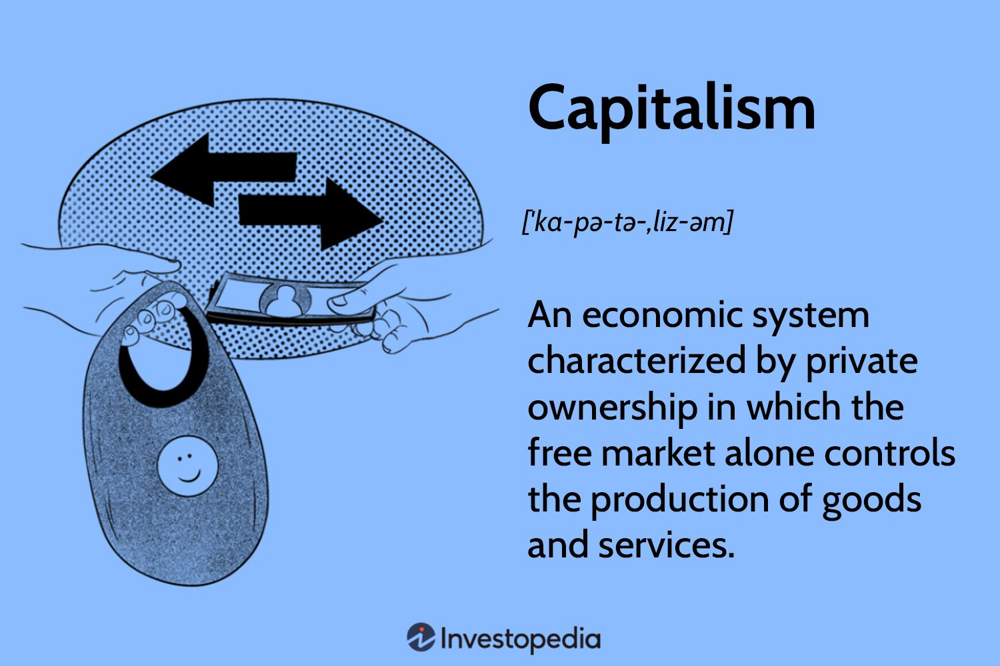

#### 韦伯的反驳与补充
- 韦伯认同**物质因素在社会变迁中的重要性**，但强调**观念和意识形态同样关键**
- 举例来说，韦伯通过其著作《**新教伦理与资本主义精神**》展示了**宗教信仰对经济活动方向的影响**
- 韦伯不认为资本主义是社会发展的**唯一或最重要的动力**，强调**科层制和理性化**在现代社会中的作用
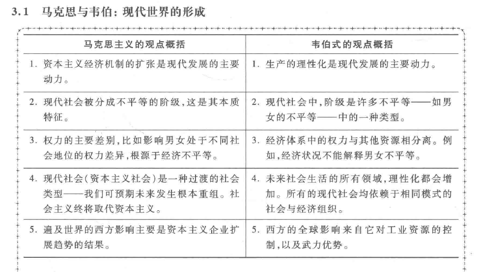

#### 马克思与韦伯理论的现代应用
- 尽管马克思和韦伯的理论为理解**工业化和资本主义**提供了框架，但它们对解释**性别关系、全球化等现代问题**可能不够充分
- 新的社会学理论可能需要**超越经典理论**，以更全面地解释现代社会的复杂性和多样性

#### 对社会学发展的批评与新方向
- 新的社会学观点如女性主义和后殖民主义批评**传统理论忽视了某些群体的经验**
- 当代理论探讨如风险社会、全球化和后现代主义等新兴问题，考察经典社会学理论在这些领域的**适用性和局限性**

### 女性主义与男性主导的社会学
#### 社会学创始人的性别偏见
- 社会学创始人**主要是男性**，他们对性别问题**关注不足**，通常忽略或描述性别关系不全面
- **涂尔干**等人将女性视作**自然的产物**，而男性则是**社会的产物**，这种区分在现代社会学中**不被接受**
- 过去的社会学家对性别的考虑**往往不全面**，未能准确反映女性的**社会角色和身份**

#### 马克思和恩格斯的性别观点
- 马克思和恩格斯认为**性别差异**主要反映了**社会的阶级差异**
- 他们认为原始社会中**不存在性别和阶级差异**，女性的从属地位是**随着私有财产和阶级制度的出现而形成的**
- 当代社会学家认为，除了阶级，还有**族群和文化**等因素影响性别关系

#### 女性主义对社会学的具体影响
- 女性主义理论强调**个人经历与政治的关联**，推动社会学将**私人领域**如**家庭生活**纳入研究范畴
- 通过诸如“**个人即政治**”（the personal is political）等观念，女性主义将家庭和私人事务提升为**社会学的合法研究主题**
- 女性主义理论提出**对整个学科的重建**，特别是在理论和方法论上进行根本性的反思和改革
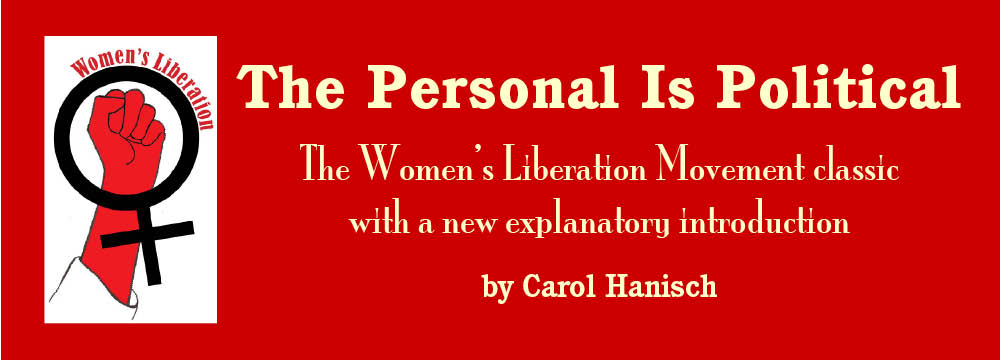

#### 女性主义理论的影响和争议
- 女性主义理论的影响和它的改变承诺在社会学中仍然是一个**有争议的问题**，有人认为它仍遵循“**前女性主义模式**”，而有人认为它是一场“**仍在迷失的革命**”
- 性别应如何在理论中被说明，不同的女性主义者之间**存在分歧**，有时这些差异**非常显著**
- 一些**后现代和后结构主义女性主义者**，如唐娜·哈拉维、埃莱娜·西克苏和朱迪斯·巴特勒，批评以前的理论**假设了女性有本质上相似的利益**
- 他们认为性别是**动态的**，是**通过行动表现出来的**，而非**固定的分类**，这一点对于战斗性别不平等是关键
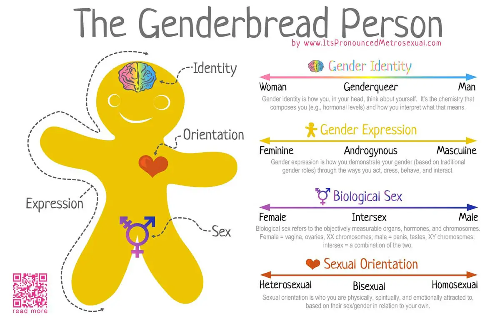

#### 交叉性的兴起
- 当代社会学增加对**交叉性的关注**，即**阶级、性别和族群差异**如何交织在一起造成复杂的社会不平等
- 交叉性理论展示需要**超越传统理论**，包括更多维度来分析社会问题
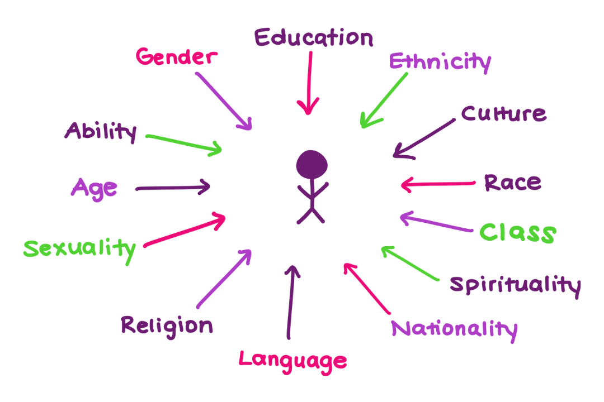

#### 女性主义理论的挑战和发展
- 女性主义学者批评传统社会学**忽略或误解性别问题**，提倡重新评估社会学的理论和方法
- 女性主义理论主张社会学应**认识到性别问题的重要性**，并纳入**对男性和女性关系的深入探讨**
- 现代女性主义理论**多样化**，包括自由主义、社会主义、激进主义、后现代主义等多种流派
- 尽管存在不同，所有女性主义理论都认同**知识与性别问题相关**，且在**父权社会**中，女性受到压迫

#### 女性主义理论的批评和全球视角
- 拉赫曼和杰克逊指出，现代女性主义必须**关注全球不平等**，尤其是**在发展中国家的女性的物质条件**
- 他们强调不平等不仅仅是**文化的**，而是建立在**制度化的**种族主义、殖民主义及全球和地方的劳动分工的实际不平等之上

### 后殖民的社会学
#### 后殖民理论的核心关注点
- **后殖民理论**（Postcolonialism）探索**欧洲殖民主义**的**长期遗留影响**在社会和学术领域的**持续存在**
- 这包括挑战无法解释**殖民和后殖民关系**的**核心社会学概念和理论**
- 后殖民批判者指出，标准社会学的叙述忽视了**殖民主义和帝国主义在现代社会中的关键作用**

#### 社会学的欧洲中心主义批评
- 后殖民批判者认为社会学受限于**分析“现代”社会**，忽略了**非欧洲和殖民社会的经验**
- 社会学历史上与人类学的学科分工导致社会学**关注现代工业社会**，而人类学**处理非欧洲和非现代的社会**

#### 爱德华·萨义德的东方主义批评
- **爱德华·萨义德**（Edward Said）在《**东方主义**》（Orientalism）中批评**西方学者对东方的描述**，认为它们基于**西方对东方的统治**
- 萨义德指出，东方主义是**西方优越性的一部分**，为政治和经济的殖民统治提供支持
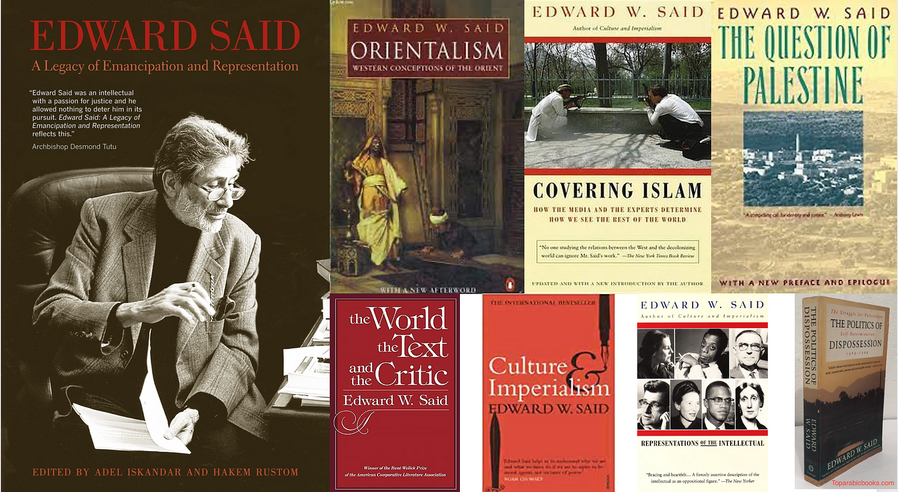

#### 后殖民理论的现代挑战
- 后殖民理论家认为即使是现代社会学理论也未能逃脱**过时的思维模式**，如将全球化视为**西方向“其余部分”世界的扩展**
- 他们呼吁对社会学的**核心概念和理论进行修改**，以更真实地反映全球社会的多样性和复杂性

#### 女性主义与后殖民批评的影响
- 后殖民批评和女性主义理论推动了对社会学的**根本反思**，尽管不是每个人都认为这种改变是可能或必要的
- 社会学需要继续适应**不断变化的社会挑战**，并在此过程中相应地发展理论

### 后结构主义与后现代性
#### 后结构主义思想
- **米歇尔·福柯** （Michel Foucault）、**雅克·德里达**（Jacques Derrida）和**朱利娅·克里斯特瓦**（Julia Kristeva）是后结构主义的主要人物
- 福柯分析了**监狱、医院、学校等机构**在社会人口管理中的角色
- 福柯的研究强调**启蒙思想对个人自由的消极面**，特别是关于**规训和监视**的问题
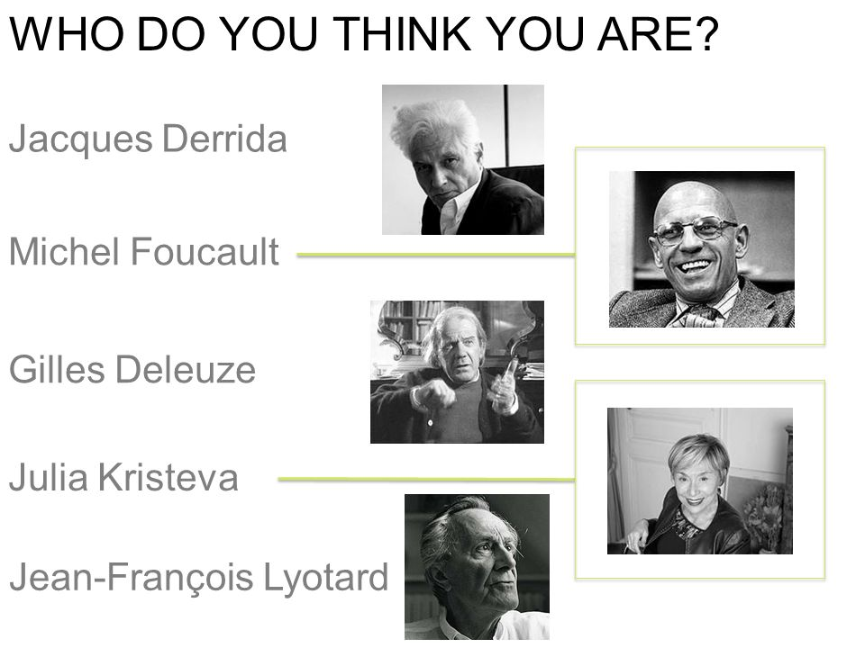

#### 权力与话语
- 福柯将**权力、意识形态与话语**的关系放在研究的核心
- 他认为**话语定义了可以被认知和讨论的对象**，如疯癫的医学化话语强化了医学网络的权力
- 通过控制话语，权力能够**塑造公众态度**并**限制其他思考或言说方式**
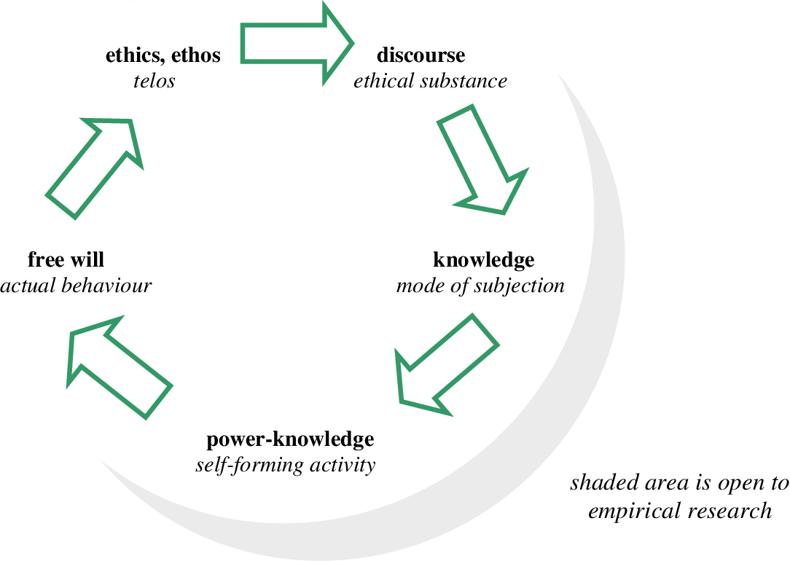

#### 后现代主义的观点
- 后现代主义者认为历史**无终点、无模式**，否定了历史或社会的**总体性叙事** （metanarratives）
- 后现代世界视角认为科学和民主**并不总是促进进步**，强调**多样性和复杂性的认识**
- **让·鲍德里亚**（Jean Baudrillard）提出的**超现实主义**指出**现实与象征的界限已模糊**，例如人们对公众人物如戴安娜王妃的反应更像对肥皂剧的反应
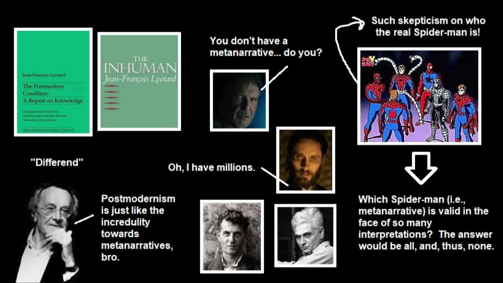

#### 社会学的适应与批评
- **齐格蒙特·鲍曼**（Zygmunt Bauman）区分了**后现代性社会学**与**后现代社会学**，探讨了社会学应**如何适应或重塑以适应后现代世界**
- **尤尔根·哈贝马斯**批评后现代理论，认为应**继续发展现代性项目**，推动**民主与理性政策**
- 后现代分析已逐渐**被全球化理论取代**，后者成为解释21世纪社会变迁的主导理论框架

### 全球化、风险与自然的“报复”
#### 社会反思性的增加
- **安东尼·吉登斯** (Anthony Giddens) 描述我们所处的现代世界为“**失控的世界**” (runaway world)，强调信息时代带来的**社会反思性增加**
- 反思性让人们**不断思考自己的生活处境**，与过去习惯和传统指导的生活方式**形成对比**
- 现代技术如**避孕和生殖技术**改变了**家庭规模和结构**，带来新的选择同时也引发**伦理困境**

#### 失控的世界和全球化的影响
- 全球化导致**国家权力的相对下降**，2008年的**全球金融危机**显示了国家对自身经济的**影响力减弱**
- 尽管如此，国家通过**合作制定策略和提供资金援助**受影响国家显示了在全球框架下重新获得影响力的可能
- **非政府组织和社会运动**在**形成社会政策**和**反映民众利益**方面发挥作用，但**不能完全替代传统的民主政治结构**
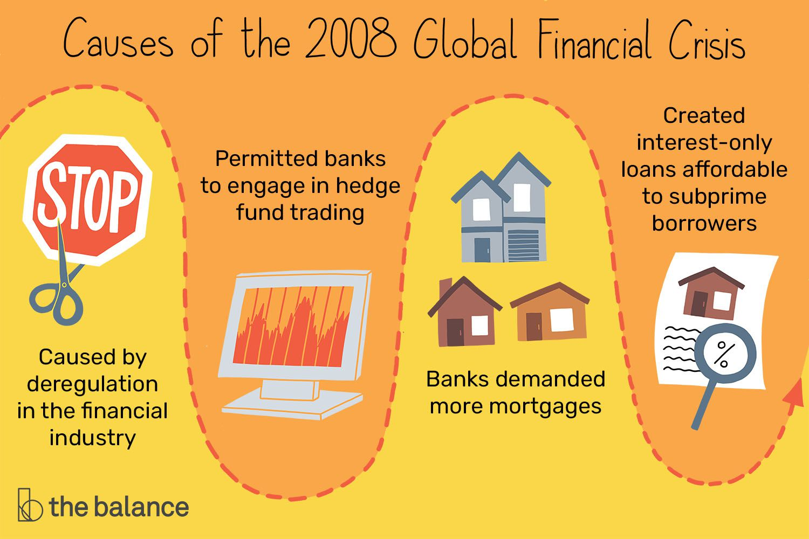

#### 社会学的反思性和适应性
- 社会学作为学科，反思其**研究方法**和**对研究参与者的影响**
- 研究过程越来越多地看到**参与者的深度参与**，比如在**设计研究问题**和**讨论初步结果**方面有所贡献
- 这种参与增强了研究的有效性，使得社会学家能与参与者**共同审视和解释研究结果**，反思性的趋势可能会继续**扩展到更多社会生活领域**

#### 乌尔里希·贝克的风险时代观点
- **乌尔里希·贝克** (Ulrich Beck) 提出“**第二现代性**” (the second modernity) 和“**风险社会**” (risk society)，描述了从传统和习惯束缚中释放出来的**现代制度**全球化和**日常生活的变化**
- 现代社会风险**更多来源于人类活动**，如**全球变暖**和**科技发展带来的未知风险**
- 贝克强调，风险社会的**全球影响和跨国界特性**，以及必须通过**国际合作**来应对全球性问题的需求
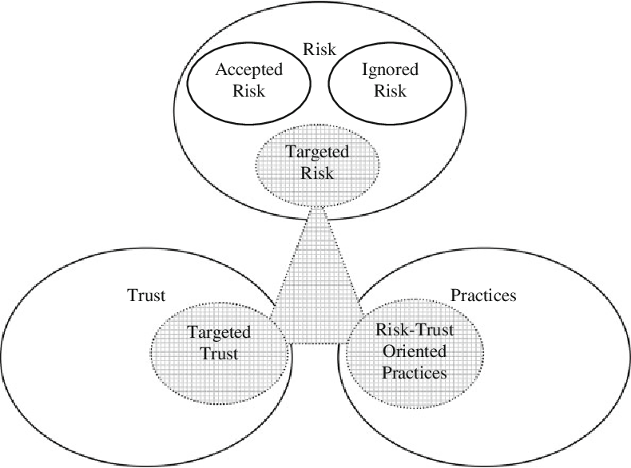

## 结论
### 社会学理论的历史背景和适应性
- 社会学理论如**马克思**（Karl Marx）、**涂尔干**（Émile Durkheim）、**韦伯**（Max Weber）的理论源于**对社会、政治、经济巨变的理解尝试**
- 这些理论在全球化和社会快速变迁的背景下**需要更新和适应**，以便**更好地解释现代社会的新发展**
- 理论更新不意味着**旧理论的完全废弃**，而是通过**新旧理论的对话和整合**来提升理论的实用性和内在一致性

### 理论整合的必要性
- 社会学的理论发展不能仅仅依赖**内部争论**，必须能**对现代关键问题提供洞见**
- 旧的理论观点应与新的理论相**结合**，进行效果的**测试和比较**，从而**检验和更新**这些理论
- **新马克思主义**（Neo-Marxism）是一个例子，它虽然与马克思的原始观点密切相关，但已根据现代情境进行了**适当的修改和更新**

### 理论的现代化和多样性
- 现代社会学理论通过**整合古典与当代理论**，推动了**理论的多样性和发展**
- 理论综合被视为一种**保留古典理论精华**的同时，更新它们以**应对社会变迁**的有效方式
- 当代理论的成功在于其对新兴社会问题的**敏感性和解释能力**，如全球化、技术变革等对社会构成的影响