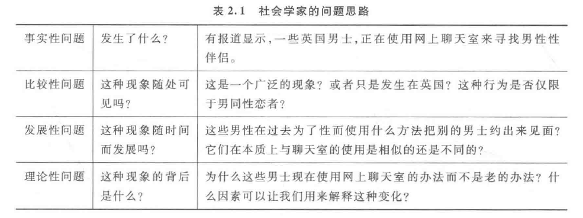
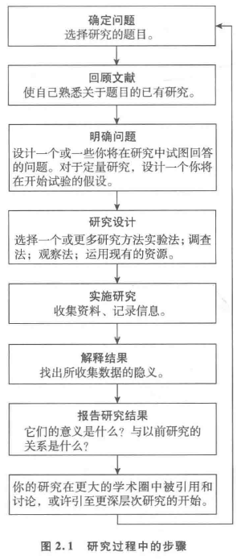

[TOC]
# 社会学的提问与解答
## 劳德·汉弗莱斯的《茶室交易》研究
### 社会学的研究背景和动机
- **劳德·汉弗莱斯**关注于美国密苏里州圣路易斯市公厕内发生的**匿名同性性行为**，该行为被称为“**茶室交易**”（tearoom trade）
- 汉弗莱斯的研究旨在揭示**隐藏的男同性恋亚文化**，这一亚文化在1960年代社会背景下被**严重污名化和刑事追究**
- 研究显示，参与这种匿名性行为的男性中，不仅包括**自认为是同性恋者**的人，还有**不认为自己是同性恋者的已婚男性**和**其他社会成员**

### 研究方法与伦理争议
- 汉弗莱斯通过**秘密观察**和**未经参与者同意**的方式进行研究，引发了**广泛的伦理争议**
- 他**没有透露**自己是社会学家的身份，而是假装为“茶室”里的一员，这种做法在当时的社会环境下被认为是**有违道德的**
- 尽管如此，汉弗莱斯**未收集任何能够明确识别参与者身份的信息**，比如他没有收集车牌号码以避免对个人生活造成直接影响

### 研究的社会意义与影响
- 汉弗莱斯的研究**突破了社会对男同性恋者的传统看法**，展示了他们在**保持社会形象**的同时**寻求性满足**的隐蔽方式
- 该研究揭示了同性恋者在社会中受到的**迫害**和隐蔽生活的**痛苦**，为**理解和减少这种痛苦**提供了科学依据
- 汉弗莱斯认为，社会**对同性恋亚文化的更大宽容**可以减轻同性恋者的苦难，他的研究在社会学和同性恋权利运动中产生了**长远影响**

## 社会学研究中的道德问题
### 研究的道德困境
- 社会学研究**涉及人类**，常**面临道德困境**，尤其是当研究**可能带来的风险**超过**日常生活中的风险**时
- **脆弱群体**如儿童的研究**尤需谨慎**，必须考虑是否继续进行这种研究
- 道德问题现今**比过去更受重视**，研究对象**逐渐参与研究过程**，影响问题设定和研究结果的反馈

### 参与者的变化角色
- 参与者**不再仅是研究对象**，他们越来越多地**参与研究设计**，提出意见，并期望得到**研究结果的反馈**
- 这种参与改变了**传统的研究者与参与者的动态**，减少了**对研究者作为唯一知识权威的依赖**
- 研究机构要求**明确道德问题处理方式**，如避免欺骗、保护参与者免受风险、确保结果的正当反馈

### 拉洛德·汉弗莱斯的争议性研究
- **汉弗莱斯**在研究《**茶室交易**》时未透露身份，导致**对研究对象的欺骗行为**，虽无直接危害但**伦理上存争议**
- 汉弗莱斯记录了参与者的车牌，通过**不透明的方式**获取个人信息，引发对研究伦理的重大质疑
- 研究行为如**记录车牌**和**随后访问家庭**，虽未直接揭露茶室活动，但**涉及潜在风险**，如数据泄露或被法律诉讼利用

### 现代社会学研究的道德规范
- 当前研究必须**遵循严格的道德准则**，如需获得**官方批准**，汉弗莱斯的方法将不被接受
- 国际和国家研究机构设有**道德审查板**，要求研究中明确道德风险和应对策略
- 社会学家被要求在研究中**保持透明度**，避免欺骗行为，确保研究的**合法性和伦理性**

## 社会学的问题与理论多样性
### 社会学的研究问题
- 社会学研究如《茶室交易》常常揭示出**社会结构的隐秘方面**，挑战我们对日常现象的理解
- 汉弗莱斯的研究提出问题，为什么公共场所如厕所会有**与公认功能不同的社会用途**
- **社会建构论**（social constructionism）认为社会现实是**通过个体和群体的互动构建的**，而不是自然发生的

### 不同理论视角的应用
- **互动论者**关注个体之间的**互动**如何**导致特定的社会行为**
- **功能主义者**探讨茶室如何帮助**维持社会秩序**，允许参与者在社会中正常功能
- **马克思主义者**分析茶室中的**阶级和民主性**，如何跨阶层和种族提供性服务
- **女性主义者**考虑这种研究**忽视的女性角色**和**受影响的女性伴侣**

### 经验性和事实性问题
- 社会学家经常面临**确定事实性问题**的挑战，如在没有官方统计的情况下，探索**特定群体的职业和家庭背景**
- 例如，汉弗莱斯的茶室研究中**缺乏关于参与者的正式统计数据**，反映了收集某些社会现象数据的困难
- **犯罪统计的可靠性问题**表明，很多社会行为的数据只是“冰山一角”，真实情况常被隐藏或误解

### 比较性和发展性问题
- 社会学家致力于探索**不同国家间的社会体制和法律制度差异**，例如美国、意大利和南非在犯罪行为和法律执行上的不同
- 通过**比较不同社会**，社会学家尝试理解**不同社会体制的发展**及其**对现代社会的影响**
- 研究不仅涉及**横向比较**，也包括**纵向比较**，探索社会**从过去到现在的演变**，例如监狱制度的起源和变化

### 理论性和实际性问题
- **理论性问题**关注**解释社会现象背后的原因**，社会学研究不仅仅依赖于事实收集，还需要**深入理解这些事实背后的含义**
- **实际性问题**更多关注**社会学理论对现实问题的应用**，如政策制定和实际社会行动
- **理论与实际的结合**体现在社会学的方法论中，确保研究既有理论深度也能应对实际社会问题

### 社会学的科学性和客观性
- 社会学努力保持**科学性**，通过使用**系统的方法论**来克服研究中的障碍
- 理想的研究状态与现实中的研究状态常**存在差异**，研究者需要**解决多种实际问题**以维持研究的质量和可靠性
- **客观性**在社会学研究中是一个**核心目标**，尽管其面临多种挑战，研究者需要注意**不受个人价值观和偏见的影响**

### 社会学作为一门科学的探讨
#### 社会学的科学基础
- 社会学采用**系统的方法**进行**经验调查**，包括**数据分析和理论评估**，这符合**科学研究的基本定义**
- **定量和定性研究方法**的应用显示社会学使用**经验数据和逻辑推理**，这与科学的方法相一致
- 然而，人类社会的**复杂性**和个体的**自我意识**使得社会学和自然科学在科学性的表现上存在**明显不同**

#### 人类行为的科学研究挑战
- 人类具有**赋予行为意义和目的**的能力，这要求社会学家在研究时首先理解人们的意图
- 例如，自杀者的意图必须被**准确理解**，才能在科学研究中**准确描述其行为**
- 研究人类行为时，社会学家不能像自然科学家那样**将人作为研究对象**，而必须处理**个体的主观性和复杂性**

#### 社会学研究的优势和限制
- 社会学家可以**直接与研究对象交流**，获得**研究参与者对行为的解释**，这为研究提供了**高度的信度和效度**
- 然而，社会学研究也面临**被研究者行为改变**的问题，特别是当参与者**意识到自己被观察**时，可能**不会表现出平常的行为**
- 社会学家需要对这些问题有所认识，并**在研究策略中加以调整**，以确保研究结果的有效性和可靠性

## 社会学研究的过程
### 确定研究问题
- 社会学研究始于对特定社会现象、过程或制度的**好奇**，提出**探索性的研究问题**
- 研究问题通常源于**观察到的社会问题**或已有研究中**未涵盖的领域**
- 好的研究问题不仅寻求**描述性答案**，更重要的是提供**解释性的深入分析**，例如探讨宗教信仰模式变化的原因

### 证据回顾
- 进行研究前需通过文献回顾了解**领域内已有的研究成果**，避免**不必要的重复研究**
- 文献回顾帮助识别研究领域中的**知识空白**，为构建**新的研究问题**提供依据
- 通过分析以往研究的方法和结论，研究者可以**选择或改进自己的研究方法**

### 明确问题
- 在已有文献基础上，研究者需要**明确自己的研究目标**，形成**清晰的研究假设**
- 假设需要具有**可验证性**，即通过**研究数据**能够被支持或反驳
- 研究假设的形成是基于**对预期结果的合理预测**，并能够明确指导数据的收集和分析

### 研究设计
- 研究设计决定研究的**具体执行方式**，包括选择**合适的研究方法**（如调查、访谈、观察等）
- 方法的选择依赖于**研究目标和问题的性质**，大量数据的需求倾向使用**定量方法**，而详细深入了解小群体可能适用**定性方法**
- 研究设计必须充分考**虑实际操作的可行性和研究伦理**，确保数据的**真实性和可靠性**

### 实施研究
- 实际研究中可能面临**多种预料之外的困难**，如样本获取困难、数据收集过程中的非预期问题
- 处理实际困难时，研究者需要**灵活调整研究方案**，可能包括**修改数据收集方法**或**调整样本范围**
- 实施阶段的挑战可能导致**研究结果的偏差**，研究者需通过合适的策略**最小化这些偏差的影响**

### 解释结果
- 数据收集后，研究者需要对数据进行**详细分析**，找出数据背后的**社会学意义**
- 解释研究结果涉及**将数据与理论联系起来**，验证或反驳研究假设
- 在解释结果时可能面临**数据解读的难题**，需要结合专业知识和理论框架来准确理解数据所反映的社会现象

### 报告发现
- 研究结果通常通过**学术期刊文章或书籍**的形式发布，以**传播知识和启发后续研究**
- 发布的**研究报告**应详细描述研究过程、方法、结果及其社会学意义
- 报告也应指出研究的**局限性和未解决的问题**，为未来的研究提供可能的方向

## 理解原因与结果
### 因果与相关 (Causation and Correlation)
- 确定因果关系是**社会学研究的核心**，目的是理解一个事件或情境如何影响另一个
- **相关**（Correlation）指两个变量间的**系统关联**，但**不必然意味着因果关系**
- 错误地将相关解释为因果可能导致**误导性结论**，如吸烟率下降与看电影人数增加的例子

### 因果机制 (Causal Mechanisms)
- 揭示**因果机制**涉及理解变量间的**直接关系**及其背后的**社会、心理或经济过程**
- 例如，教育和职业成功之间的相关可能由**家庭背景和社会资源等因素介导**
- 理解因果机制需要综合考虑**多方面的影响**，包括文化、环境和个人行为

### 控制 (Control)
- 控制是在分析中**固定一些变量**以明确其他变量间关系的研究策略
- 通过**控制潜在的干扰变量**，研究者可以更准确地判断观察到的相关性是否反映因果关系
- 控制的应用示例包括在考虑母爱剥夺对儿童发展影响时**排除其他干扰因素**，如其他照顾者的影响

### 确认原因 (Establishing Cause)
- 即便面对**明显的相关**，确认因果关系**仍然具有挑战性**，因为可能的原因多且复杂
- 在社会学研究中，常通过**建立假设**和**进行系统测试**来探究和确认因果关系
- 确认因果关系需**谨慎**，避免过度简化，特别是在处理复杂的社会现象时
- 例如，吸烟与肺癌的研究历史，展示了如何从广泛的相关中探索和确定因果机制

## 社会学研究方法的应用
#### 定量研究与定性研究的区分
- **定量研究**（Quantitative Research）致力于使用**统计工具**来**测量并解释社会现象**，常与**功能主义**和**实证主义**（Functionalism and Positivism）联系
- **定性研究**（Qualitative Research）专注于**收集详尽的数据**来深入理解**个体行为及其社会背景**，通常与**互动论**（Symbolic Interactionism）关联
- 这种分类有助于**初步理解社会学研究方法**，但实际应用中两者不应被视为完全对立的方法

#### 混合研究方法的实践
- 当今研究中常见的是**混合方法研究**（Mixed Methods Research），它结合了定量和定性研究的优势，以获得**更全面的主题理解**
- 混合方法有助于**克服单一研究方法的局限性**，通过**多角度分析**提高研究的丰富性和有效性
- 例如，社会学家可能使用定性方法来探索**女性的真实经历**，同时使用定量数据来衡量**性别不平等的社会范围**

#### 研究方法的选择重要性
- 社会学家选择研究方法时需**根据所要回答的具体问题和研究目的**来决定最适合的方法
- 有效的研究设计应**结合问题的性质**，可能需要同时运用**多种数据收集和分析技术**
- 选择**合适的研究方法**可以最大化研究的效率和影响，确保研究结果的可靠性和实用性

### 民族志
#### 民族志的基本概念与应用
- **民族志**（Ethnography）是一种**田野工作类型**，研究者与研究对象**共同生**活并**直接参与其日常活动**
- 使用的主要方法包括**参与观察和访谈法**，使研究者能够获得**深入了解**被研究群体的行为及其**对这些行为的理解**
- 这种方法有助于构建对特定社会群体、组织或群落内部观点的理解，并可以推广到更广泛的社会过程理解

#### 民族志研究中的自反性与透明度
- 现代民族志研究越来越**注重研究者的自反性**，即研究者**讨论自己的背景**（如种族、阶层、性别）如何影响研究
- 讨论研究者与被研究者之间的**关系**和可能的**权力差异**，这对于理解数据的收集和分析至关重要
- **自反性的增强**有助于揭示可能**扭曲研究结果的偏见和预设**，使民族志的描述更为客观和准确

#### 民族志研究的挑战与限制
- 民族志通常针对**较小的群体**进行，研究的**广泛性和普遍性**可能受限
- 研究者需要**获得群体的信任**，这一过程可能**复杂且充满挑战**，特别是在对研究者有**敌意**的环境中
- 民族志的研究可能**面临失败的风险**，例如研究者可能**过于同化**进群体而失去客观性，或者研究因方法**依赖过重**而难以被其他研究者重复

### 问卷调查
#### 问卷调查的基本特征
- 问卷调查通常涉及**大规模样本的数据收集**，使用**问卷**作为主要工具，可以是面对面、电话、邮寄或电子方式进行
- 这种方法允许社会学家**迅速从大量人群中收集数据**，可以对社会现象进行**广泛的测量和统计分析**
- 问卷调查尤其适用于需要**评估和比较大量数据**的研究场景，如政治态度、社会行为等

#### 问卷调查的类型及其适用性
- **标准化问卷**（Standardized questionnaires）提供**固定的回答选项**，如“是/否”，**便于统计和比较**，但可能**限制深度信息的收集**
- **开放式问卷**（Open-ended questionnaires）允许受访者**用自己的语言回答**，提供**更丰富的数据**，但分析起来**更复杂**，难以进行广泛比较
- **半结构化问卷**（Semi-structured questionnaires）结合了上述两种类型的优点，通过设置**标准问题与开放式问题相结合**，既能进行统计分析，也能探索更深入的回答

#### 抽样技术及其重要性
- 社会学家通过**抽样**（Sampling）来研究**总体的一个代表性子集**，以便推广研究结果到更大的群体
- 抽样技术包括**随机抽样**（Random sampling），确保每个人有**平等的被选中机会**，以及**方便抽样**（Convenience sampling）和**滚雪球抽样**（Snowball sampling），后两者**更适用于难以接触的群体**
- 精确的抽样方法是获得**代表性数据**并进行**有效推广**的关键，但抽样过程**复杂且需要精确控制**以避免偏差
- **保罗·拉扎斯非尔**在1948年进行的研究“**人民的选择？**”使用**问卷调查**技术来分析政治态度和选民行为，开创了现代社会学研究的一些主要技术

#### 问卷调查的优点与局限
- 问卷调查的优点在于能够**处理和分析大量数据**，适用于**定量研究和统计分析**，但可能**缺乏深度和个性化的细节**
- 问卷调查可能受到**非应答率高的问题**影响，特别是在邮寄问卷的情况下，而且有时可能会给出**误导性的精确感**
- 社会学家需要**谨慎对待**通过问卷调查得出的结论，特别是在数据收集存在系统偏误时，需要通过**额外措施**来确保数据的准确性和代表性

### 实验
#### 实验的定义和特性
- **实验**是一种研究方法，其中研究者在高度控制的条件下**测试一个假设**（hypothesis）
- 它通常用于**自然科学和心理学**，因为可以**直接控制研究环境**，从而**精确地观察和测量**变量之间的因果关系
- 在社会学中，实验的使用**相对有限**，因为从其社会环境中**剥离个体进行观察**可能**不会反映真实的社会动态**

#### 社会学中实验的应用
- 社会学实验通常探索**群体动力学或个体行为**，但面临的挑战是实验环境可能导致**非自然行为**，如**霍桑效应**（Hawthorne effect）
- 霍桑工厂实验揭示了**工人知道自己被观察时会提高工作效率的现象**，这反映了**实验设置本身可能影响行为**的问题
- 实验方法可以揭示**某些社会行为和环境设置下的行为变化**，但其结果往往**难以泛化到更广泛的社会环境**

#### 经典研究：斯坦福监狱实验
- **菲利普·津巴多**（Philip Zimbardo）的**斯坦福监狱实验**是社会心理学中的一个著名案例，用以探索人在极端环境下的行为
- 实验**模拟监狱环境**，参与者随机**分配为狱警和囚犯**，结果显示人们在特定社会角色下可能**迅速采纳极端行为**
- 实验因参与者的极端反应而**提前结束**，结果强调了**环境条件和社会角色对个体行为的显著影响**，而非**个体的性格特征**

#### 实验的限制和批评
- **实验的伦理性**受到质疑，特别是当参与者**没有充分了解实验可能的风险**时
- **实验环境的人造性**可能使结果**无法泛化**到真实世界的复杂社会结构
- 批评者指出，如斯坦福监狱实验的**设置**可能导致了**结果的无效性**，因为参与者的行为受到了**实验预期和短暂角色扮演**的影响

### 传记研究
#### 传记研究的定义和背景
- **传记研究**（biographical research）是一种**专门的社会科学方法**，用于探索**个人如何体验**社会生活和其变化
- 这类研究包括**口述历史、叙事、自传、传记以及生活史**（life history），提供了一种**深入理解**个体在其社会环境中的行为和经历的方式
- 传记研究强调**个体经历的主观性和历史性**，与更为普遍的统计方法形成对比

#### 生活史方法的实际应用
- 生活史研究侧重于**收集个体的生活经历**，通常是基于**个人回忆**（life history）
- 例如，《**在欧洲和美国的波兰裔农民**》（The Polish Peasant in Europe and America）是一个著名的生活史研究，使用了**个人信件、官方文件和新闻报道**来构建波兰农民的移民经历
- 这种方法可以揭示**信仰和态度如何随时间变化**，为社会科学研究提供丰富、深入的数据

#### 传记研究的优点与局限
- 传记研究能够提供**深刻的、情境化的见解**，展示个体如何在具体的社会和历史环境中生活和作出反应
- 然而，这种研究依赖于**个人记忆和叙述**，可能存在**主观性和回忆偏差**
- 使用**附加资料**如**信件和历史文档**可以帮助验证和丰富个体叙述，增加研究的可靠性

#### 社会学家对传记研究的看法
- 社会学家对传记研究方法的评价**褒贬不一**，一些研究者质疑其可靠性和客观性，而其他人则赞赏它提供的独特视角
- 有些社会学家甚至运用传记研究方法来**反思和分析自己的学术生涯和理论发展**，如**尼科斯·穆泽利斯**（Nicos Mouzelis）在其工作中的自我反思

### 比较研究
#### 比较研究的定义和重要性
- 比较研究是一种在社会学中**非常重要的研究方法**，通过比较不同社会、群体或时间段的**相似性和差异性**，以**增强对社会现象的理解**（comparative research）
- 它允许社会学家**识别和分析**社会变化和社会结构的模式，比如家庭结构、离婚率和社会政策的影响
- 通过这种方法，研究者可以**更全面地评估**特定社会现象在不同社会和文化环境中的表现和原因

#### 离婚率的比较分析
- **英国的离婚率**从20世纪60年代的较低水平逐渐上升至2003年的高峰，之后又开始下降
- 通过比较**英国和其他西方国家的离婚率数据**，研究者发现，大多数西方国家在20世纪后半叶也经历了类似的离婚率**上升和顶峰后的稳定或下降趋势**
- 这种比较不仅显示了英格兰和威尔士的特定情况，而且揭示了现代西方社会中离婚现象的**普遍趋势**和可能的**社会、文化驱动因素**

#### 比较研究的应用价值
- 通过比较研究，社会学家可以更好地理解特定社会问题在不同国家或文化背景下的**共同因素和区别**，如离婚、家庭结构变化和社会态度
- 它有助于从**更广泛的社会文化背景**中识别出可能影响个别国家或地区的**全球或地区趋势**
- 比较研究还可以帮助政策制定者**了解不同社会制度对特定社会问题的影响**，从而制定**更有效的政策和干预措施**

### 历史分析
#### 重要性和方法
- **历史分析**（historical analysis）是社会学研究中重要的视角，提供了**理解社会问题和变化的时间维度**
- 社会学家**通过历史分析直接研究过去的事件**，尤其是当**相关的证人还在时**，例如二战的幸存者，这种研究通常**涉及口述历史**
- 对于**更早的历史时期**，研究者依赖于**文献研究**，包括私人的如**日记**，官方的如**政策文件**，以及其他来源如**商业记录或新闻报道**

#### 历史研究的挑战
- 历史研究依赖的资料来源可能存在**偏见和局限性**，社会学家必须**评估资料的可靠性和真实性**
- 需要**耐心和系统的方法**来分析历史文献和其解释，确保所得到的信息是全面和准确的
- 历史研究可能**受限于可得到的资料**，特别是关于较早期历史事件的资料可能不完整或被遗忘

#### 实例分析：第一次世界大战期间的堑壕战
- **安东尼·阿什沃思**的研究利用了各种历史文献来分析一战期间士兵的日常生活（Anthony Ashworth, 1980）
- 通过官方历史、个人笔记、和私人记录，他描述了**士兵如何经常无视上级命令自行决定开火时间**
- 揭示了1914年圣诞节期间德国和盟军士兵的**非正式停战和互动**，如**共同唱圣诞颂歌和交换礼物**，显示了人性在战争中的一面

### 影视社会学的发展和应用
#### 影视资料的利用
- 社会学传统上侧重于**书面文本分析**，而**影视材料**如照片和电影往往仅作为**研究的补充**
- **民族志研究**中通常包含**影像元素**如照片，这些通常用来**辅助解释书面材料**
- 社会学家也将统计信息**可视化为图表和饼图**，以便更清晰地传达复杂数据

#### 影视社会学的兴起
- 最近一些社会学家开始对**影视社会学**（visual sociology）表现出更多兴趣，研究影视资料作为**独立的研究对象**
- 家庭相册、电影和艺术作品被用来探索**社会规范和世代间的文化变迁**，例如**早期的着装规范和礼仪**
- 影视材料的历史告诉我们**关于社会规范的变化和历史流变**

#### 影视材料的生产和分析
- 研究**影视材料的生产过程**（production of visual materials）可以揭示这些材料是如何形成的，包括它们的内容和所遗漏的信息
- 谁生产了这些材料，为什么生产，以及这些材料是怎样被生产出来的？这些都是影视社会学中的核心问题
- 理解影视材料的生产过程有助于我们**深入理解**不同社会是如何塑造其成员的行为和价值观的

### 互联网作为社会学研究工具
#### 互联网作为信息来源
- **互联网**（Internet）提供了访问全球信息的**便捷途径**，只需简单的点击就可以**获取大量的学术和非学术资源**
- 社会学家可以通过互联网访问期刊文章、书籍、研究报告、政府文件等，**极大地促进了国际学术交流**
- 存在的风险是，**容易获取的信息**可能被误认为是**精确的**，学生和研究者需要不断审视信息的来源和可靠性

#### 教育中的互联网应用
- 许多教育者教授学生如何**有效使用互联网资源**（teaching internet literacy），关注信息来源的**可靠性和可能的偏见**
- 互联网上的大量信息**未经同行评审**，学生需要学会**如何评估这些材料的适用性和准确性**

#### 互联网作为研究场所
- 互联网提供了一个**新的研究环境**，特别是对于那些**难以通过传统方法研究的社会群体**（virtual communities）
- 网络聊天室、论坛和特殊利益群体为社会学家提供了**独特的研究机会**，这些平台成为了**理解特定社群的重要工具**
- 社会学家可以通过**电子邮件、在线问卷和视频访谈**等方式收集数据，这些方法提供了新的视角以理解互联网对现实生活的影响

## 经典研究：西达·斯考切波的社会革命比较研究
### 研究的问题
- 斯考切波试图理解**特定革命的时机和原因**，如1789年的法国大革命，1917年的俄国革命，以及1911-1949年的中国革命（Theda Skocpol, States and Social Revolutions, 1979）
- 她探索了**革命的结构性原因**，反对**马克思主义的观点**，即革命仅是由**极度不满的群众运动**所引发，而支持革命作为**非预期后果的自然发展**的观点
- 斯考切波的研究显示，革命往往由**国家结构的分解**触发，尤其是在国家**面临外部压力而无法维持其行政和军事结构**时

### 斯考切波的解释
- 她分析了**三个不同的社会革命案例**，并发现它们虽然**背景不同**，但**潜在的结构性原因相似**
- 斯考切波认为，社会革命的根本原因在于来自别的国家**激烈的竞争压力**导致**国家结构的分解**，导致**权力真空和合法性的丧失**，从而使得**革命势力得以获得政权**
- 她通过**比较三个国家的革命**，运用约翰·斯图尔特·密尔提出的“**相似性法**”（method of similarity）来寻找关键的相似点，并作为独立变量帮助解释政治革命的原因

### 批评的观点
- 批评者认为斯考切波的结构性论点**忽视了人们的主观能动性**，例如农民如何反抗以及领导者的作用
- 有观点认为斯考切波的**结构性因素解释**是对观察到的事件的**概括**，而非**普遍适用的因果理论**
- 批评者还指出，斯考切波的研究可能**过于依赖历史特定事件的分析**，难以将其理论应用于**所有类型的社会革命**，如1979年**伊朗革命**和1989年的**天鹅绒革命**

### 当代意义
- 斯考切波的研究由于其**对社会变革因果性解释的深刻见解**而被视为现代经典
- 她的方法将宏观社会学和微观社会学的视角**结合在一起**，为理解革命提供了丰富的框架
- 通过比较研究，斯考切波的工作帮助弥合了**历史学和社会学**在革命研究方面的差距，并推动了对社会变革一般理论的追求

## 现实世界中的社会学研究
### 三角校正法
- **三角校正法**（Triangulation）是一种**结合多种研究方法**来补充和检验的常用做法，旨在产生**更可信、更全面的知识**（Norman Denzin, 1970）
- 存在四种类型的三角校正法：**数据的三角校正法**（data triangulation）、**研究者的三角校正法**（investigator triangulation）、**理论的三角校正法**（theory triangulation）和**方法论的三角校正法**（methodological triangulation）
- 例子中**劳德·汉弗莱斯**（Laud Humphreys）通过结合参与观察和社会调查的方法，对“茶室交易”现象进行了深入研究，表明了**使用多种方法的重要性**

### 重述显而易见之事？
- 社会学研究可能开始于**人们已经意识到的问题**，但目的**不是仅仅重述这些问题**，而是**深入分析并挑战**“常识”或简单的答案
- 社会学研究通过可靠的研究方法**收集证据**，并利用理论观点**进行分析**，从而达到对现象**更深层次的理解**
- 良好的社会学研究旨在**加强我们对显而易见事物的理解**或**彻底转变我们的常识**（Berger, 1963）

### 社会学的影响
- 社会学研究不仅吸引社会学家，也关联**政府资金和政策制定**，如犯罪和越轨行为的研究，旨在有效应对相关社会问题
- **应用社会学研究**（applied sociological research）旨在不仅创造知识，还寻求**改善社会生活的干预措施**，如研究父母饮酒对孩子的影响
- 社会学研究与社会现实之间存在**反思性关系**，研究结果能够影响公众对社会现象的理解并通过此途径再次影响社会学研究本身
