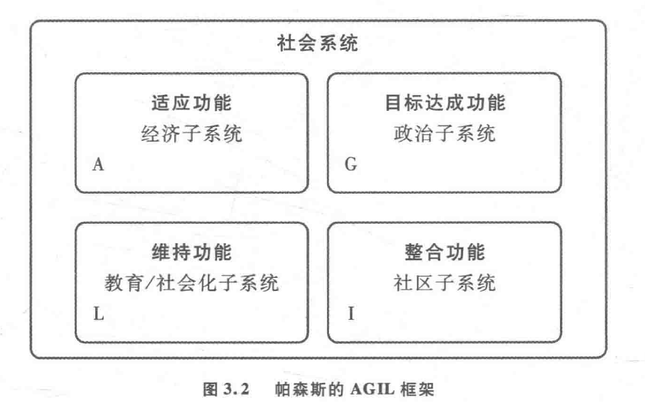

[TOC]
# 理论与视角
## 迈向社会学
### 实证主义与社会演进
#### 工业革命与社会问题的诞生
- 工业革命在**18世纪晚期和19世纪**为人类社会带来了**根本的物质和生活方式的变革**
- 这一时期出现的新社会问题包括**城市过度拥挤、恶劣的卫生条件、疾病和工业污染**
- 社会改革者通过**研究和收集数据**，寻求解决这些问题的方法，这推动了**社会科学的早期发展**

#### 法国革命与启蒙运动
- 1789年的**法国革命**结束了欧洲的**封建土地制度**和**君主专制**，引发了对自由、民主和公民权利的**广泛讨论**
- 法国革命被视为**启蒙思想的一部分**，启蒙时期强调**理智、理性和批判性思维**，挑战宗教与传统权威
- 启蒙哲学家如牛顿等**自然科学的成就**激励了对社会与政治生活**可能遵循类似自然规律**的探究

#### 奥古斯特·孔德的研究方法
- **奥古斯特·孔德**（Auguste Comte）将社会科学与自然科学**类比**，提出社会学研究应基于**观察、预测和控制社会现象**
- 孔德的**实证主义哲学**强调通过**科学方法**掌握社会规律，以**科学的预测和干预**推动社会进步
- 虽然孔德的方法深受自然科学的影响，但现代社会学家通常认为，对人类行为的科学研究应**避免过度控制和简化**

#### 赫伯特·斯宾塞的社会进化论
- **斯宾塞**（Herbert Spencer）将社会视为**生物体**，认为社会通过**结构分化和功能适应**进行进化
- 他的社会进化论包含“**适者生存**”原则，主张社会如生物一样，通过**适应环境**变得更加复杂和适应性强
- 斯宾塞**反对国家干预社会**，认为社会应**允许自然发展**，弱者的保护可能阻碍社会的整体进步

### 卡尔·马克思：资本主义革命
#### 马克思的理论思路：历史唯物主义
- 马克思认为社会的主导思想和理想主要反映其**经济基础**，尤其是**生产方式**，这反对了当时主流的**唯心主义学说**
- **唯物史观**（materialist conception of history）认为社会历史的发展是由**物质生活方式**尤其是**社会生产方式的变化**所推动的，而非由抽象的理想或概念推动
- 马克思以**自然科学的发展**为例，提出通过**相似的科学方法**，社会和政治生活的规律也能被发现和理解

#### 阶级冲突和社会变迁
- 马克思认为社会的历史是**阶级斗争的历史**，**阶级对立**是推动社会变革的基本动力
- 从封建社会的**地主和农民的对立**转变为资本主义社会的**资本家和工人的对立**，展示了社会结构的演变
- 资本主义社会中，阶级冲突主要表现为**资本家和工人之间的矛盾**，这些矛盾预示着未来**向共产主义的转变**

#### 马克思主义的历史影响
- 马克思的思想深刻影响了20世纪全球范围内的**政治运动和政府政策**，尤其是在苏联、中国和东欧等地区的**共产党政权**
- 马克思主义被政治运动和政府用来**解释和推动社会和政治变革**，超越了学术讨论，进入**实际的政治实践**
- 马克思和恩格斯的作品，尤其是《**共产党宣言**》（The Communist Manifesto）和《**资本论**》，成为影响深远的政治和社会学理论文本

#### 对现代社会学的意义
- 马克思提供了关于如何通过**分析社会生产方式和阶级结构**来理解社会动力学的理论框架
- 马克思主义批判地分析了资本主义社会中的**阶级剥削、劳动异化**和其他社会问题，对现代社会问题提供了深刻见解
- 虽然马克思的理论存在争议，但其对社会变革和结构的分析对于理解和研究社会动态仍具有重要的理论和实践价值

### 新马克思主义：法兰克福学派的批判理论
#### 马克思主义的演变和法兰克福学派的兴起
- 在20世纪30年代，**法兰克福学派**由**马克斯·霍克海默**领导，成为**西方马克思主义**的重要支流，反对苏联的共产主义版本
- 法兰克福学派原始成员在纳粹上台后**被迫离开德国**，转移到**美国和其他地方**继续他们的学术工作
- 法兰克福学派结合了**马克思、弗洛伊德的理论**以及**康德的哲学**，产生了关于资本主义、法西斯主义和消费社会的深刻批判

#### 批判理论的核心观点和影响
- **西奥多·阿多诺**和同事们研究了**法西斯主义的兴起**，将其部分归因于一种**独裁的人格类型**，易受强权领导者影响
- **赫伯特·马尔库塞**在《**单向度的人**》中批判了工业资本主义下的**消费文化**，认为它制造了**虚假需求**，抑制了人们的批判性思维
- 法兰克福学派的研究显示了消费资本主义社会中，工人阶级革命的**障碍如何增加**，以及资本主义如何**适应并抵抗变革的尝试**

#### 尤尔根·哈贝马斯和交往行为理论
- **尤尔根·哈贝马斯**发展了**交往行为理论**，强调人们在交流时的期望被理解，但通常**权力不对称**导致**沟通扭曲**
- 哈贝马斯主张通过**扩大民主**和**减少阻碍正当沟通的不平等**，来**深化现代性**，而不是放弃现代理性思维
- 哈贝马斯的理论继续了新马克思主义批判理论的传统，关注如何通过社会交往中的对话实现**更广泛的社会变革**

#### 马克思主义在当代的地位和前景
- 尽管马克思的革命预言**未能在预期的西方国家实现**，但2008年的经济危机再次引起人们对**资本主义经济周期性危机**的关注
- 马克思的**宽泛理论**依然为理解资本主义社会的经济动态提供了**有价值的视角**
- 现代社会学和政治分析中，马克思主义分析框架仍然被用来**解释和预测社会变革**

## 社会学的建立
### 埃米尔·涂尔干：社会事实
#### 涂尔干的学术生涯和社会学的定位
- 涂尔干是法国的**第一位社会科学教授**，最终在**巴黎大学**担任了教育学和社会学教授，为社会学在学术界确立地位
- 他远离哲学，专注于**社会科学**，特别关注能解释当时法国社会面临的**道德和社会问题**的学科
- 涂尔干对社会学的贡献在于他**对社会学科性质的界定**，即研究**超出个体互动的社会制度和形式**，如社会运动、组织和家庭

#### 社会事实的理念和其研究方法
- 涂尔干定义了“**社会事实**”作为研究的核心对象，认为它们如同自然物体一样，具有**独立于个人之外的客观实在**
- 社会事实对于个体行为有着**约束力**，是外在于个体的存在，需要通过**社会学的方法**进行**研究和理解**
- 他强调，社会事实不可以通过个体的**心理学或哲学思辨来**充分理解，因此推动了一种真正**基于社会逻辑的科学研究方法**

#### 社会团结的理论与现代社会的分析
- 在《**社会分工论**》（The Division of Labour in Society）中，涂尔干区分了**简单社会的机械团结**和**现代工业社会的有机团结**
- 机械团结体现在**个体服从集体**，**个人主义被弱化**，而有机团结则是通过**高度的劳动分工**，强调个性和经济上的**相互依赖**来实现社会凝聚
- 涂尔干对现代社会的**乐观评估**，认为有机团结通过**相互依赖**强化社会团结，反驳了**工业化不可避免地摧毁社会团结**的观点

#### 涂尔干的社会学视角与当代社会问题
- 涂尔干的研究不仅是理论上的探讨，他密切关注**如何通过社会学分析解决实际的道德和社会问题**
- 他的工作展示了工业社会在**个体主义日益盛行的时代**如何达成整合，提供了**解决社会问题的新途径**
- 涂尔干的方法强调**科学的社会学分析**与当时的**道德和社会问题之间的联系**，展示了社会学研究的现实意义和应用价值

#### 功能主义的基本观点与批评
- 涂尔干的社会研究方法以**功能主义**著称一对**社会及其制度联结和变迁方式**的研究
- **功能主义**以解释社会如何**维持共性和团结**为强项，但在解释**社会冲突和快速变迁**时效果不佳
- 批评者指出功能主义过于强调**社会对个人的约束**，忽视了**个人创新的空间和可能性**
- 功能主义常被批评为归因于**社会自身**的“**意图**”和“**需求**”，如将教育系统的存在归因于社会的需求，这种解释被视为**过于简化**

### 20世纪的结构功能主义
#### 结构功能主义的发展和社会学的定义
- **结构功能主义**（Structural Functionalism）在20世纪40年代到60年代成为了**社会学的核心范式**，尽管它**从未完全占据主导地位**
- 在那个时期，社会学常常与结构功能主义视为**相同的事物**，反映了当时社会学的**单一理论趋势**
- **塔尔科特·帕森斯**（Talcott Parsons）和**罗伯特·默顿**（Robert K.  Merton）是该理论的重要代表人物，其中帕森斯尝试整合涂尔干、韦伯和帕累托的思想，建构了**宏大的结构功能主义理论**

#### 帕森斯的理论与AGIL框架
- 帕森斯提出**社会秩序问题**，关注社会如何协调个体行为以达到集体和谐
- 他发展了**AGIL框架**，这是一个**按社会系统需求设计的模型**，指出社会系统需要**适应、目标实现、整合和文化传承**四个功能
- 帕森斯的视角认为社会规则通过**持续的社会化过程**得到**个体的内化**，不仅仅是外力作用

#### 默顿的中层理论和功能的分类
- 默顿提出**中层理论**（Middle Range Theory），试图纠正**仅关注宏观或微观层面的研究方法**，强调研究**特定主题和领域**
- 他区分了**显性功能和隐性功能**，前者为行为的**可观察结果**，后者为**未预见的方面**
- 默顿的理论增加了对**反功能的考虑**，即社会制度可能包含**有损社会整体的功能**

#### 结构功能主义的批评和衰落
- 结构功能主义因**过于强调共识**而被批评忽视了社会的**根本冲突和不稳定因素**
- 随着社会动荡的增加，如反核运动、反战运动等，**冲突理论**得到了**复兴**
- 20世纪六七十年代，结构功能主义理论开始**走向衰落**，帕森斯的理论影响逐渐减弱，社会学理论再次**多元化**

### 马克斯·韦伯：资本主义和宗教
#### 马克斯·韦伯的基本问题
- **马克斯·韦伯**（Max Weber）通过他的著作《**新教伦理与资本主义精神**》（The Protestant Ethic and the Spirit of Capitalism）探索了**为何资本主义首先在西方兴起的问题**
- 他分析了其他文明**在经济和技术上曾超过西方的时期**，并特别提到了**中国、印度和奥斯曼帝国**
- 韦伯的研究挑战了简单**将资本主义发展归因于对财富的渴望**的观点，指出必须有**其他因素**推动资本主义的形成

#### 资本主义精神的宗教根源
- 韦伯提出资本主义的核心在于一种特殊的**对财富积累的态度**，称为“**资本主义精神**”，这种态度在历史上的其他地方未曾出现
- 他指出早期的资本家往往**生活朴素且节俭**，与他们的财富积累目的不是为了**奢侈生活**而是**再投资于企业的扩张**
- **新教**，尤其是**清教和加尔文教派**，对**资本主义精神的形成**起到了关键作用，这与宗教观念如**预定论和天职观念**密切相关

#### 韦伯的社会经济分析
- 韦伯分析了早期资本家如何**将宗教信仰转化为经济活动**的动力，将财富积累视为上帝赋予的任务
- 清教徒对财富的积累是为了**证明自己是上帝的选民**，这种信念导致了资本主义经济活动的**特有发展方式**
- 韦伯认为，虽然这些资本家**未有意图促发资本主义革命**，他们的宗教驱动行为却是现代资本主义快速发展的**无意间促进者**

#### 韦伯理论的影响和评价
- 韦伯的理论对理解现代资本主义的起源具有**深远的影响**，尽管受到了一些批评，例如关于资本主义精神**是否早于加尔文教存在**的争论
- 他的理论因其**独创性**和对经济社会现象提供**非直观的新解释**而受到高度评价
- 韦伯的分析强调了社会学中**反直觉性的重要性**，他的方法不仅揭示了资本主义的特殊起源，而且提供了理解社会变迁的一种新视角

### 符号互动论、现象学以及常人方法学的概述
#### 符号互动论
- **符号互动论**由**乔治·赫伯特·米德**（George Herbert Mead）提出，专注于**语言和符号**在社会互动中的核心作用
- **赫伯特·布鲁默**（Herbert Blumer）进一步发展了这一理论，强调**个体行动和互动**是社会结构的真实存在，而非**抽象的社会结构**
- 米德的研究显示，个体“我”是**社会互动的产物**，称为“**社会我**”（social self），强调人类沟通的象征性和符号的重要性

#### 现象学
- 现象学源自**埃德蒙·胡塞尔**（Edmund Husserl）的哲学，通过**阿尔弗雷德·舒茨**（Alfred Schutz）在社会学中得到应用
- 舒茨探索了**个体如何经历**并**将日常生活常态化**的过程，他称之为“**自然态度**”（natural attitude）
- 现象学关注**类型化的概念**，这是个体**基于以往经验对现象进行分类和理解**的过程，这有助于秩序的产生但也可能导致**过度刻板化**

#### 常人方法学
- 常人方法学由**哈罗德·加芬克尔**（Harold Garfinkel）提出，强调研究“**本土人**”如何在日常生活中构建社会现象
- 这一方法论**批评主流社会学**，尤其是**结构功能主义**的局限，认为它将人视为**被动的社会化接受者**
- 常人方法学努力揭示社会事实是如何在日常生活中**被个体创造并赋予“物”的性质**，强调互动中的**主体性和创造性**

#### 社会学理论的群体性质
- 这些理论将**人类行动者**和**社会互动**置于分析的中心，与**侧重社会结构**的理论形成对比
- 它们强调社会生活的**微观层面**，特别是个体如何**在互动中构建和理解社会现象**
- 这些理论在社会学中形成了一个**重要的群体**，为**理解人类行为和社会结构**提供了**不同的视角和方法论**